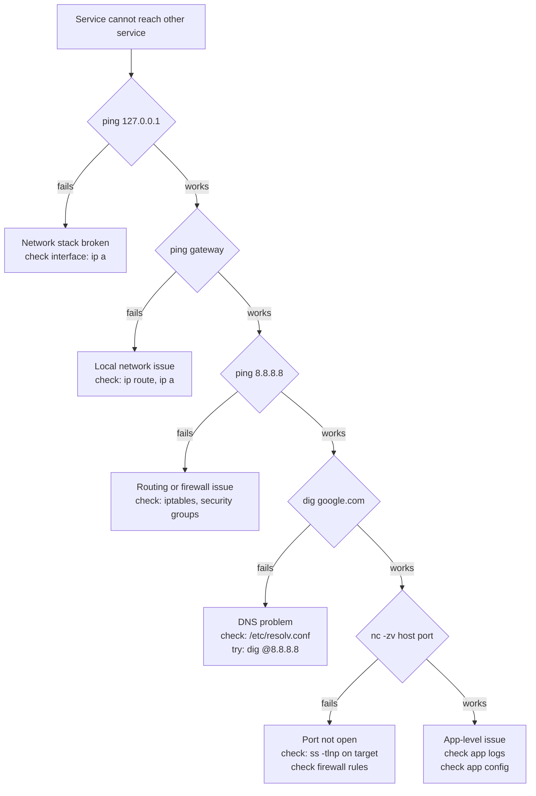

# Networking

Your app cannot reach the database. The error says "connection refused." You check the database — it's running. The credentials are correct. Something in the network is wrong, but you don't know what.

Networking problems are invisible until you know how to see them. This page builds the mental model for how traffic moves between machines and how to trace failures through the network stack.

---

## IP addresses and interfaces

Every machine on a network has one or more network interfaces. Each interface has an IP address. When another machine sends you a packet, it addresses it to your IP.

```bash
# View all interfaces and their IP addresses
ip addr show
ip a                          # shorthand
```

```
2: eth0: <BROADCAST,MULTICAST,UP,LOWER_UP>
    inet 192.168.1.10/24 brd 192.168.1.255 scope global eth0
```

`192.168.1.10` is the IP. `/24` means the first 24 bits identify the network — this machine is on the `192.168.1.0/24` network. Any address in `192.168.1.0` to `192.168.1.255` is on the same local network.

---

## Routing

When your machine sends a packet to an address outside its local network, it needs to know where to send it. It checks the routing table.

```bash
ip route show
ip r                          # shorthand
```

```
default via 192.168.1.1 dev eth0
192.168.1.0/24 dev eth0 proto kernel
```

- `192.168.1.0/24 dev eth0` — packets for this network go directly to `eth0`
- `default via 192.168.1.1` — everything else goes to the gateway at `192.168.1.1`

The gateway is a router. It knows how to reach other networks. This is how your machine reaches the internet.

---

## Ports

A port is a number that routes incoming traffic to the right process. When your app listens on port 8080, the kernel directs any incoming TCP connection to port 8080 to your process.

Ports 1–1023 are privileged — only root can bind to them. Ports 1024–65535 are unprivileged.

```bash
# What ports is this machine listening on?
ss -tlnp

# What process owns port 8080?
ss -tlnp | grep :8080
lsof -i :8080
```

---

## DNS

IP addresses are hard to remember and change when infrastructure changes. DNS maps names to addresses.

When you run `curl api.example.com`, your machine:
1. Checks `/etc/hosts` for a local override
2. Asks the DNS server configured in `/etc/resolv.conf`
3. The DNS server resolves the name through the hierarchy

```bash
cat /etc/resolv.conf          # which DNS server am I using?
cat /etc/hosts                # local overrides
```

DNS record types that matter most:

| Type | Maps |
|------|------|
| A | hostname → IPv4 address |
| CNAME | alias → another hostname |
| MX | domain → mail server |
| TXT | domain → text (SPF, DKIM, verification) |

---

## Hands-on: diagnose a connectivity failure

When a service cannot reach another service, follow this sequence.

```bash
# Step 1: Can I reach myself? (tests that the network stack is up)
ping 127.0.0.1

# Step 2: Can I reach my gateway? (tests local network)
ip route show | grep default           # get gateway IP
ping <gateway-ip>

# Step 3: Can I reach a public IP? (tests routing to internet)
ping 8.8.8.8

# Step 4: Can I resolve DNS? (tests DNS)
nslookup google.com
dig +short google.com

# If Step 3 works but Step 4 fails: DNS problem, not network problem.
# If Step 2 fails: local network or interface is down.
```

### Test if a service is reachable on a specific port

```bash
# Is port 80 open on this host?
nc -zv 192.168.1.10 80

# Success output:
# Connection to 192.168.1.10 80 port [tcp/http] succeeded!

# Test HTTPS
nc -zv api.example.com 443

# Test with curl
curl -I http://192.168.1.10     # HTTP headers only — does the server respond?
```

### Debug DNS specifically

```bash
# Simple lookup
nslookup api.example.com

# Detailed lookup
dig api.example.com A

# Query a specific DNS server (bypass your default)
dig @8.8.8.8 api.example.com

# If the @8.8.8.8 query works but your default DNS doesn't:
# your DNS server has a problem, not the record itself.

# Check TTL (how long the record is cached)
dig api.example.com A | grep -A 3 "ANSWER SECTION"
# The number before "IN  A" is the TTL in seconds
```

### Inspect active connections

```bash
# All established connections
ss -tnp

# All listening ports with which process owns them
ss -tlnp

# Filter for a specific port
ss -tnp | grep :5432          # who is connected to postgres?
```

---

## The diagnostic mental model



---

## Quick reference

```bash
ip addr show                  # interfaces and IPs
ip route show                 # routing table
ping <host>                   # reachability test
nc -zv <host> <port>          # port connectivity test
ss -tlnp                      # listening ports
ss -tnp                       # active connections
lsof -i :<port>               # what owns a port
dig +short <domain>           # DNS lookup
dig @8.8.8.8 <domain>         # bypass local DNS
cat /etc/resolv.conf          # configured DNS server
cat /etc/hosts                # local DNS overrides
```
