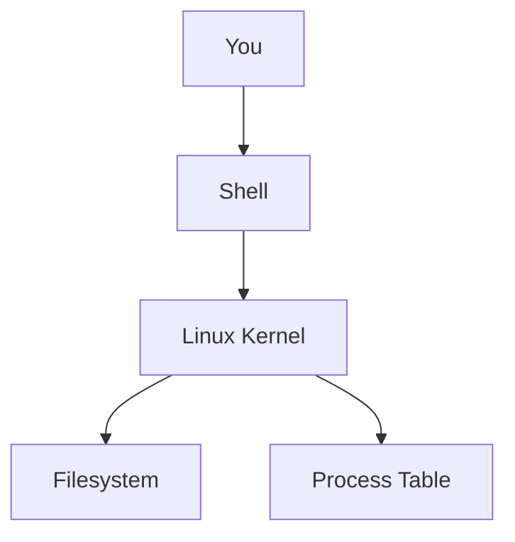

# Linux Commands

Linux commands are the language of infrastructure.

## Why it matters

A command like `ls` or `ps` has the same role as a troubleshooting sentence in production: it reveals state.

## Key example

```bash
ls -l /var/log | tail -n 5
```

Expected result:

```text
-rw-r--r-- 1 root root 12345 Mar 20 12:34 syslog
```

That output tells you what files exist, who owns them, and when they changed.

## Practical commands

- `ps aux | grep nginx` ? find processes.
- `df -h` ? check disk usage.
- `journalctl -u nginx.service --since "1 hour ago"` ? read service logs.

## Diagram


