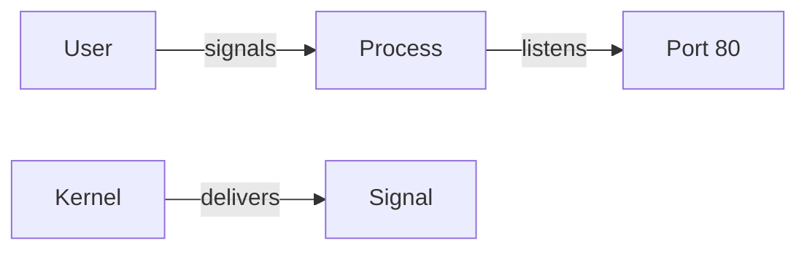

# Processes, Signals, and Ports

A process is a running program. Signals are the way the OS communicates with processes. Ports are the entry points for network services.

## Example: find the process using port 80

```bash
sudo lsof -iTCP:80 -sTCP:LISTEN -P
```

Result:

```text
nginx  1245  root  6u  IPv4 0x... TCP *:80 (LISTEN)
```

This tells you which service is listening on port 80.

## Send a signal

```bash
kill -TERM 1245
```

That asks the process to shut down cleanly. If it does not stop, `kill -KILL` forces termination.

## Diagram


