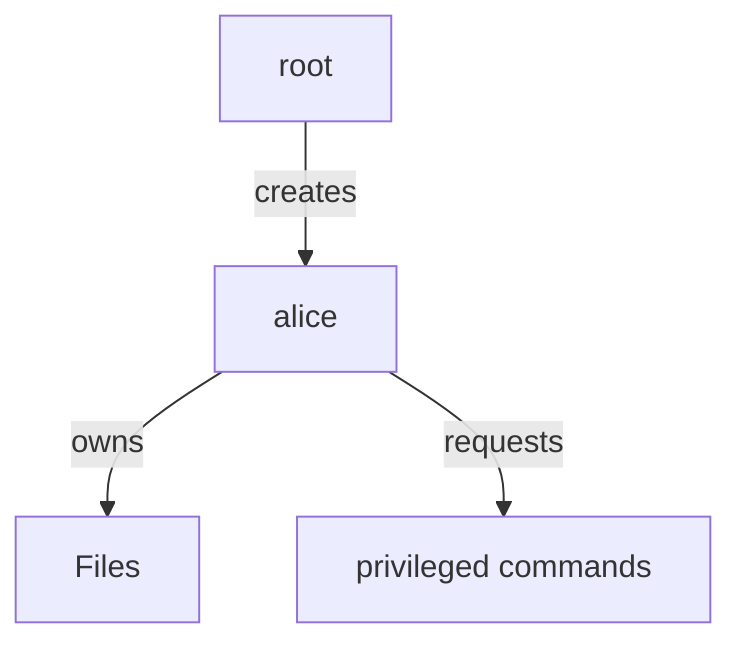

# User Access in Linux Servers

Linux access is built on users, groups, and permissions.

## Practical rule

If a user cannot read a file, they cannot use it.

## Example inspect permissions

```bash
ls -l /etc/ssh/sshd_config
```

Result:

```text
-rw-r--r-- 1 root root 2427 Jan  9 10:22 /etc/ssh/sshd_config
```

Root can edit the file. Others can read it but not change it.

## Role model

- `root` is the system administrator.
- A regular user can run commands and own files.
- `sudo` gives temporary privilege to a user.

## Example add a user

```bash
sudo useradd -m alice
sudo passwd alice
```

## Diagram


