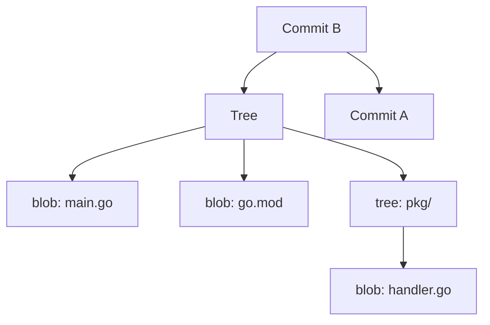
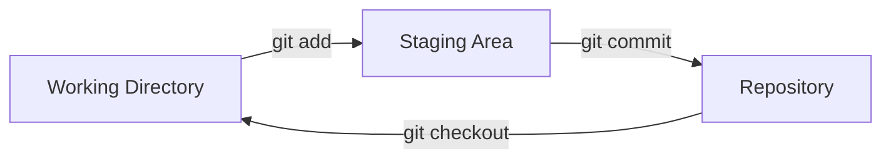
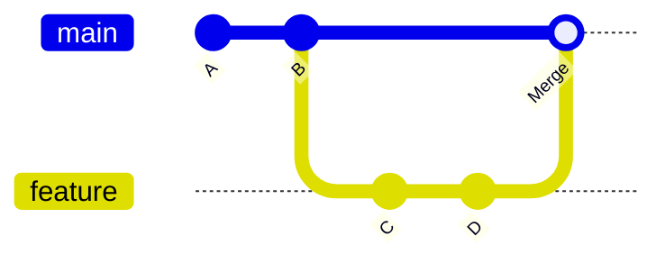

# Git

Git does not store diffs. It stores **snapshots**.

Every time you commit, Git takes a picture of your entire working tree and stores it permanently. Each snapshot is addressed by a SHA hash of its contents. This one decision — content-addressed snapshots — is responsible for almost everything that makes Git powerful, fast, and safe.

---

## The data model

Three object types. Everything in Git is made of these.

**Blob** — the contents of a file. Nothing else. No filename, no path.

**Tree** — a directory listing. Maps filenames to blobs or other trees.

**Commit** — a snapshot. Points to a tree (the root of the working directory at that moment), records the author, timestamp, message, and a pointer to the previous commit.



Commits form a chain. This chain is the history. Because every commit is identified by a hash of its contents — including the hash of its parent — you cannot change any commit without changing everything after it. History is immutable.

**Branches are just pointers.** A branch is a file that contains a commit hash. When you commit on a branch, the pointer moves to the new commit. That is all a branch is.

**HEAD is where you are.** HEAD points to the current branch (or directly to a commit in detached HEAD state).

---

## Working locally

```bash
# Initialize a repository
mkdir my-project && cd my-project
git init

# Create and stage files
echo "# My Project" > README.md
git add README.md             # stage one file
git add .                     # stage everything
git status                    # what is staged?

# Commit
git commit -m "Initial commit"

# View history
git log
git log --oneline             # compact
git log --oneline --graph     # with branch graph
```

### The three areas



- **Working directory** — your files as you edit them
- **Staging area (index)** — what will go into the next commit
- **Repository** — all commits, stored permanently in `.git/`

This separation matters. You can stage part of a file, not all of it. You can prepare a clean logical commit even if your working directory is messy.

```bash
git diff                      # working directory vs staging
git diff --staged             # staging vs last commit
git restore --staged <file>   # unstage a file
git restore <file>            # discard working directory changes
```

---

## Branching

A branch is a line of development. You create a branch to work on something without touching the main branch. When it's ready, you merge it back.

```bash
# Create and switch to a branch
git switch -c feature/auth

# Or older syntax
git checkout -b feature/auth

# List branches
git branch
git branch -a                 # including remotes

# Switch to existing branch
git switch main

# See divergence between branches
git log main..feature/auth    # commits in feature/auth not in main
```

### Merge vs rebase

Both integrate changes from one branch into another. They produce different history.

**Merge** creates a merge commit. The full history of both branches is preserved. Safe on shared branches.

```bash
git switch main
git merge feature/auth
```

**Rebase** replays your commits on top of the target branch. No merge commit. Linear history. Do not rebase commits that have already been pushed to a shared branch — you rewrite their hashes, which breaks everyone else's copy.

```bash
git switch feature/auth
git rebase main               # replay feature/auth commits on top of main
```



---

## Undoing things

```bash
# Amend the last commit (before pushing)
git commit --amend -m "better message"

# Undo last commit but keep the changes staged
git reset --soft HEAD~1

# Undo last commit and unstage the changes
git reset HEAD~1

# Discard last commit and all changes (destructive)
git reset --hard HEAD~1

# Revert a commit by creating a new inverse commit (safe for shared branches)
git revert <commit-hash>

# Find a lost commit
git reflog
```

---

## Under the hood

When you run `git commit`, Git:
1. Hashes each staged file → creates blobs
2. Builds a tree object representing the directory structure
3. Creates a commit object pointing to the tree and the previous commit
4. Moves the current branch pointer to the new commit

This is why `git log --graph` shows branches as lines that split and rejoin — it is literally drawing the commit DAG (directed acyclic graph).

```bash
# Explore the .git directory
ls .git/
cat .git/HEAD                  # current branch
cat .git/refs/heads/main       # commit hash for main branch
git cat-file -p HEAD           # print the current commit object
git cat-file -p HEAD^{tree}    # print the tree at HEAD
```

---

## Hands-on: complete local workflow

```bash
# 1. Create a project
mkdir git-practice && cd git-practice
git init

# 2. First commit
echo "# Practice" > README.md
git add . && git commit -m "Initial commit"

# 3. Create a feature branch
git switch -c feature/hello

# 4. Add a file
echo 'print("hello")' > hello.py
git add . && git commit -m "Add hello script"

# 5. Make another change
echo 'print("world")' >> hello.py
git add . && git commit -m "Extend hello script"

# 6. View the branch divergence
git log --oneline --graph --all

# 7. Merge back to main
git switch main
git merge feature/hello --no-ff   # --no-ff preserves the merge commit

# 8. View final history
git log --oneline --graph

# 9. Clean up
git branch -d feature/hello
cd .. && rm -rf git-practice
```

---

## Quick reference

```bash
git init                           # create repository
git add <file> / git add .         # stage
git commit -m "message"            # commit
git status                         # current state
git log --oneline --graph          # history
git diff / git diff --staged       # see changes

git switch -c <branch>             # create and switch branch
git switch <branch>                # switch branch
git merge <branch>                 # merge into current
git rebase <branch>                # rebase onto branch

git reset --soft HEAD~1            # undo commit, keep staged
git reset HEAD~1                   # undo commit, unstage
git revert <hash>                  # safe undo (new commit)
git reflog                         # find lost commits

git cat-file -p <hash>             # inspect any git object
```
