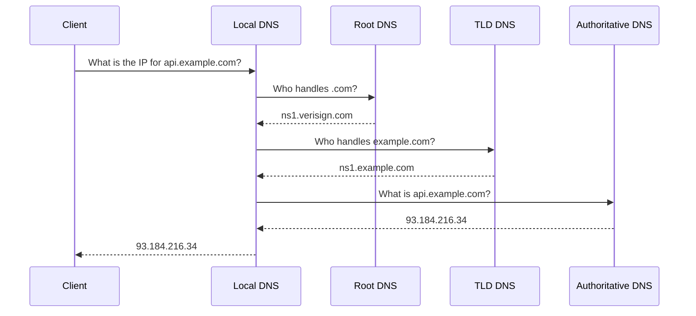

# DNS

Your app talks to `db.internal`. At some point a request fails with "connection refused." You check the database — it's fine. Then you check the IP. The IP is fine. Then someone tells you the hostname changed.

DNS is how names become addresses. When it breaks, nothing works, and the errors point you in the wrong direction. Understanding DNS means you can debug it in under a minute instead of an hour.

---

## How DNS resolution works



In practice, your machine almost never goes through the full chain. Results are cached. Your `/etc/resolv.conf` points to a local resolver (often your router or a company DNS server) that handles the lookup and caches the result.

---

## Key files

**`/etc/resolv.conf`** — which DNS server to ask:
```
nameserver 8.8.8.8
nameserver 8.8.4.4
```

**`/etc/hosts`** — local name overrides (checked before DNS):
```
127.0.0.1   localhost
192.168.1.10  db.internal  db
```

**`/etc/nsswitch.conf`** — resolution order:
```
hosts: files dns
```

`files` is checked first (meaning `/etc/hosts`), then `dns`. Add an entry to `/etc/hosts` and it overrides whatever DNS says.

---

## DNS record types

| Type | What it maps |
|------|-------------|
| A | Hostname → IPv4 address |
| AAAA | Hostname → IPv6 address |
| CNAME | Alias → another hostname |
| MX | Domain → mail server |
| TXT | Domain → arbitrary text (used for verification, SPF, DKIM) |
| NS | Domain → authoritative nameservers |

---

## Hands-on

### Resolve a domain

```bash
# Simple lookup
nslookup google.com

# Detailed lookup with record type
dig google.com A
dig google.com AAAA
dig google.com MX

# Check who is authoritative for a domain
dig google.com NS

# Query a specific DNS server
dig @8.8.8.8 google.com A

# Short output — just the answer
dig +short google.com A
```

### Test local name resolution

```bash
# Add a test entry to /etc/hosts
echo "127.0.0.1 myapp.local" | sudo tee -a /etc/hosts

# Resolve it
ping myapp.local
dig myapp.local
nslookup myapp.local

# Confirm it resolves locally, not from DNS
dig myapp.local | grep SERVER    # should show 127.0.0.53 or your local resolver
```

Clean up:
```bash
sudo sed -i '/myapp.local/d' /etc/hosts
```

### Diagnose a DNS failure

```bash
# Can I reach the DNS server?
ping 8.8.8.8                     # test connectivity first

# Does DNS resolve public names?
dig +short google.com

# Does it resolve internal names?
dig +short db.internal

# What DNS server am I using?
cat /etc/resolv.conf
resolvectl status                 # on systemd-resolved systems

# Try a manual lookup against a known-good server
dig @8.8.8.8 google.com

# If @8.8.8.8 works but your configured DNS doesn't, it's a server issue, not a network issue.
```

### Check DNS caching and TTL

```bash
# TTL shows how long this record will be cached
dig google.com A | grep -A 3 "ANSWER SECTION"
```

Output:
```
;; ANSWER SECTION:
google.com.  60  IN  A  142.250.80.46
```

`60` means the record expires in 60 seconds. After that, another DNS lookup is needed. During a migration, low TTL = fast propagation. High TTL = slow, but fewer lookups.

---

## Quick reference

```bash
dig +short <domain>              # quick IP lookup
dig <domain> <type>              # lookup specific record type
dig @<server> <domain>           # query specific DNS server
nslookup <domain>                # simple lookup
cat /etc/resolv.conf             # which DNS server am I using?
cat /etc/hosts                   # local overrides
resolvectl status                # systemd-resolved status
```
