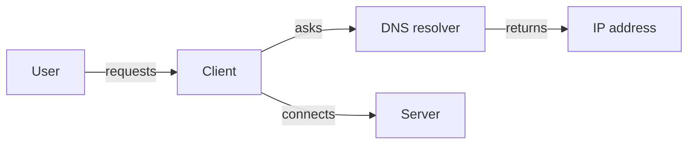

# DNS

DNS translates names into IP addresses. It is the lookup service for the internet.

## Example lookup

```bash
dig +short example.com
```

Result:

```text
93.184.216.34
```

That result means your browser can now connect to the right server.

## Why DNS matters

Developers use hostnames. Machines use IP addresses. DNS is the translator between them.

## Diagram


