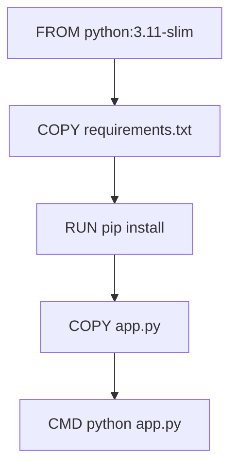

# Docker

An **image** is a snapshot of your application and its environment. A **container** is a running instance of an image. A **Dockerfile** is the recipe for building an image.

These three concepts are Docker. Everything else is details.

---

## Images and layers

Docker images are built in layers. Each instruction in a Dockerfile creates one layer. Layers are cached and reused.



If `requirements.txt` does not change, the `pip install` layer is served from cache on every rebuild. This is why instruction order matters: put things that change least at the top, things that change most at the bottom.

```bash
# Pull an image
docker pull nginx

# List local images
docker images

# See image layers
docker history nginx
```

---

## Writing a Dockerfile

| Instruction | Purpose |
|-------------|---------|
| `FROM` | Base image |
| `WORKDIR` | Working directory for subsequent instructions |
| `COPY` | Copy files from host to image |
| `RUN` | Execute a command during build |
| `ENV` | Set environment variables |
| `EXPOSE` | Document which port the app uses |
| `CMD` | Default command when container starts |
| `ENTRYPOINT` | Executable that always runs |

```dockerfile
FROM python:3.11-slim

WORKDIR /app

# Copy dependency list first — changes rarely
COPY requirements.txt .
RUN pip install --no-cache-dir -r requirements.txt

# Copy source — changes often
COPY . .

EXPOSE 5000

CMD ["python", "app.py"]
```

```bash
# Build the image
docker build -t my-app:1.0 .

# Build with a specific Dockerfile
docker build -f Dockerfile.prod -t my-app:prod .
```

---

## Running containers

```bash
# Run a container
docker run nginx

# Run in background (detached)
docker run -d nginx

# Map ports: host:container
docker run -d -p 8080:80 nginx

# Give it a name
docker run -d -p 8080:80 --name web nginx

# Pass environment variables
docker run -d -e DB_HOST=postgres -e DB_PORT=5432 my-app

# Run and delete on exit
docker run --rm ubuntu echo "hello"

# Interactive shell
docker run -it --rm ubuntu bash
```

### Container lifecycle

```bash
docker ps                     # running containers
docker ps -a                  # all containers including stopped
docker stop web               # graceful stop (SIGTERM → SIGKILL after timeout)
docker start web              # start stopped container
docker restart web            # stop + start
docker rm web                 # delete stopped container
docker rm -f web              # force remove running container
```

### Inspect running containers

```bash
docker logs web               # stdout + stderr
docker logs web -f            # follow live
docker logs web --tail 50     # last 50 lines
docker exec -it web bash      # shell into running container
docker inspect web            # full config as JSON
docker stats                  # live resource usage
```

---

## Volumes

Containers are ephemeral. Every new container starts with a clean filesystem. For data that must survive container replacement, use volumes.

**Named volumes** — managed by Docker, portable, persists across container replacements:

```bash
# Create
docker volume create pgdata

# Use
docker run -d \
  -v pgdata:/var/lib/postgresql/data \
  -e POSTGRES_PASSWORD=secret \
  --name postgres postgres:15

# Data survives container deletion
docker rm -f postgres
docker run -d \
  -v pgdata:/var/lib/postgresql/data \
  -e POSTGRES_PASSWORD=secret \
  --name postgres postgres:15
# Data is still there

docker volume ls
docker volume inspect pgdata
```

**Bind mounts** — mount a host directory into the container. Used for local development:

```bash
docker run -d \
  -p 8080:80 \
  -v $(pwd)/html:/usr/share/nginx/html \
  nginx

# Edit files on your host — changes are immediately visible in the container
```

---

## Networking

By default, containers can reach the internet but cannot reach each other by name.

**User-defined bridge networks** fix this. Containers on the same network can reach each other by container name.

```bash
# Create a network
docker network create myapp

# Run containers on that network
docker run -d --network myapp --name postgres postgres:15
docker run -d --network myapp --name app -p 8080:3000 my-app

# Inside the 'app' container, 'postgres' resolves to the postgres container IP
# docker exec -it app sh
# > ping postgres     ← works
```

```bash
docker network ls                          # list networks
docker network inspect myapp              # inspect
docker network connect myapp <container>  # add container to network
```

---

## Hands-on: build and run a full app

```bash
# 1. Create app files
mkdir flask-demo && cd flask-demo

cat > requirements.txt << 'EOF'
flask==3.0.0
EOF

cat > app.py << 'EOF'
from flask import Flask
app = Flask(__name__)

@app.route("/")
def hello():
    return "Hello from Docker"

@app.route("/health")
def health():
    return {"status": "ok"}

if __name__ == "__main__":
    app.run(host="0.0.0.0", port=5000)
EOF

cat > Dockerfile << 'EOF'
FROM python:3.11-slim
WORKDIR /app
COPY requirements.txt .
RUN pip install --no-cache-dir -r requirements.txt
COPY app.py .
EXPOSE 5000
CMD ["python", "app.py"]
EOF

# 2. Build
docker build -t flask-demo:1.0 .

# 3. Run
docker run -d -p 5000:5000 --name flask flask-demo:1.0

# 4. Test
curl http://localhost:5000
curl http://localhost:5000/health

# 5. View logs
docker logs flask

# 6. Modify and rebuild — observe caching
echo "# updated" >> app.py
docker build -t flask-demo:2.0 .
# requirements layer is cached, only app.py layer rebuilds
```

### Cleanup

```bash
docker rm -f flask
docker rmi flask-demo:1.0 flask-demo:2.0
cd .. && rm -rf flask-demo
```

---

## Quick reference

```bash
# Images
docker build -t <name>:<tag> .         # build
docker images                           # list
docker pull <image>                     # pull
docker rmi <image>                      # remove
docker history <image>                  # show layers

# Containers
docker run -d -p <h>:<c> --name <n>    # run background with ports
docker ps / docker ps -a                # list running / all
docker logs <name> -f                   # follow logs
docker exec -it <name> sh              # shell in
docker stop / start / rm <name>        # lifecycle
docker inspect <name>                   # full config
docker stats                            # resource usage

# Volumes
docker volume create <name>             # create
docker volume ls / inspect / rm        # manage
-v <vol>:<path>                         # mount named volume
-v $(pwd):<path>                        # bind mount

# Networks
docker network create <name>            # create
docker network ls                       # list
--network <name>                        # attach container
```
