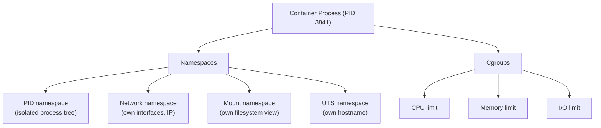

# Production Containers

A container that works in development may not be safe or efficient in production. Development images are often large, run as root, and include build tools that have no business being in a running container.

This page covers the practices that separate production-grade containers from development containers.

---

## Multi-stage builds

Build tools — compilers, test runners, package managers — are needed to build the application. They are not needed to run it. Multi-stage builds let you use one image for building and a different, smaller image for running.

```dockerfile
# Stage 1: build
FROM node:20 AS builder
WORKDIR /app
COPY package*.json ./
RUN npm ci
COPY . .
RUN npm run build

# Stage 2: run
FROM nginx:alpine
COPY --from=builder /app/dist /usr/share/nginx/html
EXPOSE 80
```

The final image contains only nginx and the compiled output. No Node.js, no `node_modules`, no source code. The attack surface is smaller. The image is smaller.

```bash
# Compare sizes
docker build -t app-multistage .
docker images | grep app-multistage
# vs. a single-stage build that includes all dev tools
```

---

## Minimal base images

The base image is the largest contributor to image size and vulnerability surface. Use the smallest base that works.

| Base | Size | Use when |
|------|------|---------|
| `ubuntu:22.04` | ~70MB | You need apt and standard tools |
| `debian:slim` | ~30MB | Debian with fewer packages |
| `alpine:3.19` | ~5MB | Minimal; uses musl libc (watch for compatibility) |
| `python:3.11-slim` | ~40MB | Python apps (based on debian:slim) |
| `gcr.io/distroless/*` | ~20MB | No shell, no package manager — production hardening |

```dockerfile
# Prefer slim or alpine variants
FROM python:3.11-slim    # not python:3.11
FROM node:20-alpine      # not node:20
```

---

## Non-root users

By default, Docker runs processes as root inside the container. Root in a container is not the same as root on the host — namespaces provide isolation — but it is still a bad practice. If your app has a vulnerability and an attacker gets a shell, they have root inside the container.

Run your application as a non-root user.

```dockerfile
FROM python:3.11-slim

WORKDIR /app
COPY requirements.txt .
RUN pip install --no-cache-dir -r requirements.txt
COPY . .

# Create a non-root user and switch to it
RUN useradd --system --no-create-home appuser
USER appuser

CMD ["python", "app.py"]
```

```bash
# Verify the process runs as the expected user
docker run -d --name app my-app
docker exec app whoami         # should print: appuser
docker exec app id             # uid should not be 0
```

---

## Resource limits

Without limits, one container can consume all CPU and memory on the host, starving every other container and process.

```bash
docker run -d \
  --memory 512m \             # hard memory limit (OOMKilled if exceeded)
  --memory-reservation 256m \ # soft limit (scheduling hint)
  --cpus 0.5 \                # limit to half a CPU core
  --name app my-app

# View resource usage
docker stats
docker stats --no-stream      # snapshot, no live update
```

---

## How containers work: kernel primitives

A container is not a special thing. It is a Linux process with:
- **Namespaces** — isolated views of system resources
- **Cgroups** — limits on resource consumption
- A root filesystem from the image (via overlay filesystem)



**Namespaces** give each container its own view. The container sees its own PID 1, its own network interfaces, its own filesystem root. On the host, these are just regular processes with filtered views.

**Cgroups** (control groups) limit and account for resource usage. Docker uses cgroups to enforce `--memory` and `--cpus` limits.

```bash
# See the container as a host process
docker run -d --name demo nginx
docker inspect demo | grep '"Pid"'        # get the host PID

# See the container's namespaces
ls -la /proc/<host-pid>/ns/               # each namespace is a file descriptor

# See cgroup limits for the container
cat /sys/fs/cgroup/memory/docker/<container-id>/memory.limit_in_bytes
```

---

## Image security: scanning and .dockerignore

```bash
# Scan for vulnerabilities
docker scout cves my-app:1.0             # Docker Scout
trivy image my-app:1.0                   # Trivy (install separately)
```

Use `.dockerignore` to exclude files from the build context. This reduces build time and prevents secrets from leaking into images.

```
# .dockerignore
.git/
node_modules/
*.log
.env
.env.*
tests/
*.md
```

```bash
# Check what would be included in the build context
docker build --no-cache -t test . 2>&1 | head -5
# "Sending build context to Docker daemon  X.XXX MB"
```

---

## Hands-on: harden an existing image

```bash
# 1. Build the default image (as root, full size)
cat > Dockerfile.before << 'EOF'
FROM python:3.11
WORKDIR /app
COPY . .
RUN pip install flask
CMD ["python", "app.py"]
EOF

docker build -f Dockerfile.before -t app-before .
docker images app-before        # note the size

# 2. Build the hardened image
cat > Dockerfile.after << 'EOF'
FROM python:3.11-slim
WORKDIR /app
COPY requirements.txt .
RUN pip install --no-cache-dir -r requirements.txt && \
    useradd --system --no-create-home appuser
COPY app.py .
USER appuser
CMD ["python", "app.py"]
EOF

docker build -f Dockerfile.after -t app-after .
docker images app-after         # compare the size

# 3. Verify it runs as non-root
docker run --rm app-after whoami

# 4. Cleanup
docker rmi app-before app-after
rm Dockerfile.before Dockerfile.after
```

---

## Quick reference

```bash
# Multi-stage
FROM <image> AS builder          # name a build stage
COPY --from=builder <src> <dst>  # copy from a stage

# Security
USER <username>                  # run as non-root
--read-only                      # read-only root filesystem
--security-opt no-new-privileges # prevent privilege escalation

# Resource limits
docker run --memory 512m --cpus 0.5    # set limits
docker stats                            # live usage

# Image size
docker images                           # see sizes
docker history <image>                  # which layers are large
docker image prune                      # remove unused images
```
