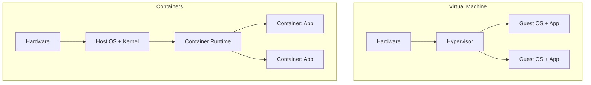

# Containers

It works on your laptop. It doesn't work on the server. The server has a different Python version, different library paths, different OS dependencies. You spend hours debugging an environment problem, not an application problem.

Containers solve this. A container is not a virtual machine. It does not boot a full OS. It packages the application together with its runtime environment and uses Linux kernel features — namespaces and cgroups — to run it in isolation.

---

## The container model

A VM virtualizes hardware — each VM runs its own full operating system. Boot time is minutes, overhead is gigabytes.

A container virtualizes the OS — containers share the host kernel. They start in milliseconds, use megabytes of overhead. The kernel uses **namespaces** to give each container its own view of the filesystem, network, and processes. It uses **cgroups** to limit how much CPU and memory each container can consume.

---

## What this section covers

**Docker** — images, Dockerfile, running containers, lifecycle, volumes, and networking. Everything you need to package and run applications in containers.

**Production containers** — multi-stage builds, minimal base images, running as non-root, container networking internals, and the kernel primitives underneath.
