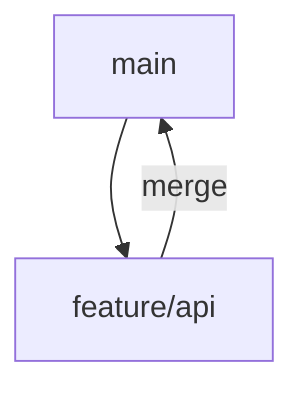

# Branching in Git

Branches let you isolate work and keep the main history clean.

## Example

```bash
git branch feature/api
git checkout feature/api
```

Alternative:

```bash
git switch -c feature/api
```

## Result

You now have a separate line of work that does not affect `main` until you merge it.

## Diagram


