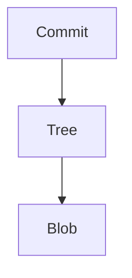

# Git Internals

Git stores commits, trees, and blobs in a local object database.

## Mental model

- Blob = file contents.
- Tree = directory listing.
- Commit = snapshot with metadata.

## Example inspection

```bash
git cat-file -p HEAD^{commit}
```

## Diagram



The commit points to a tree. The tree points to blob contents. This is how Git reconstructs files.
