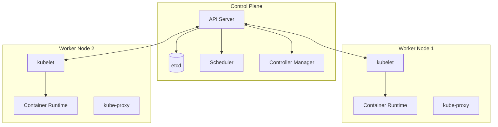
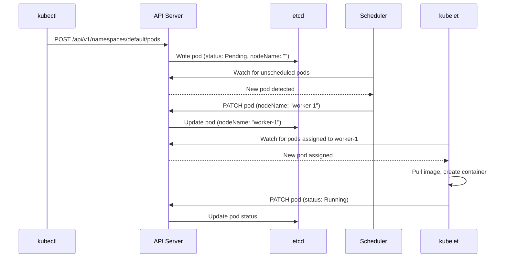

# Cluster Architecture

Most engineers learn `kubectl` before they understand what they are talking to. They apply YAML and hope. When something breaks, they have no mental model for where to look.

This page builds that model. Before you run a single command, understand what is running.

---

## The two layers

A Kubernetes cluster has two kinds of machines:

**Control plane** — the brain. Makes decisions about the cluster (scheduling, scaling, healing). Does not run application workloads.

**Worker nodes** — the workers. Run your application containers. Report state back to the control plane.



---

## Control plane components

### API Server

The single entry point for all cluster operations. Every `kubectl` command, every controller action, every kubelet heartbeat goes through the API server. It authenticates requests, validates them, and writes the result to etcd.

The API server is stateless. Multiple replicas can run simultaneously — they all read and write to the same etcd.

### etcd

The cluster's source of truth. A distributed key-value store that holds the entire cluster state: every pod spec, every deployment, every service. If etcd is lost without a backup, the cluster state is gone.

You do not interact with etcd directly. The API server manages it.

### Scheduler

Watches for pods that have been created but not yet assigned to a node. For each unscheduled pod, it selects a node based on: resource requests, node taints and tolerations, affinity rules, and available capacity.

The scheduler writes its decision to the API server. It does not start the container — that's the kubelet's job.

### Controller Manager

Runs a set of control loops that watch the cluster state and reconcile it toward the desired state.

- **Deployment controller** — if you want 3 replicas and 2 are running, create 1 more
- **ReplicaSet controller** — ensures the correct number of pods exist
- **Node controller** — notices when nodes stop responding and marks pods for eviction

Each controller watches the API server for changes and acts on them independently.

---

## Worker node components

### kubelet

The agent that runs on every worker node. It receives pod specs from the API server and ensures the containers described in those specs are running.

The kubelet does not run containers directly. It delegates to a container runtime (containerd or CRI-O).

The kubelet continuously reports pod status back to the API server. If it stops reporting, the node controller marks the node as `NotReady`.

### Container runtime

The software that actually runs containers. Docker Desktop uses `containerd`. On production clusters, `containerd` is standard. The kubelet talks to the container runtime via the CRI (Container Runtime Interface).

### kube-proxy

Runs on every node. Maintains the network rules that implement Kubernetes Services. When you create a Service with a ClusterIP, kube-proxy programs `iptables` (or `ipvs`) rules on every node so that traffic to that virtual IP gets forwarded to the correct pod.

---

## How a pod gets scheduled

This is the full flow when you run `kubectl apply -f pod.yaml`.



Nothing is peer-to-peer. Every component communicates through the API server. Every state change is written to etcd. This is what makes Kubernetes so reliable: the system is designed around eventual consistency, and every component knows how to recover from restarts.

---

## Hands-on: explore the cluster

```bash
# View cluster info
kubectl cluster-info

# View all nodes
kubectl get nodes
kubectl describe node docker-desktop

# View control plane components
kubectl get pods -n kube-system

# The control plane (on Docker Desktop) runs as pods in kube-system:
# - etcd
# - kube-apiserver
# - kube-controller-manager
# - kube-scheduler
# - kube-proxy (on each node)
# - coredns (cluster DNS)

kubectl get pods -n kube-system | grep etcd
kubectl get pods -n kube-system | grep api

# Watch the scheduler in action
kubectl run test-pod --image=nginx
kubectl get events --sort-by='.lastTimestamp' | tail -10
# You will see: Scheduled, Pulling, Pulled, Created, Started

kubectl delete pod test-pod
```

---

## Quick reference

```bash
kubectl cluster-info                    # cluster endpoints
kubectl get nodes                       # node status
kubectl describe node <name>            # node details and conditions
kubectl get pods -n kube-system         # control plane components
kubectl get events --sort-by=.metadata.creationTimestamp
kubectl top nodes                       # node resource usage
kubectl top pods                        # pod resource usage
```
