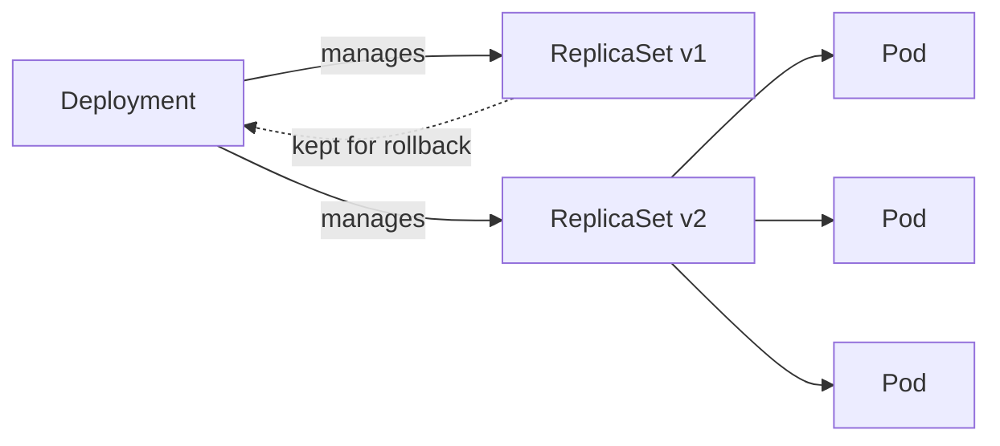
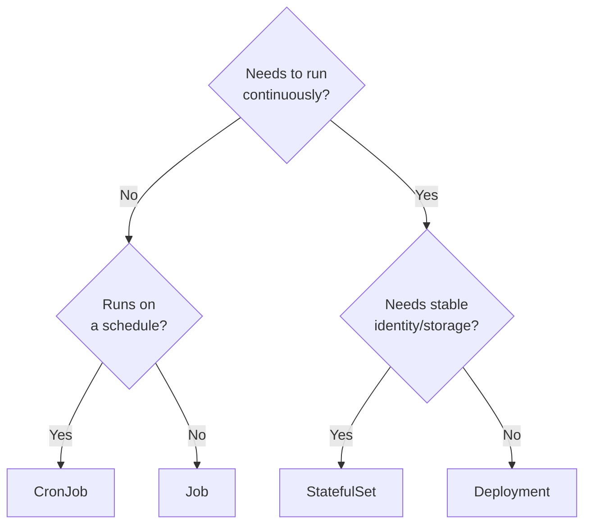

# Workloads

A pod runs your container. Simple. Done.

Until it crashes. Nobody restarts it. It is just gone. In production, that is not acceptable.

So you use a Deployment. One pod dies and another comes back. You want 3 running, it keeps 3 running. You want to roll out a new version, it replaces pods gradually without downtime.

But not everything is a stateless API. A database needs stable network identity. Pod 0 is always pod 0. Its storage stays attached to it specifically.

And some workloads should not run forever. A database migration runs once. A nightly report runs on a schedule.

Four workload types. Each one exists because the previous was not enough for a specific problem.

---

## Pod

The smallest unit Kubernetes manages. One or more containers that share a network namespace — same IP, same ports, same localhost.

In practice, most pods run exactly one container. Multi-container pods are for sidecars (log collectors, proxies) that run alongside the main container.

```bash
kubectl run nginx-pod --image=nginx
kubectl get pods
kubectl describe pod nginx-pod    # look at Events at the bottom
kubectl logs nginx-pod
kubectl exec -it nginx-pod -- sh
kubectl delete pod nginx-pod
```

Pods are not self-healing. Delete a pod and it stays deleted. That is why you almost never create pods directly. You use a Deployment.

---

## Deployment

A Deployment defines desired state: how many pods, which image, which labels. A controller watches actual state against desired state and corrects continuously.



A Deployment manages a ReplicaSet. A ReplicaSet manages pods. When you roll out a new version, the Deployment creates a new ReplicaSet and gradually shifts pods from the old one to the new one. If the rollout fails, rolling back is instant — the old ReplicaSet is still there.

```bash
# Create
kubectl create deployment demo --image=nginx

# Scale
kubectl scale deployment demo --replicas=3
kubectl get pods                           # 3 pods

# Self-healing
kubectl delete pod <any-pod>               # delete one
kubectl get pods                           # a new one appears immediately

# Roll out a new version
kubectl set image deployment/demo nginx=nginx:1.26
kubectl rollout status deployment/demo

# Roll back
kubectl rollout undo deployment/demo

# History
kubectl rollout history deployment/demo

# Labels — how the Deployment finds its pods
kubectl get pods --show-labels
kubectl get pods -l app=demo
```

---

## StatefulSet

Use StatefulSet when your pods need:
- **Stable names** — `pod-0`, `pod-1`, `pod-2` not random hashes
- **Stable DNS** — `pod-0.service.namespace.svc.cluster.local` survives restarts
- **Dedicated storage** — each pod gets its own PVC that stays attached to it
- **Ordered startup** — pod-0 starts before pod-1 starts before pod-2

These properties are what databases and distributed systems need. MySQL primary needs a stable hostname. Kafka brokers need to find each other by name. Zookeeper needs ordered startup.

```bash
# Examine the demo StatefulSet
kubectl apply -f - << 'EOF'
apiVersion: apps/v1
kind: StatefulSet
metadata:
  name: web
spec:
  serviceName: "web"
  replicas: 3
  selector:
    matchLabels:
      app: web
  template:
    metadata:
      labels:
        app: web
    spec:
      containers:
      - name: nginx
        image: nginx
EOF

kubectl get pods -w
# web-0 starts first, then web-1, then web-2

kubectl delete pod web-1
kubectl get pods
# Replacement is named web-1 again — not a random hash

kubectl delete statefulset web
```

---

## Job

A Job runs a pod to completion. When the container exits successfully, the Job is done. If it fails, the Job retries.

Use Job for: database migrations, batch processing, one-time data transforms.

```bash
# Run a job
kubectl create job hello --image=busybox -- echo "job done"

kubectl get jobs
kubectl get pods
kubectl logs job/hello           # job done

# Job with retry on failure
kubectl create job flaky \
  --image=busybox \
  -- sh -c 'exit $((RANDOM % 2))'   # randomly fail 50% of the time

kubectl describe job flaky       # watch retries
kubectl delete job hello flaky
```

---

## CronJob

A CronJob creates Jobs on a schedule. Standard cron syntax.

```bash
kubectl create cronjob report \
  --image=busybox \
  --schedule="0 2 * * *" \          # 2am every day
  -- sh -c 'echo "running report"'

# Test immediately (not waiting for schedule)
kubectl create job --from=cronjob/report report-manual

kubectl get cronjobs
kubectl get jobs
kubectl logs job/report-manual

kubectl delete cronjob report
kubectl delete job report-manual
```

---

## Choosing the right workload



---

## Quick reference

```bash
# Deployment
kubectl create deployment <name> --image=<image>
kubectl scale deployment <name> --replicas=N
kubectl set image deployment/<name> <container>=<image>
kubectl rollout status / undo / history deployment/<name>

# Pods
kubectl get pods / kubectl get pods -w
kubectl describe pod <name>
kubectl logs <name> --previous
kubectl exec -it <name> -- sh
kubectl delete pod <name>

# StatefulSet
kubectl get statefulsets
kubectl scale statefulset <name> --replicas=N

# Job / CronJob
kubectl create job <name> --image=<image> -- <command>
kubectl create cronjob <name> --image=<image> --schedule="<cron>"
kubectl get jobs / cronjobs
```
