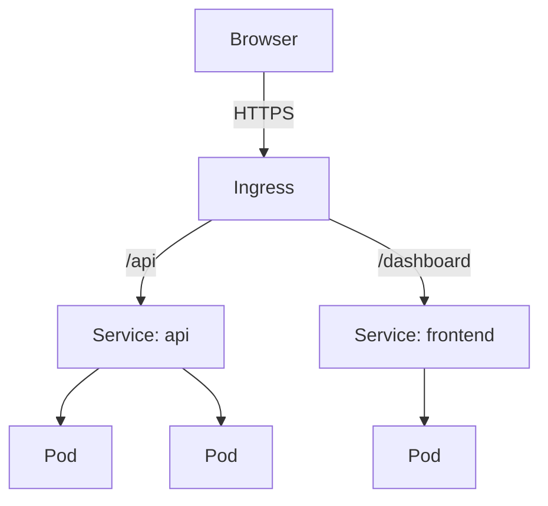

# Networking

Every time a pod restarts, it gets a new IP address.

You have 3 pods running your API. Another service needs to talk to them. Which IP do you use? They keep changing. You cannot hardcode them. You cannot track them at scale.

So you use a Service. One stable virtual IP that always finds your pods using labels, not IPs. Pods die and come back with new IPs — the Service does not care. It always finds them. It also load-balances traffic across all healthy pods automatically.

But now your app needs to be accessible from outside the cluster. So you expose it with a LoadBalancer Service. This creates a real cloud load balancer. Works perfectly. Until you have 10 services. Now you have 10 load balancers. Your cloud bill does not care that 6 of them handle almost no traffic.

So you use Ingress. One load balancer, all your services behind it, smart routing by host or path. But Ingress is just rules. Something has to execute those rules. So you add an Ingress Controller.

---

## Service types

**ClusterIP** — reachable only inside the cluster. Default. Use for internal service-to-service communication.

**NodePort** — exposes the service on a static port on every node. Accessible from outside the cluster. Fine for local development.

**LoadBalancer** — provisions a cloud load balancer. One per service. Use for production external access on cloud providers.

**Ingress** — HTTP routing layer in front of multiple services. One load balancer, routing by host or path.



---

## Hands-on

### ClusterIP — internal communication

```bash
kubectl create deployment demo --image=nginx
kubectl scale deployment demo --replicas=3
kubectl expose deployment demo --port=80

kubectl get services

# ClusterIP is only reachable from inside the cluster
kubectl run curl --image=curlimages/curl -it --rm --restart=Never -- \
  curl http://demo
# Service name 'demo' resolves via cluster DNS
```

### Change to NodePort

```bash
kubectl patch svc demo -p '{"spec":{"type":"NodePort"}}'
kubectl get services
# PORTS column shows 80:31234/TCP — open localhost:31234 in your browser
```

### Verify routing

```bash
kubectl get endpoints demo
# Shows 3 pod IPs backing this service

# Kill a pod and watch the endpoint list update
kubectl delete pod <any-demo-pod>
kubectl get endpoints demo -w   # the dead pod disappears within seconds
```

### Ingress

```bash
# Enable ingress controller (Docker Desktop / nginx)
kubectl apply -f https://raw.githubusercontent.com/kubernetes/ingress-nginx/controller-v1.10.0/deploy/static/provider/cloud/deploy.yaml

kubectl wait --namespace ingress-nginx \
  --for=condition=ready pod \
  --selector=app.kubernetes.io/component=controller \
  --timeout=120s

# Create an ingress resource
kubectl apply -f - << 'EOF'
apiVersion: networking.k8s.io/v1
kind: Ingress
metadata:
  name: demo-ingress
  annotations:
    nginx.ingress.kubernetes.io/rewrite-target: /
spec:
  ingressClassName: nginx
  rules:
  - http:
      paths:
      - path: /demo
        pathType: Prefix
        backend:
          service:
            name: demo
            port:
              number: 80
EOF

curl http://localhost/demo
```

---

## Cleanup

```bash
kubectl delete service demo
kubectl delete deployment demo
kubectl delete ingress demo-ingress --ignore-not-found
```

---

## Quick reference

```bash
kubectl expose deployment <name> --port=80                    # ClusterIP
kubectl expose deployment <name> --type=NodePort --port=80    # NodePort
kubectl get services
kubectl get endpoints <name>
kubectl describe service <name>
kubectl patch svc <name> -p '{"spec":{"type":"NodePort"}}'
kubectl delete service <name>
```
