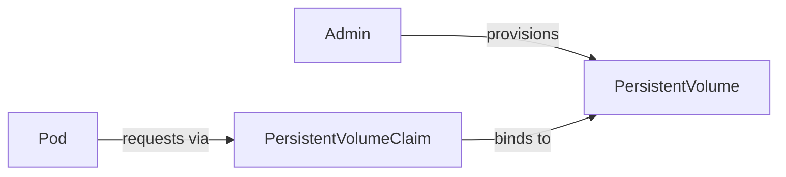

# Storage

Your container writes a file. The container crashes. Kubernetes restarts it. The file is gone.

Containers are ephemeral by design — their filesystem resets on every restart. For anything that needs to survive beyond a container's lifetime, you need a volume.

Kubernetes has two tiers:

**emptyDir** — temporary storage that lives as long as the pod. Shared between containers in the same pod. Gone when the pod is deleted. Use it for caching, scratch space, or passing data between containers in a sidecar pattern.

**PersistentVolume (PV) + PersistentVolumeClaim (PVC)** — storage that lives independently of any pod. The pod claims it; the data persists even if the pod is replaced, rescheduled, or deleted. Use it for databases, user uploads, anything stateful.

---

## How PV and PVC work



A **PersistentVolume** is a piece of storage provisioned by an admin (or dynamically by a StorageClass). It exists cluster-wide.

A **PersistentVolumeClaim** is a request from a pod for a piece of that storage. It says: "I need 1Gi, read-write." Kubernetes finds a PV that satisfies the claim and binds them together.

The pod mounts the PVC. The pod doesn't know or care where the actual storage lives — whether it's a local disk, NFS, or an EBS volume.

---

## Hands-on

### emptyDir — shared scratch space

Save as `emptydir-demo.yaml`:

```yaml
apiVersion: v1
kind: Pod
metadata:
  name: emptydir-demo
spec:
  containers:
  - name: writer
    image: busybox
    command: ["sh", "-c", "echo 'hello from writer' > /shared/data.txt; sleep 3600"]
    volumeMounts:
    - name: shared
      mountPath: /shared
  - name: reader
    image: busybox
    command: ["sh", "-c", "sleep 2; cat /shared/data.txt; sleep 3600"]
    volumeMounts:
    - name: shared
      mountPath: /shared
  volumes:
  - name: shared
    emptyDir: {}
```

```bash
kubectl apply -f emptydir-demo.yaml
kubectl logs emptydir-demo -c reader
# hello from writer
```

Two containers in one pod, sharing a directory. Neither container has a filesystem dependency on the other — they communicate through the shared volume.

### PersistentVolumeClaim — data that survives pod deletion

Save as `pvc-demo.yaml`:

```yaml
apiVersion: v1
kind: PersistentVolumeClaim
metadata:
  name: demo-pvc
spec:
  accessModes:
  - ReadWriteOnce
  resources:
    requests:
      storage: 1Gi
---
apiVersion: v1
kind: Pod
metadata:
  name: pvc-writer
spec:
  containers:
  - name: app
    image: busybox
    command: ["sh", "-c", "echo 'persistent data' > /data/output.txt; sleep 3600"]
    volumeMounts:
    - name: storage
      mountPath: /data
  volumes:
  - name: storage
    persistentVolumeClaim:
      claimName: demo-pvc
  restartPolicy: Never
```

```bash
kubectl apply -f pvc-demo.yaml
kubectl get pvc
```

```
NAME       STATUS   VOLUME     CAPACITY   ACCESS MODES   STORAGECLASS
demo-pvc   Bound    pvc-xyz    1Gi        RWO            hostpath
```

Now delete the pod and create a new one reading from the same PVC:

```bash
kubectl delete pod pvc-writer
```

Save as `pvc-reader.yaml`:

```yaml
apiVersion: v1
kind: Pod
metadata:
  name: pvc-reader
spec:
  containers:
  - name: app
    image: busybox
    command: ["sh", "-c", "cat /data/output.txt"]
    volumeMounts:
    - name: storage
      mountPath: /data
  volumes:
  - name: storage
    persistentVolumeClaim:
      claimName: demo-pvc
  restartPolicy: Never
```

```bash
kubectl apply -f pvc-reader.yaml
kubectl logs pvc-reader
# persistent data
```

The pod is gone. The data is not.

---

## Cleanup

```bash
kubectl delete pod emptydir-demo pvc-writer pvc-reader --ignore-not-found
kubectl delete pvc demo-pvc --ignore-not-found
rm emptydir-demo.yaml pvc-demo.yaml pvc-reader.yaml
```

---

## Quick reference

```bash
kubectl get pv                            # list PersistentVolumes
kubectl get pvc                           # list PersistentVolumeClaims
kubectl describe pvc <name>               # check binding status
kubectl get storageclass                  # list available storage classes
kubectl delete pvc <name>                 # release storage claim
```
