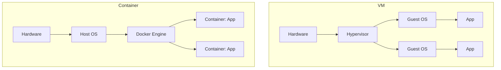

# What is Docker?

It works on your machine. It doesn't work in staging. You spend four hours debugging only to find the server has Python 3.8 and you've been developing on 3.11.

So you use Docker.

Docker packages your application together with its entire environment — the runtime, libraries, config, everything. The image runs the same way on your laptop, in CI, and in production. The "works on my machine" problem disappears.

---

## Container vs Virtual Machine

Both solve isolation. They do it differently.



A **VM** virtualizes hardware. Each VM runs its own full operating system. Boot time is minutes. Memory overhead is gigabytes.

A **container** virtualizes the OS. Containers share the host kernel. They start in milliseconds and use megabytes of overhead. The tradeoff: containers are less isolated than VMs.

---

## Key concepts

**Image** — a read-only snapshot of an application and its environment. Built once, run anywhere.

**Container** — a running instance of an image. You can run 10 containers from the same image simultaneously.

**Dockerfile** — instructions for building an image. `FROM`, `RUN`, `COPY`, `CMD`.

**Registry** — a place to store and distribute images. Docker Hub is the default. Private registries exist for enterprise use.

---

## Hands-on

### Run your first container

```bash
docker run hello-world
```

Docker pulls the `hello-world` image from Docker Hub and runs it. The container prints a message and exits.

### Run a real application

```bash
# Run nginx web server
docker run -d -p 8080:80 --name my-nginx nginx
```

- `-d` — detached (run in background)
- `-p 8080:80` — map port 8080 on your machine to port 80 in the container
- `--name my-nginx` — give it a name

Open `http://localhost:8080` — you get the nginx welcome page.

```bash
# What containers are running?
docker ps

# View logs
docker logs my-nginx

# Stop it
docker stop my-nginx

# Remove it
docker rm my-nginx
```

### Run interactively

```bash
# Shell into Ubuntu without installing it
docker run -it --rm ubuntu bash
```

You're inside a Ubuntu container. `apt install`, explore, experiment. When you exit, the container is gone. Nothing is left on your machine.

---

## Cleanup

```bash
docker stop my-nginx 2>/dev/null; docker rm my-nginx 2>/dev/null
docker rmi nginx hello-world
```

---

## Quick reference

```bash
docker run <image>                     # run a container
docker run -d -p <host>:<container>    # background + port mapping
docker ps                              # running containers
docker ps -a                           # all containers including stopped
docker logs <name>                     # container output
docker stop <name>                     # graceful stop
docker rm <name>                       # remove container
docker images                          # list local images
docker rmi <image>                     # remove image
docker pull <image>                    # pull without running
```
