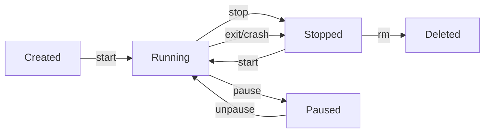

# Running Containers

`docker run` is simple for hello-world. In practice, you need to control what the container can do: which ports it listens on, what environment it sees, whether it restarts on failure, how much CPU and memory it gets.

---

## The container lifecycle



A container can be created without starting, started and stopped repeatedly, and only deleted with `docker rm`.

```bash
# Create without running
docker create --name app nginx

# Start it
docker start app

# Stop gracefully (SIGTERM, wait 10s, then SIGKILL)
docker stop app

# Force stop immediately
docker kill app

# Remove (must be stopped first)
docker rm app

# Stop and remove in one step
docker rm -f app
```

---

## Port mapping

The container has its own network namespace. To reach a service inside it, you map a port from your host to the container.

```bash
# -p <host-port>:<container-port>
docker run -d -p 8080:80 nginx            # localhost:8080 → container:80
docker run -d -p 3000:3000 my-app         # same port both sides
docker run -d -p 127.0.0.1:5432:5432 pg  # bind only on loopback (more secure)
```

```bash
# See port mappings for running containers
docker port my-nginx
docker ps                    # PORTS column
```

---

## Environment variables

Pass configuration to containers without baking it into the image.

```bash
docker run -d \
  -e DB_HOST=postgres \
  -e DB_PORT=5432 \
  -e DB_PASSWORD=secret \
  --name app my-app

# Read from a file
docker run --env-file .env my-app
```

Inside the container, these are available as regular environment variables.

---

## Restart policies

By default, stopped containers stay stopped. For production services you want automatic restarts.

```bash
# Restart unless manually stopped
docker run -d --restart unless-stopped nginx

# Always restart (including after Docker daemon restart)
docker run -d --restart always nginx

# Restart on failure, up to 5 times
docker run -d --restart on-failure:5 nginx
```

---

## Resource limits

Without limits, one container can consume all CPU and memory on the host.

```bash
# Limit memory to 512MB and CPU to half a core
docker run -d \
  --memory 512m \
  --cpus 0.5 \
  --name app nginx

# View resource usage
docker stats
docker stats --no-stream       # one-time snapshot
```

---

## Hands-on

### Run a database locally

```bash
docker run -d \
  --name postgres \
  -e POSTGRES_PASSWORD=mysecret \
  -e POSTGRES_DB=mydb \
  -p 5432:5432 \
  --restart unless-stopped \
  postgres:15

# Confirm it started
docker ps

# Connect to it
docker exec -it postgres psql -U postgres -d mydb
```

Inside the psql shell:
```sql
CREATE TABLE test (id serial, name text);
INSERT INTO test (name) VALUES ('hello');
SELECT * FROM test;
\q
```

### Shell into a running container

```bash
docker exec -it postgres bash
# Inside: ls /, cat /etc/os-release, exit
```

### Check what a container is doing

```bash
# Logs
docker logs postgres
docker logs postgres -f          # follow live
docker logs postgres --tail 20   # last 20 lines

# Stats
docker stats postgres --no-stream

# Detailed config and state
docker inspect postgres
```

---

## Cleanup

```bash
docker rm -f postgres
docker rmi postgres:15
```

---

## Quick reference

```bash
docker run -d -p <host>:<ctr> --name <n>   # run background with port and name
docker run -e KEY=VALUE                    # environment variable
docker run --restart unless-stopped        # auto-restart
docker run --memory 512m --cpus 0.5        # resource limits
docker exec -it <name> sh                  # shell into container
docker logs <name> -f                      # follow logs
docker stats                               # live resource usage
docker inspect <name>                      # full config/state
docker rm -f <name>                        # force remove running container
```
