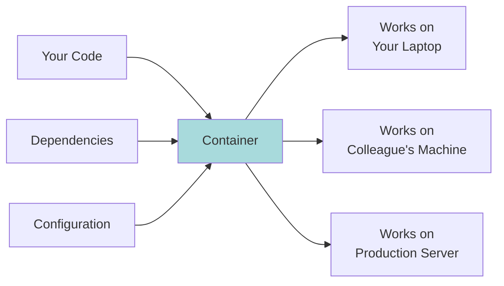
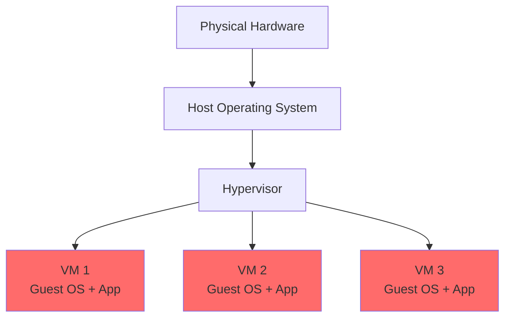
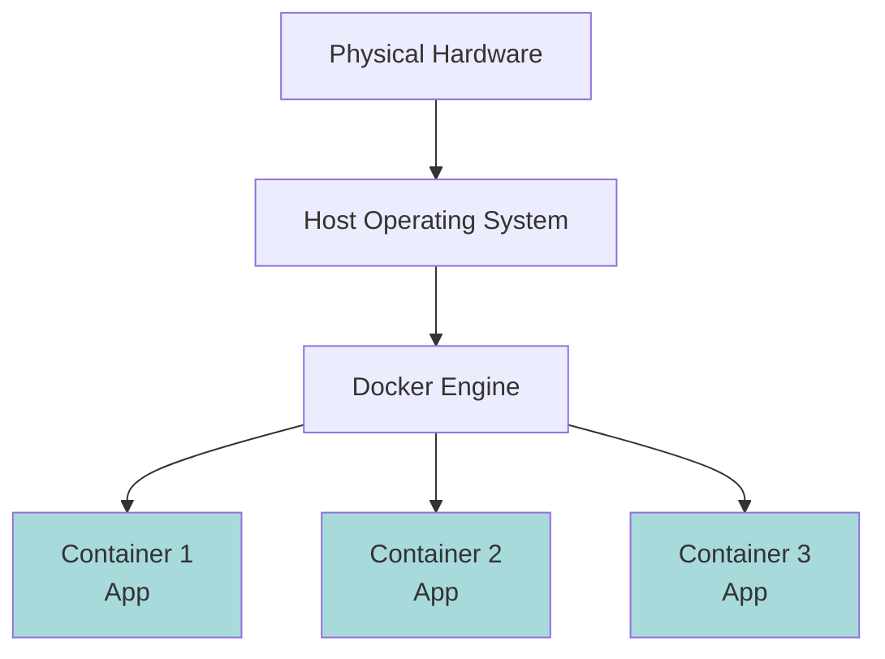
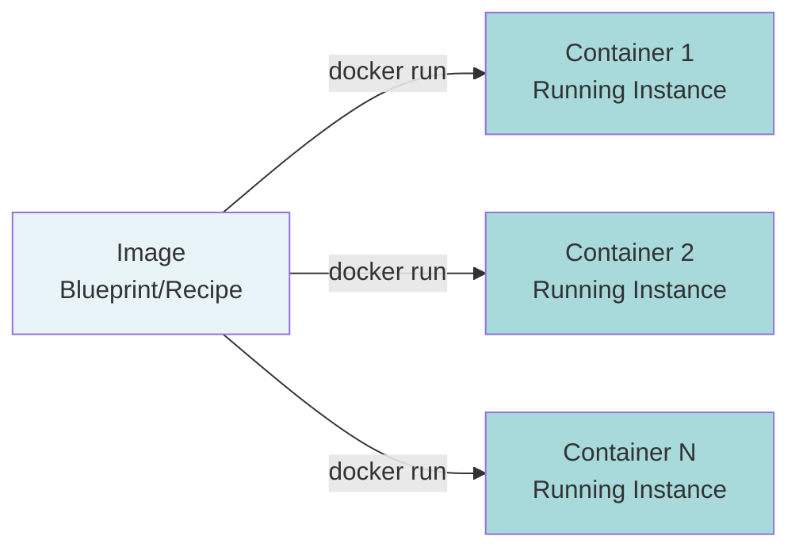
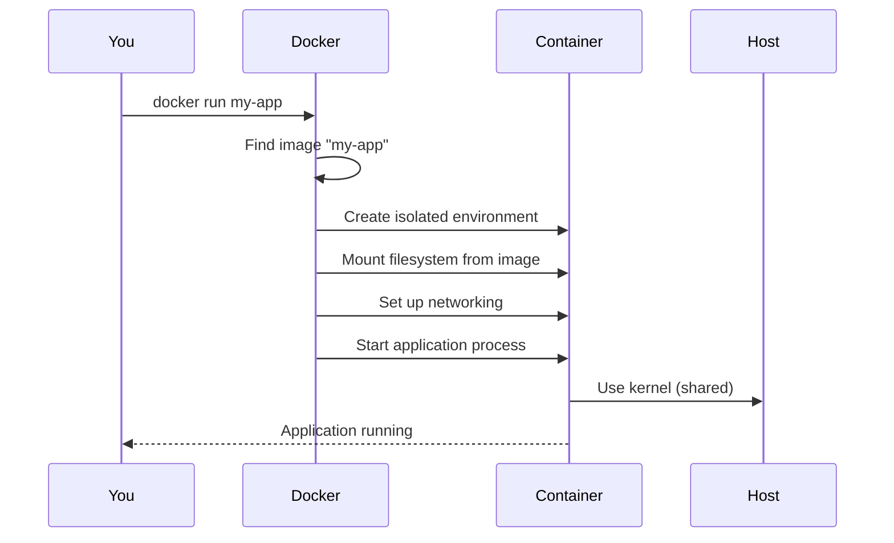
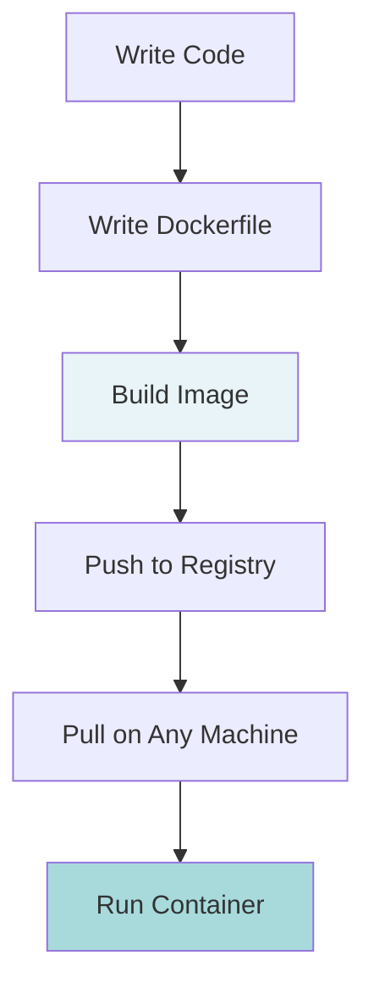

# Docker: What It Is and Why It Exists

## The Problem Docker Solves

Your code works on your laptop.

Send it to a colleague - breaks on their machine.

Deploy to a server - breaks differently.

You know this problem: "It works on my machine."

Why does this happen?

- Your colleague has Python 3.9, you have Python 3.11
- The server has different libraries installed
- Dependencies conflict with other applications
- Environment variables are different

Each environment is subtly different. Code is fragile to these differences.

Docker solves this by packaging your application with its entire environment.

## What Docker Actually Is

Docker is a tool that packages your application and everything it needs to run into a single portable unit called a **container**.

Think of it this way:



The container includes:
- Your application code
- The programming language runtime (Python, Node.js, etc.)
- All libraries your code needs
- System tools
- Configuration files

**Key insight:** The container is isolated from the host machine. It doesn't care what's installed on the host.

## How Docker Differs from Virtual Machines

You might know about virtual machines (VMs). Docker is similar but fundamentally different.

**Virtual Machine approach:**



Each VM runs a complete operating system. Heavy and slow.

**Docker approach:**



Containers share the host OS kernel. Light and fast.

**Comparison:**

| Aspect | Virtual Machine | Docker Container |
|--------|----------------|------------------|
| Size | Gigabytes (includes full OS) | Megabytes (shares OS) |
| Startup | Minutes | Seconds |
| Resource use | Heavy | Light |
| Isolation | Complete | Process-level |

**Mental model:** VMs are like separate houses. Containers are like apartments - they share infrastructure but remain isolated.

## Core Concepts

Docker has three fundamental concepts you need to understand.

### 1. Image

An image is a template. It contains:
- Base operating system (usually minimal Linux)
- Your application code
- Dependencies
- Instructions to run your application

Think of it as a recipe or blueprint.

**Key property:** Images are read-only. Once built, they don't change.

### 2. Container

A container is a running instance of an image.



**Key property:** Containers are isolated from each other and from the host.

**Analogy:** Image is a class, container is an object instance (if you know programming).

### 3. Dockerfile

A Dockerfile is a text file with instructions to build an image.

Example:
```dockerfile
FROM python:3.11
COPY app.py /app/
RUN pip install flask
CMD ["python", "/app/app.py"]
```

This says:
1. Start with Python 3.11 as base
2. Copy my code
3. Install dependencies
4. Define how to run the application

**Mental model:** Dockerfile → (build) → Image → (run) → Container

## How Docker Works: The Mental Model

When you run a Docker container, here's what happens:



**The key insight:** The container process thinks it has its own machine. But it's actually sharing the host's kernel.

This is done through Linux kernel features:
- **Namespaces:** Isolate what the process can see (network, processes, filesystem)
- **Cgroups:** Limit resources the process can use (CPU, memory)

You don't need to understand these details to use Docker, but knowing they exist helps you understand the isolation model.

## Practical Example

Let's make this concrete with a simple Python application.

**Without Docker:**

You need to:
1. Install Python on your machine
2. Install all dependencies (Flask, requests, etc.)
3. Set environment variables
4. Run the application
5. Hope the versions match production

Someone else needs to repeat all these steps on their machine.

**With Docker:**

You create a Dockerfile:
```dockerfile
FROM python:3.11-slim
WORKDIR /app
COPY requirements.txt .
RUN pip install -r requirements.txt
COPY . .
CMD ["python", "app.py"]
```

Then build an image:
```bash
docker build -t my-app .
```

Now anyone can run it:
```bash
docker run my-app
```

The environment is identical everywhere. No installation steps needed.

## Why Developers Use Docker

**Consistency:** Same environment in development, testing, and production.

**Isolation:** Multiple applications can run without conflicts. Each container is independent.

**Portability:** Works on any machine that runs Docker (Linux, Mac, Windows, cloud servers).

**Efficiency:** Containers start in seconds, use minimal resources.

**Version control:** Image versions track your application versions. You can roll back easily.

## Common Use Cases

### Development
You're building a web application that needs:
- PostgreSQL database
- Redis cache
- Your application server

Without Docker: Install and configure each on your machine. Conflicts likely.

With Docker: Run three containers. Each isolated. Clean environment.

```bash
docker run postgres
docker run redis
docker run my-app
```

### Microservices
Your application is split into services:
- User service
- Payment service
- Notification service

Each service runs in its own container. Independent deployment. Separate scaling.

### CI/CD Pipelines
Your code needs to be tested and deployed automatically.

Docker ensures tests run in the exact same environment every time. Build once, deploy anywhere.

### Legacy Applications
You have an old application that needs Python 2.7 (which is end-of-life).

Put it in a container with Python 2.7. Isolated from your modern system.

## What Docker Is Not

**Docker is not a virtual machine.** It shares the kernel with the host.

**Docker is not a security boundary.** Containers provide isolation but not complete security. Don't run untrusted code in containers without additional security layers.

**Docker is not a deployment tool.** It's a packaging tool. You need orchestration tools (like Kubernetes) for production deployment at scale.

**Docker doesn't make slow code fast.** It packages and runs your code. Performance depends on your code, not Docker.

## The Mental Model You Should Remember



1. You write code
2. You describe the environment in a Dockerfile
3. You build an image (docker build)
4. You share the image (docker push)
5. Anyone can run it (docker pull + docker run)

**The value:** Package once, run anywhere.

## Common Misconceptions

**"Docker makes things faster"**
Not true. Docker adds a thin layer. The benefit is consistency, not speed.

**"I need to know Linux to use Docker"**
Helpful but not required. Basic command line knowledge is enough to start.

**"Docker is only for big applications"**
No. Even small projects benefit from consistent environments.

**"Containers are permanent"**
No. Containers are ephemeral. Data inside containers is lost when they stop (unless you use volumes).

## When Not to Use Docker

**For simple scripts:** If you're writing a single Python script with no dependencies, Docker is overkill.

**For desktop GUI applications:** Docker is designed for server applications. Desktop apps are possible but awkward.

**When learning a language:** When you're learning Python or JavaScript, install it directly first. Add Docker later when you understand dependencies.

**For performance-critical applications:** The containerization layer adds minimal overhead, but if you're optimizing for every microsecond, bare metal is better.

## The Docker Ecosystem

Docker is part of a larger ecosystem:

**Docker Hub:** Public registry of images. Like GitHub for Docker images.

**Docker Compose:** Tool to run multiple containers together. Useful for development.

**Docker Swarm:** Built-in orchestration for multiple machines. Simple but limited.

**Kubernetes:** Advanced orchestration platform. Industry standard for production.

You start with Docker. As your needs grow, you learn these tools.

## Practical Commands You'll Use

These five commands cover 90% of daily use:

```bash
# Build an image from a Dockerfile
docker build -t my-app .

# Run a container
docker run my-app

# List running containers
docker ps

# Stop a container
docker stop container-name

# View logs
docker logs container-name
```

That's it for basics.

## Summary: Three Key Ideas

**1. Docker solves the "works on my machine" problem**
It packages your application with its environment. Consistency everywhere.

**2. Three concepts matter: Dockerfile, Image, Container**
Dockerfile is the recipe. Image is the template. Container is the running instance.

**3. Containers are lightweight, not virtual machines**
They share the host OS kernel. Fast startup, minimal resources.

## What You Should Be Able to Explain

After reading this, you should be able to explain:

- Why Docker exists (environment consistency)
- How it differs from VMs (shared kernel vs separate OS)
- The relationship between Dockerfile, image, and container
- When Docker is useful (and when it's not)

If you can explain these to someone else, you understand Docker.

---

**Remember:** Docker is a tool. It solves a specific problem (environment consistency). Use it when it makes your life easier. Ignore it when it doesn't.