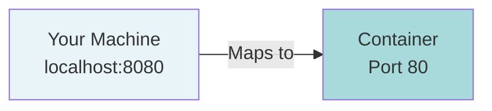
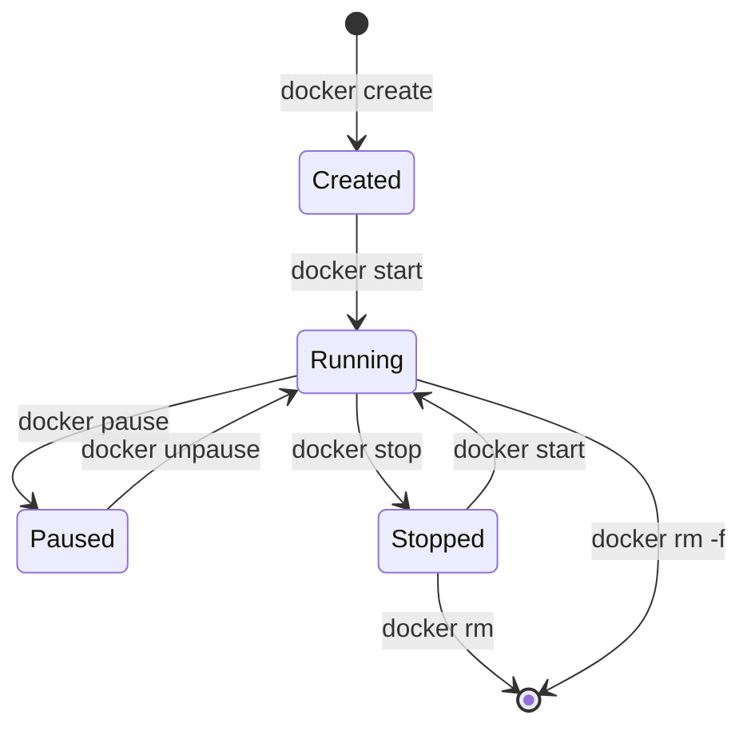

# Running Containers: Hands-on Basics

## Your First Container

Let's run something. Open your terminal:

```bash
docker run hello-world
```

**Output:**
```
Unable to find image 'hello-world:latest' locally
latest: Pulling from library/hello-world
719385e32844: Pull complete
Digest: sha256:88ec0acaa3ec199d3b7eaf73588f4518c25f9d34f58ce9a0df68429c5af48e8d
Status: Downloaded newer image for hello-world:latest

Hello from Docker!
This message shows that your installation appears to be working correctly.
```

What just happened?

1. Docker looked for an image called `hello-world` on your machine
2. Didn't find it, so pulled it from Docker Hub
3. Created a container from that image
4. Ran the container (which printed the message)
5. Container exited automatically

Run it again:

```bash
docker run hello-world
```

This time it's instant. The image is already on your machine.

**Key insight:** Docker caches images locally. First run downloads, subsequent runs reuse.

## Running a Real Application

Let's run nginx (a web server):

```bash
docker run nginx
```

**Output:**
```
Unable to find image 'nginx:latest' locally
latest: Pulling from library/nginx
a2abf6c4d29d: Pull complete
a9edb18cadd1: Pull complete
589b7251471a: Pull complete
Digest: sha256:0d17b565c37bcbd895e9d92315a05c1c3c9a29f762b011a10c54a66cd53c9b31
Status: Downloaded newer image for nginx:latest
/docker-entrypoint.sh: /docker-entrypoint.d/ is not empty, will attempt to perform configuration
/docker-entrypoint.sh: Looking for shell scripts in /docker-entrypoint.d/
2024/01/15 10:23:45 [notice] 1#1: using the "epoll" event method
2024/01/15 10:23:45 [notice] 1#1: nginx/1.25.3
2024/01/15 10:23:45 [notice] 1#1: built by gcc 12.2.0 (Debian 12.2.0-14)
2024/01/15 10:23:45 [notice] 1#1: OS: Linux 5.15.0
2024/01/15 10:23:45 [notice] 1#1: getrlimit(RLIMIT_NOFILE): 1048576:1048576
2024/01/15 10:23:45 [notice] 1#1: start worker processes
```

Your terminal is stuck. That's expected. Nginx is running in the foreground.

Press `Ctrl+C` to stop it.

**Problem:** The container blocked your terminal. You can't do anything else.

**Solution:** Run it in detached mode.

## Detached Mode: Running in Background

Add the `-d` flag:

```bash
docker run -d nginx
```

**Output:**
```
8f3a2c9b1e4d5a6f7b8c9d0e1f2a3b4c5d6e7f8a9b0c1d2e3f4a5b6c7d8e9f0
```

That long string is the container ID. The container is running in the background.

Your terminal is free. Check what's running:

```bash
docker ps
```

**Output:**
```
CONTAINER ID   IMAGE     COMMAND                  CREATED         STATUS         PORTS     NAMES
8f3a2c9b1e4d   nginx     "/docker-entrypoint.…"   10 seconds ago  Up 9 seconds   80/tcp    inspiring_tesla
```

**Understanding the output:**

- **CONTAINER ID:** First 12 characters of the full ID
- **IMAGE:** Which image was used
- **COMMAND:** What's running inside
- **CREATED:** When the container was created
- **STATUS:** Current state (Up = running)
- **PORTS:** Which ports are exposed (we'll fix this)
- **NAMES:** Random name Docker assigned

Notice the PORTS column: `80/tcp`. This means nginx is listening on port 80 inside the container. But you can't access it yet.

## Port Mapping: Accessing Your Container

Stop the running container first:

```bash
docker stop 8f3a2c9b1e4d
```

You can use the container ID or name. Shorthand works too:

```bash
docker stop 8f3
```

Docker matches partial IDs.

Now run nginx with port mapping:

```bash
docker run -d -p 8080:80 nginx
```

**What `-p 8080:80` means:**



Format: `-p HOST_PORT:CONTAINER_PORT`

Check it's running:

```bash
docker ps
```

**Output:**
```
CONTAINER ID   IMAGE     COMMAND                  CREATED          STATUS          PORTS                  NAMES
2a3b4c5d6e7f   nginx     "/docker-entrypoint.…"   5 seconds ago    Up 4 seconds    0.0.0.0:8080->80/tcp   brave_darwin
```

Now PORTS shows: `0.0.0.0:8080->80/tcp`. This means port 8080 on your machine maps to port 80 in the container.

Open your browser and go to `http://localhost:8080`

You'll see the nginx welcome page.

**Mental model:** Ports are like doorways. Without mapping, the container's door is closed to the outside. With mapping, you create a tunnel from your machine to the container.

## Naming Containers

Random names like `brave_darwin` are hard to remember. Give your containers meaningful names:

```bash
docker run -d -p 8080:80 --name my-web-server nginx
```

Check it:

```bash
docker ps
```

**Output:**
```
CONTAINER ID   IMAGE     COMMAND                  CREATED         STATUS         PORTS                  NAMES
3b4c5d6e7f8a   nginx     "/docker-entrypoint.…"   3 seconds ago   Up 2 seconds   0.0.0.0:8080->80/tcp   my-web-server
```

Now you can use the name instead of the ID:

```bash
docker stop my-web-server
docker start my-web-server
docker logs my-web-server
```

Much cleaner.

**Note:** Container names must be unique. You can't have two containers with the same name.

## Viewing Logs

Your container is running in the background. How do you see what it's doing?

```bash
docker logs my-web-server
```

**Output:**
```
/docker-entrypoint.sh: /docker-entrypoint.d/ is not empty, will attempt to perform configuration
/docker-entrypoint.sh: Looking for shell scripts in /docker-entrypoint.d/
2024/01/15 10:30:12 [notice] 1#1: using the "epoll" event method
2024/01/15 10:30:12 [notice] 1#1: nginx/1.25.3
2024/01/15 10:30:12 [notice] 1#1: start worker processes
```

Visit `http://localhost:8080` in your browser, then check logs again:

```bash
docker logs my-web-server
```

**Output:**
```
[previous logs...]
172.17.0.1 - - [15/Jan/2024:10:32:45 +0000] "GET / HTTP/1.1" 200 615 "-" "Mozilla/5.0..."
```

You'll see the HTTP request logged.

**Follow logs in real-time:**

```bash
docker logs -f my-web-server
```

The `-f` flag follows logs (like `tail -f`). Press `Ctrl+C` to stop following.

## Executing Commands Inside Containers

Sometimes you need to get inside a running container. Like SSH, but for containers.

```bash
docker exec -it my-web-server bash
```

**Output:**
```
root@3b4c5d6e7f8a:/#
```

You're now inside the container. The prompt changed.

**What the flags mean:**
- `-i`: Interactive (keep STDIN open)
- `-t`: Allocate a pseudo-TTY (makes it feel like a real terminal)

Try some commands:

```bash
ls
```

**Output:**
```
bin  boot  dev  docker-entrypoint.d  docker-entrypoint.sh  etc  home  lib  lib64  media  mnt  opt  proc  root  run  sbin  srv  sys  tmp  usr  var
```

This is the container's filesystem. Not your host machine.

Check nginx config:

```bash
cat /etc/nginx/nginx.conf
```

Check what processes are running:

```bash
ps aux
```

**Output:**
```
USER       PID %CPU %MEM    VSZ   RSS TTY      STAT START   TIME COMMAND
root         1  0.0  0.1  11224  5432 ?        Ss   10:30   0:00 nginx: master process
nginx       29  0.0  0.0  11680  2876 ?        S    10:30   0:00 nginx: worker process
root        30  0.0  0.0   4136  3524 pts/0    Ss   10:35   0:00 bash
root        39  0.0  0.0   7368  1628 pts/0    R+   10:36   0:00 ps aux
```

Notice PID 1 is nginx. In containers, your application typically runs as PID 1.

Exit the container:

```bash
exit
```

You're back on your host machine.

**Key insight:** `docker exec` runs a new process inside an existing container. The container keeps running after you exit.

## Container Lifecycle

Containers have states:



### Creating Without Running

```bash
docker create --name my-nginx -p 8080:80 nginx
```

**Output:**
```
4c5d6e7f8a9b0c1d2e3f4a5b6c7d8e9f0a1b2c3d4e5f6a7b8c9d0e1f2a3b4c5
```

Container is created but not started. Check it:

```bash
docker ps -a
```

The `-a` flag shows all containers (including stopped ones).

**Output:**
```
CONTAINER ID   IMAGE     COMMAND                  CREATED          STATUS    PORTS     NAMES
4c5d6e7f8a9b   nginx     "/docker-entrypoint.…"   5 seconds ago    Created             my-nginx
```

STATUS is "Created", not "Up".

Start it:

```bash
docker start my-nginx
```

Now it's running.

### Stopping and Starting

```bash
docker stop my-nginx
```

The container stops gracefully. Nginx gets SIGTERM, has 10 seconds to shut down cleanly.

```bash
docker start my-nginx
```

Starts the same container again. Same ID, same name, same configuration.

**Important distinction:** `docker run` creates a new container. `docker start` resumes an existing one.

### Restarting

```bash
docker restart my-nginx
```

This is `docker stop` followed by `docker start`. Useful when you want to reset the container's state.

### Removing Containers

```bash
docker stop my-nginx
docker rm my-nginx
```

Container is gone. Check:

```bash
docker ps -a
```

It won't appear anymore.

**Shortcut to force remove running container:**

```bash
docker rm -f my-nginx
```

This stops and removes in one command.

## Cleaning Up

Stopped containers stick around until you remove them. Check all containers:

```bash
docker ps -a
```

You might see many stopped containers. Remove them all:

```bash
docker container prune
```

**Output:**
```
WARNING! This will remove all stopped containers.
Are you sure you want to continue? [y/N] y
Deleted Containers:
8f3a2c9b1e4d5a6f7b8c9d0e1f2a3b4c5d6e7f8a9b0c1d2e3f4a5b6c7d8e9f0
2a3b4c5d6e7f8a9b0c1d2e3f4a5b6c7d8e9f0a1b2c3d4e5f6a7b8c9d0e1f2a3

Total reclaimed space: 127MB
```

All stopped containers are removed.

## Environment Variables

Pass environment variables to containers with `-e`:

```bash
docker run -d --name my-postgres \
  -e POSTGRES_PASSWORD=mysecretpassword \
  -p 5432:5432 \
  postgres
```

Check logs:

```bash
docker logs my-postgres
```

**Output:**
```
The files belonging to this database system will be owned by user "postgres".
This user must also own the server process.

PostgreSQL init process complete; ready for start up.

2024-01-15 10:45:22.123 UTC [1] LOG:  starting PostgreSQL 16.1
2024-01-15 10:45:22.456 UTC [1] LOG:  listening on IPv4 address "0.0.0.0", port 5432
2024-01-15 10:45:22.789 UTC [1] LOG:  database system is ready to accept connections
```

PostgreSQL is running with your password.

**Multiple environment variables:**

```bash
docker run -d --name my-app \
  -e DATABASE_URL=postgres://localhost/mydb \
  -e API_KEY=abc123 \
  -e DEBUG=true \
  my-app-image
```

## Automatic Restart Policies

Containers stop when their main process exits. Sometimes you want them to restart automatically.

```bash
docker run -d --name my-app --restart unless-stopped nginx
```

**Restart policies:**

| Policy | Behavior |
|--------|----------|
| `no` | Never restart (default) |
| `on-failure` | Restart if container exits with error |
| `always` | Always restart if stopped |
| `unless-stopped` | Always restart unless explicitly stopped |

**Example: on-failure with retry limit:**

```bash
docker run -d --restart on-failure:3 my-app
```

Restart up to 3 times if it crashes.

**Mental model:** `unless-stopped` is what you want for services that should survive machine reboots.

## Resource Limits

Containers can consume all your CPU and memory. Limit them:

```bash
docker run -d --name limited-nginx \
  --memory="256m" \
  --cpus="0.5" \
  nginx
```

**What this means:**
- `--memory="256m"`: Maximum 256MB of RAM
- `--cpus="0.5"`: Maximum 50% of one CPU core

The container can't use more than these limits.

Check resource usage:

```bash
docker stats limited-nginx
```

**Output:**
```
CONTAINER ID   NAME            CPU %     MEM USAGE / LIMIT   MEM %     NET I/O       BLOCK I/O   PIDS
5d6e7f8a9b0c   limited-nginx   0.01%     3.2MiB / 256MiB     1.25%     1.2kB / 0B    0B / 0B     3
```

Press `Ctrl+C` to exit.

**Real-time stats for all containers:**

```bash
docker stats
```

## Volumes: Persistent Data

Containers are ephemeral. When you remove a container, its data is gone.

Test this:

```bash
docker run -it --name temp-ubuntu ubuntu bash
```

Inside the container:

```bash
echo "Important data" > /data.txt
cat /data.txt
```

**Output:**
```
Important data
```

Exit:

```bash
exit
```

Remove the container:

```bash
docker rm temp-ubuntu
```

Run it again:

```bash
docker run -it --name temp-ubuntu ubuntu bash
cat /data.txt
```

**Output:**
```
cat: /data.txt: No such file or directory
```

The file is gone. New container, fresh filesystem.

**Solution: Volumes**

Create a volume:

```bash
docker volume create my-data
```

Run a container with the volume:

```bash
docker run -it --name persistent-ubuntu -v my-data:/data ubuntu bash
```

Inside the container:

```bash
echo "Important data" > /data/file.txt
cat /data/file.txt
exit
```

Remove the container:

```bash
docker rm persistent-ubuntu
```

Run a new container with the same volume:

```bash
docker run -it --name another-ubuntu -v my-data:/data ubuntu bash
cat /data/file.txt
```

**Output:**
```
Important data
```

The data persisted!

**Mental model:** Volumes are like external hard drives. Containers come and go, but volumes stay.

## Bind Mounts: Using Host Files

Sometimes you want to use files from your host machine.

Create a directory:

```bash
mkdir ~/my-website
echo "<h1>Hello from bind mount</h1>" > ~/my-website/index.html
```

Run nginx with a bind mount:

```bash
docker run -d --name my-site \
  -p 8080:80 \
  -v ~/my-website:/usr/share/nginx/html \
  nginx
```

Visit `http://localhost:8080` - you'll see your HTML.

Edit the file on your host:

```bash
echo "<h1>Updated content</h1>" > ~/my-website/index.html
```

Refresh your browser. The change appears immediately.

**Key difference:**
- **Volume:** Managed by Docker, stored in Docker's storage
- **Bind mount:** Direct link to host filesystem

**Use volumes for:** Database data, application state

**Use bind mounts for:** Development (live code reloading)

## Common Patterns

### Run and remove automatically

```bash
docker run --rm -it ubuntu bash
```

The `--rm` flag removes the container when it exits. Useful for one-off tasks.

### Interactive containers

```bash
docker run -it python:3.11 python
```

Starts Python REPL inside a container. Great for testing.

### Run a specific command

```bash
docker run ubuntu ls /etc
```

Runs `ls /etc` inside Ubuntu container, shows output, exits.

### Background job

```bash
docker run -d --name backup-job my-backup-script
```

Runs your backup script in the background.

## Inspecting Containers

Get detailed information about a container:

```bash
docker inspect my-web-server
```

**Output:** (truncated)
```json
[
    {
        "Id": "3b4c5d6e7f8a...",
        "Created": "2024-01-15T10:30:12.123Z",
        "Path": "/docker-entrypoint.sh",
        "Args": [
            "nginx",
            "-g",
            "daemon off;"
        ],
        "State": {
            "Status": "running",
            "Running": true,
            "Paused": false,
            "Restarting": false,
            "OOMKilled": false,
            "Dead": false,
            "Pid": 12345,
            "ExitCode": 0,
            "StartedAt": "2024-01-15T10:30:12.456Z"
        },
        "NetworkSettings": {
            "IPAddress": "172.17.0.2",
            "Ports": {
                "80/tcp": [
                    {
                        "HostIp": "0.0.0.0",
                        "HostPort": "8080"
                    }
                ]
            }
        }
    }
]
```

Useful for debugging. You can filter with `--format`:

```bash
docker inspect --format='{{.State.Status}}' my-web-server
```

**Output:**
```
running
```

## Quick Reference

### Most used commands

```bash
# Run container
docker run [OPTIONS] IMAGE [COMMAND]

# Common options
-d              # Detached mode (background)
-p 8080:80      # Port mapping
--name my-app   # Name the container
-e VAR=value    # Environment variable
-v vol:/path    # Volume mount
--rm            # Remove after exit
-it             # Interactive terminal

# Container management
docker ps                  # List running containers
docker ps -a               # List all containers
docker stop CONTAINER      # Stop container
docker start CONTAINER     # Start stopped container
docker restart CONTAINER   # Restart container
docker rm CONTAINER        # Remove container
docker rm -f CONTAINER     # Force remove running container

# Logs and execution
docker logs CONTAINER      # View logs
docker logs -f CONTAINER   # Follow logs
docker exec -it CONTAINER bash  # Get shell inside

# Cleanup
docker container prune     # Remove all stopped containers
docker system prune        # Remove unused data
```

## What You Should Understand

After working through these examples, you should grasp:

**Container lifecycle:** Created → Running → Stopped → Removed

**Port mapping:** How containers expose services to your host

**Detached vs interactive:** When to run in background vs foreground

**Persistence:** Why containers lose data and how volumes solve this

**Resource control:** How to limit CPU and memory usage

If you can spin up a container, map its ports, check its logs, and exec into it, you're operational with Docker containers.

---

**Remember:** Running containers is the daily work of Docker. These commands will become muscle memory. The concepts - isolation, port mapping, volumes - are what matter long-term.