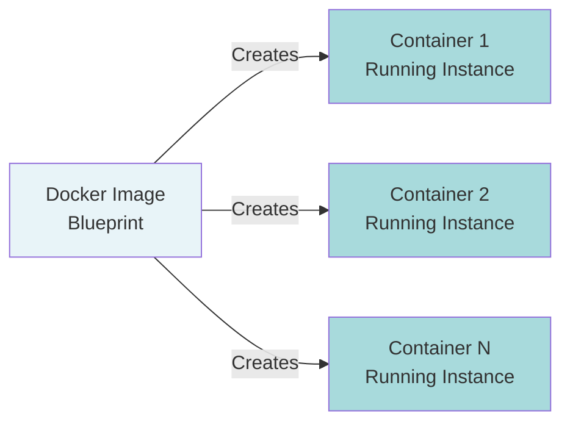
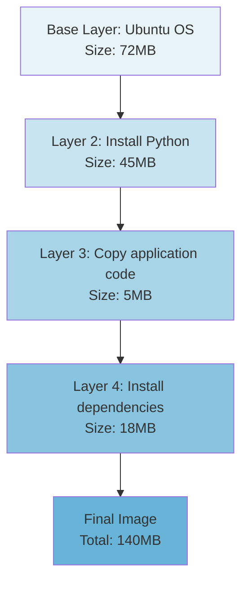
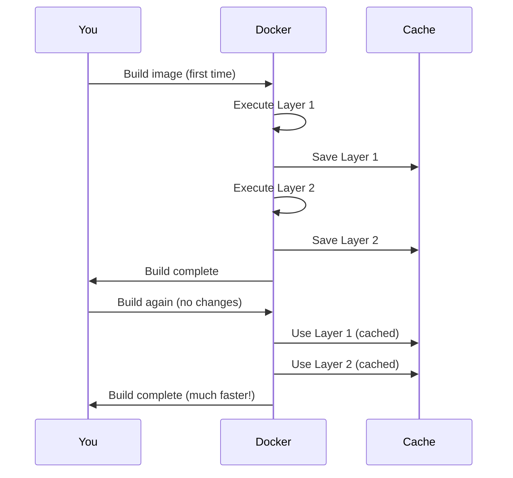
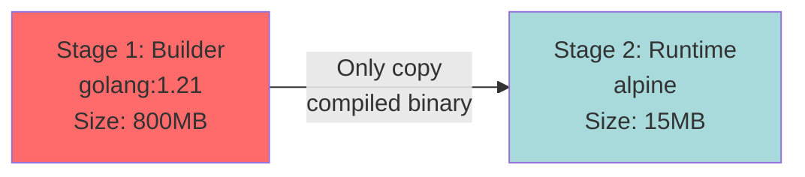
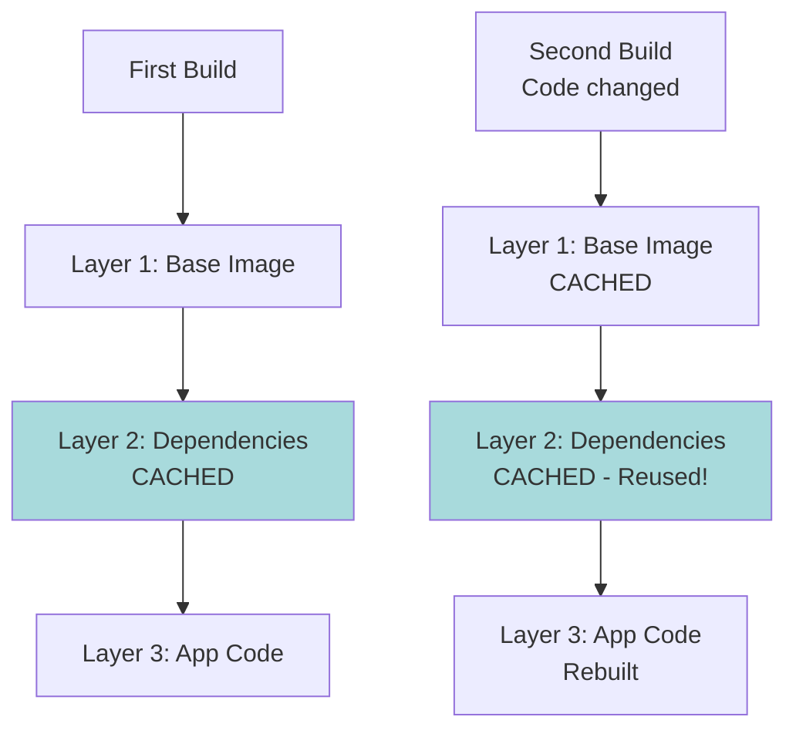
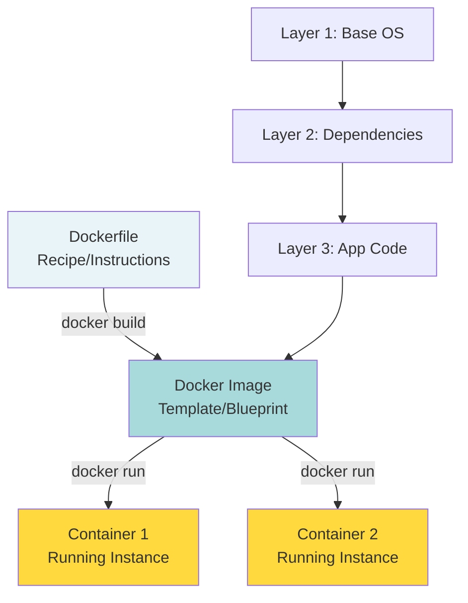

# Docker Fundamentals: Images, Layers, and Dockerfiles

## What You'll Learn

By the end of this guide, you'll understand:
- What Docker images actually are (not just theory)
- How layers work and why they matter
- How to write effective Dockerfiles
- Practical commands with real output examples

**Time Required:** 30-45 minutes

**Prerequisites:** Basic command line knowledge

---

## Part 1: Understanding Docker Images

### What is a Docker Image?

Think of a Docker image as a **template** or **blueprint** for creating containers. It's like a recipe that contains:
- The operating system (usually a lightweight Linux)
- Your application code
- Dependencies your application needs
- Configuration files
- Commands to run your application



**Mental Note:** An image is read-only and immutable. Once created, it doesn't change. Containers are running instances created from images.

### Seeing Images in Action

Let's start with something practical. First, check what images you have:

```bash
docker images
```

**Output (if you're just starting):**
```
REPOSITORY    TAG       IMAGE ID       CREATED       SIZE
```

The output is empty because you don't have any images yet. Let's pull one:

```bash
docker pull nginx
```

**Output:**
```
Using default tag: latest
latest: Pulling from library/nginx
a2abf6c4d29d: Pull complete
a9edb18cadd1: Pull complete
589b7251471a: Pull complete
186b1aaa4aa6: Pull complete
b4df32aa5a72: Pull complete
a0bcbecc962e: Pull complete
Digest: sha256:0d17b565c37bcbd895e9d92315a05c1c3c9a29f762b011a10c54a66cd53c9b31
Status: Downloaded newer image for nginx:latest
docker.io/library/nginx:latest
```

**What just happened?**
- Docker downloaded the nginx web server image
- Each line starting with a hash (like `a2abf6c4d29d`) is a layer being downloaded
- The image was pulled from Docker Hub (the default registry)

Now check your images again:

```bash
docker images
```

**Output:**
```
REPOSITORY   TAG       IMAGE ID       CREATED        SIZE
nginx        latest    605c77e624dd   2 weeks ago    141MB
```

**Understanding the output:**
- **REPOSITORY:** Name of the image (nginx)
- **TAG:** Version label (latest means most recent)
- **IMAGE ID:** Unique identifier (like a fingerprint)
- **CREATED:** When this image was built
- **SIZE:** How much disk space it uses

**Mental Note:** Images are stored locally after pulling. You only download them once, then reuse them.

---

## Part 2: Understanding Layers

### The Layer Concept

Docker images are built in layers, stacked on top of each other. Each layer represents a change or addition to the filesystem.



**Why Layers Matter:**

1. **Efficiency:** Layers are reused across images
2. **Speed:** Only changed layers need to be downloaded/uploaded
3. **Storage:** Common layers are shared, saving disk space

### Seeing Layers in Practice

Let's inspect the nginx image to see its layers:

```bash
docker history nginx
```

**Output:**
```
IMAGE          CREATED        CREATED BY                                      SIZE      COMMENT
605c77e624dd   2 weeks ago    CMD ["nginx" "-g" "daemon off;"]                0B        
<missing>      2 weeks ago    STOPSIGNAL SIGQUIT                              0B        
<missing>      2 weeks ago    EXPOSE map[80/tcp:{}]                           0B        
<missing>      2 weeks ago    ENTRYPOINT ["/docker-entrypoint.sh"]            0B        
<missing>      2 weeks ago    COPY docker-entrypoint.sh / # buildkit          1.2kB     
<missing>      2 weeks ago    RUN /bin/sh -c set -x     && addgroup --syst…   61MB      
<missing>      2 weeks ago    ENV PKG_RELEASE=1~bookworm                      0B        
<missing>      2 weeks ago    ENV NJS_VERSION=0.8.2                           0B        
<missing>      2 weeks ago    ENV NGINX_VERSION=1.25.3                        0B        
<missing>      2 weeks ago    LABEL maintainer=NGINX Docker Maintainers <d…   0B        
<missing>      2 weeks ago    /bin/sh -c #(nop)  CMD ["bash"]                 0B        
<missing>      2 weeks ago    /bin/sh -c #(nop) ADD file:d0447c4be323c89c7…   74.8MB   
```

**Understanding the output:**
- Each row is a layer
- **SIZE:** Shows what each layer added (0B means just metadata)
- The largest layers are actual file changes (74.8MB base OS, 61MB nginx installation)
- Layers are listed from newest (top) to oldest (bottom)

### Layer Caching: A Powerful Feature

When you build an image, Docker caches each layer. If nothing changes, Docker reuses the cached layer instead of rebuilding.



**Mental Note:** Order matters! Put things that change frequently at the bottom of your Dockerfile, and stable things at the top.

---

## Part 3: Writing Your First Dockerfile

### What is a Dockerfile?

A Dockerfile is a text file containing instructions for building a Docker image. Think of it as a recipe.

### Basic Dockerfile Structure

```dockerfile
# Start from a base image
FROM ubuntu:22.04

# Set working directory
WORKDIR /app

# Copy files
COPY . .

# Install dependencies
RUN apt-get update && apt-get install -y python3

# Define what runs when container starts
CMD ["python3", "app.py"]
```

Let's break down each instruction:

| Instruction | Purpose | Example |
|-------------|---------|---------|
| `FROM` | Specifies base image | `FROM python:3.11` |
| `WORKDIR` | Sets working directory | `WORKDIR /app` |
| `COPY` | Copies files from host to image | `COPY app.py .` |
| `RUN` | Executes commands during build | `RUN pip install flask` |
| `CMD` | Default command when container starts | `CMD ["python", "app.py"]` |
| `EXPOSE` | Documents which port to use | `EXPOSE 8000` |
| `ENV` | Sets environment variables | `ENV DEBUG=true` |

### Hands-On: Build a Simple Python App

**Step 1: Create your project directory**

```bash
mkdir my-first-docker-app
cd my-first-docker-app
```

**Step 2: Create a simple Python application**

Create a file named `app.py`:

```python
# app.py
print("Hello from Docker!")
print("This is my first containerized application.")

import time
for i in range(5):
    print(f"Running... {i+1}")
    time.sleep(1)

print("Application finished!")
```

**Step 3: Create a Dockerfile**

Create a file named `Dockerfile` (no extension):

```dockerfile
# Use Python 3.11 as base image
FROM python:3.11-slim

# Set the working directory inside the container
WORKDIR /app

# Copy our application file into the container
COPY app.py .

# This is what runs when the container starts
CMD ["python", "app.py"]
```

**Step 4: Build the image**

```bash
docker build -t my-python-app .
```

**Output:**
```
[+] Building 12.3s (8/8) FINISHED
 => [internal] load build definition from Dockerfile                       0.0s
 => => transferring dockerfile: 285B                                       0.0s
 => [internal] load .dockerignore                                          0.0s
 => => transferring context: 2B                                            0.0s
 => [internal] load metadata for docker.io/library/python:3.11-slim        2.1s
 => [1/3] FROM docker.io/library/python:3.11-slim@sha256:abc123...         8.2s
 => => resolve docker.io/library/python:3.11-slim@sha256:abc123...         0.0s
 => => sha256:abc123... 1.65kB / 1.65kB                                    0.0s
 => => sha256:def456... 6.15kB / 6.15kB                                    0.0s
 => => sha256:ghi789... 49.59MB / 49.59MB                                  4.2s
 => => extracting sha256:ghi789...                                         3.8s
 => [internal] load build context                                          0.0s
 => => transferring context: 245B                                          0.0s
 => [2/3] WORKDIR /app                                                     0.3s
 => [3/3] COPY app.py .                                                    0.0s
 => exporting to image                                                     0.1s
 => => exporting layers                                                    0.1s
 => => writing image sha256:xyz123...                                      0.0s
 => => naming to docker.io/library/my-python-app                           0.0s
```

**Understanding the build output:**
- `[1/3]`, `[2/3]`, `[3/3]` correspond to each instruction in your Dockerfile
- The `FROM` instruction takes longest (downloading base image)
- Subsequent builds will be faster due to caching

**Let's verify the image was created:**

```bash
docker images
```

**Output:**
```
REPOSITORY       TAG       IMAGE ID       CREATED          SIZE
my-python-app    latest    xyz123abc      10 seconds ago   125MB
nginx            latest    605c77e624dd   2 weeks ago      141MB
python           3.11-slim abc789def      3 weeks ago      125MB
```

Notice:
- Your new image `my-python-app` appears
- The `python:3.11-slim` base image is also listed (pulled during build)
- Both are 125MB because your app barely adds any size

**Step 5: Run your container**

```bash
docker run my-python-app
```

**Output:**
```
Hello from Docker!
This is my first containerized application.
Running... 1
Running... 2
Running... 3
Running... 4
Running... 5
Application finished!
```

**Mental Note:** You just built and ran your first containerized application! The entire Python environment and your code are packaged together.

---

## Part 4: Advanced Dockerfile Techniques

### Multi-Stage Builds

Sometimes you need tools to build your application but don't need them in the final image. Multi-stage builds solve this.

**Example: Building a Go application**

```dockerfile
# Stage 1: Build the application
FROM golang:1.21 AS builder
WORKDIR /app
COPY . .
RUN go build -o myapp

# Stage 2: Create minimal runtime image
FROM alpine:latest
WORKDIR /app
COPY --from=builder /app/myapp .
CMD ["./myapp"]
```

**What happens here:**



**Result:** Final image is 15MB instead of 800MB!

**Mental Note:** Use multi-stage builds to keep final images small. Build tools stay in the builder stage; only the result goes to the final image.

### Layer Optimization Example

**Bad Dockerfile (inefficient layering):**

```dockerfile
FROM python:3.11-slim
WORKDIR /app

# This invalidates cache every time app.py changes
COPY . .
RUN pip install -r requirements.txt

CMD ["python", "app.py"]
```

**Good Dockerfile (optimized layering):**

```dockerfile
FROM python:3.11-slim
WORKDIR /app

# Copy and install dependencies first (changes rarely)
COPY requirements.txt .
RUN pip install -r requirements.txt

# Copy application code last (changes frequently)
COPY . .

CMD ["python", "app.py"]
```

**Why this is better:**



**Mental Note:** Put stable, slow-to-change items early in your Dockerfile. Put fast-changing items (like your source code) at the end.

---

## Part 5: Practical Examples

### Example 1: Node.js Application

**Project structure:**
```
my-node-app/
  ├── package.json
  ├── package-lock.json
  ├── app.js
  └── Dockerfile
```

**package.json:**
```json
{
  "name": "my-node-app",
  "version": "1.0.0",
  "dependencies": {
    "express": "^4.18.0"
  },
  "scripts": {
    "start": "node app.js"
  }
}
```

**app.js:**
```javascript
const express = require('express');
const app = express();

app.get('/', (req, res) => {
  res.send('Hello from Node.js in Docker!');
});

app.listen(3000, () => {
  console.log('Server running on port 3000');
});
```

**Dockerfile:**
```dockerfile
# Use official Node.js image
FROM node:18-alpine

# Set working directory
WORKDIR /app

# Copy package files first
COPY package*.json ./

# Install dependencies
RUN npm install

# Copy application code
COPY . .

# Expose the port
EXPOSE 3000

# Start the application
CMD ["npm", "start"]
```

**Build and run:**

```bash
docker build -t my-node-app .
docker run -p 3000:3000 my-node-app
```

**Output:**
```
Server running on port 3000
```

Now visit `http://localhost:3000` in your browser!

**Understanding the `-p` flag:**
- `-p 3000:3000` maps port 3000 on your machine to port 3000 in the container
- Format: `-p HOST_PORT:CONTAINER_PORT`

### Example 2: Flask Web Application

**Project structure:**
```
my-flask-app/
  ├── requirements.txt
  ├── app.py
  └── Dockerfile
```

**requirements.txt:**
```
Flask==3.0.0
```

**app.py:**
```python
from flask import Flask
app = Flask(__name__)

@app.route('/')
def hello():
    return '<h1>Hello from Flask in Docker!</h1>'

if __name__ == '__main__':
    app.run(host='0.0.0.0', port=5000)
```

**Dockerfile:**
```dockerfile
FROM python:3.11-slim

WORKDIR /app

# Copy and install dependencies
COPY requirements.txt .
RUN pip install --no-cache-dir -r requirements.txt

# Copy application
COPY app.py .

EXPOSE 5000

CMD ["python", "app.py"]
```

**Build and run:**

```bash
docker build -t my-flask-app .
docker run -p 5000:5000 my-flask-app
```

**Output:**
```
 * Serving Flask app 'app'
 * Debug mode: off
WARNING: This is a development server. Do not use it in a production deployment.
 * Running on all addresses (0.0.0.0)
 * Running on http://127.0.0.1:5000
 * Running on http://172.17.0.2:5000
Press CTRL+C to quit
```

Visit `http://localhost:5000` to see your app!

---

## Part 6: Essential Docker Commands Reference

### Image Management

```bash
# List all images
docker images

# Pull an image from Docker Hub
docker pull ubuntu:22.04

# Remove an image
docker rmi nginx

# Remove unused images
docker image prune

# View image details
docker inspect nginx

# Tag an image
docker tag my-app:latest my-app:v1.0
```

### Building Images

```bash
# Build from current directory
docker build -t my-app .

# Build with specific Dockerfile
docker build -t my-app -f Dockerfile.prod .

# Build without cache
docker build --no-cache -t my-app .

# Build with build arguments
docker build --build-arg VERSION=1.0 -t my-app .
```

### Container Operations

```bash
# Run a container
docker run my-app

# Run in background (detached mode)
docker run -d my-app

# Run with port mapping
docker run -p 8080:80 nginx

# Run with name
docker run --name my-container nginx

# Run with volume mount
docker run -v /host/path:/container/path my-app

# List running containers
docker ps

# List all containers (including stopped)
docker ps -a

# Stop a container
docker stop my-container

# Remove a container
docker rm my-container

# View container logs
docker logs my-container

# Execute command in running container
docker exec -it my-container bash
```

### Cleanup Commands

```bash
# Remove all stopped containers
docker container prune

# Remove all unused images
docker image prune -a

# Remove all unused volumes
docker volume prune

# Remove everything unused
docker system prune -a
```

---

## Part 7: Common Pitfalls and Solutions

### Pitfall 1: Large Image Sizes

**Problem:** Your image is 2GB for a simple application.

**Solution:**
- Use slim or alpine base images
- Use multi-stage builds
- Clean up in the same RUN command

```dockerfile
# Bad - Creates multiple layers with cache
FROM ubuntu:22.04
RUN apt-get update
RUN apt-get install -y python3
RUN apt-get clean

# Good - Single layer, cleans up in same step
FROM ubuntu:22.04
RUN apt-get update && \
    apt-get install -y python3 && \
    apt-get clean && \
    rm -rf /var/lib/apt/lists/*
```

### Pitfall 2: Rebuilding Dependencies Every Time

**Problem:** Every code change reinstalls all dependencies.

**Solution:** Copy dependency files first.

```dockerfile
# Bad
COPY . .
RUN pip install -r requirements.txt

# Good
COPY requirements.txt .
RUN pip install -r requirements.txt
COPY . .
```

### Pitfall 3: Running as Root

**Problem:** Container runs as root user (security risk).

**Solution:** Create and use a non-root user.

```dockerfile
FROM python:3.11-slim

# Create a non-root user
RUN useradd -m -u 1000 appuser

WORKDIR /app
COPY requirements.txt .
RUN pip install -r requirements.txt

COPY . .

# Switch to non-root user
USER appuser

CMD ["python", "app.py"]
```

---

## Part 8: Mental Model Summary

### The Complete Picture



### Key Takeaways

**1. Images are layered**
- Each Dockerfile instruction creates a layer
- Layers are cached and reused
- Order matters for efficiency

**2. Dockerfile best practices**
- Put stable things first (dependencies)
- Put changing things last (code)
- Use specific base image versions
- Clean up in the same RUN command

**3. Keep images small**
- Use alpine or slim variants
- Use multi-stage builds
- Remove unnecessary files

**4. Security matters**
- Don't run as root
- Don't include secrets in images
- Use official base images
- Keep base images updated

---

## Practice Exercises

### Exercise 1: Build a Simple Static Website

Create a Dockerfile that serves a static HTML page with nginx.

**Solution:**
```dockerfile
FROM nginx:alpine
COPY index.html /usr/share/nginx/html/
EXPOSE 80
```

### Exercise 2: Multi-Stage Build

Create a multi-stage build for a simple Go application.

**Solution:**
```dockerfile
# Build stage
FROM golang:1.21 AS builder
WORKDIR /app
COPY main.go .
RUN go build -o app main.go

# Runtime stage
FROM alpine:latest
WORKDIR /app
COPY --from=builder /app/app .
CMD ["./app"]
```

### Exercise 3: Optimized Python App

Create an optimized Dockerfile for a Python application with dependencies.

**Solution:**
```dockerfile
FROM python:3.11-slim

RUN useradd -m -u 1000 appuser

WORKDIR /app

COPY requirements.txt .
RUN pip install --no-cache-dir -r requirements.txt

COPY . .

USER appuser

CMD ["python", "app.py"]
```

---

## Quick Reference Card

### Most Common Commands

| Task | Command |
|------|---------|
| Build image | `docker build -t name .` |
| Run container | `docker run name` |
| Run in background | `docker run -d name` |
| Map ports | `docker run -p 8080:80 name` |
| List images | `docker images` |
| List containers | `docker ps` |
| Stop container | `docker stop container-name` |
| View logs | `docker logs container-name` |
| Execute command | `docker exec -it container-name bash` |
| Remove image | `docker rmi image-name` |

### Dockerfile Instructions

| Instruction | Purpose |
|-------------|---------|
| FROM | Set base image |
| WORKDIR | Set working directory |
| COPY | Copy files to image |
| RUN | Execute command during build |
| CMD | Default command for container |
| EXPOSE | Document port usage |
| ENV | Set environment variable |

---

## Final Thoughts

You now understand:
- What Docker images are and how they work
- How layers improve efficiency and speed
- How to write effective Dockerfiles
- Common patterns and best practices

**Next Steps:**
1. Practice building images for your own applications
2. Explore Docker Compose for multi-container applications
3. Learn about Docker registries and image distribution
4. Study container orchestration with Kubernetes

Remember: Docker is a tool to make deployment easier. Start simple, and gradually adopt more advanced patterns as needed.

---

*Happy containerizing!*
