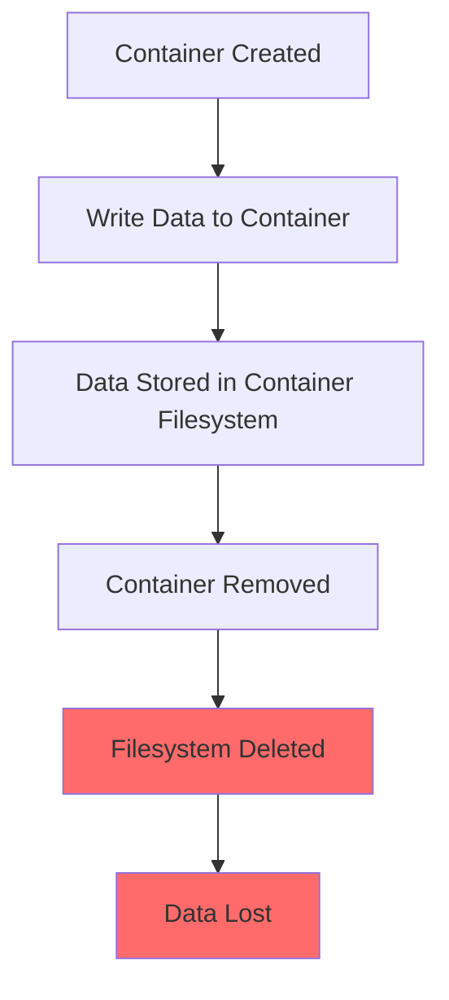
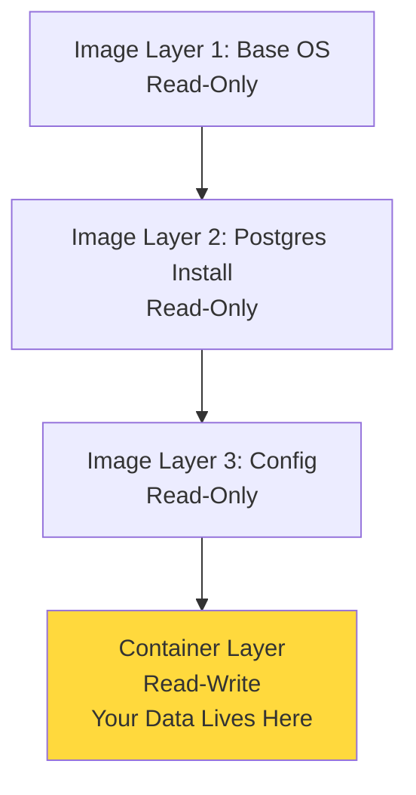
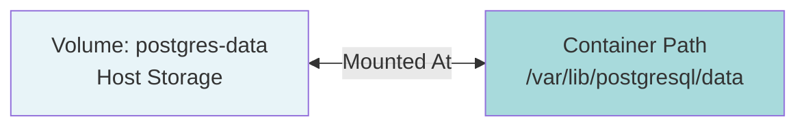

# Containers Are Ephemeral: Volumes and Data

## The Problem: Data Loss

Run a PostgreSQL container:

```bash
docker run -d --name my-db -e POSTGRES_PASSWORD=secret postgres
```

Connect to it and create some data:

```bash
docker exec -it my-db psql -U postgres
```

Inside psql:

```sql
CREATE DATABASE myapp;
\c myapp
CREATE TABLE users (id SERIAL, name TEXT);
INSERT INTO users (name) VALUES ('Alice'), ('Bob');
SELECT * FROM users;
```

**Output:**
```
 id | name  
----+-------
  1 | Alice
  2 | Bob
```

Perfect. Exit psql:

```sql
\q
```

Now remove the container:

```bash
docker rm -f my-db
```

Start PostgreSQL again:

```bash
docker run -d --name my-db -e POSTGRES_PASSWORD=secret postgres
```

Check your data:

```bash
docker exec -it my-db psql -U postgres -c "SELECT * FROM users;"
```

**Output:**
```
ERROR:  relation "users" does not exist
```

Your data is gone.

**Why this happens:** Each container has its own filesystem. When you remove a container, that filesystem disappears.



This is by design. Containers are meant to be disposable.

**Mental Note:** Container filesystems are temporary. Anything written inside a container dies with the container.

## Understanding Container Storage

When you run a container, Docker creates a read-write layer on top of the image:



The container layer is temporary. When the container is removed, this layer is deleted.

**This creates a problem:** Databases, uploaded files, logs - all need to persist beyond container lifetime.

## Solution 1: Docker Volumes

Volumes are Docker's answer to persistent storage.

### Creating a Volume

```bash
docker volume create postgres-data
```

List volumes:

```bash
docker volume ls
```

**Output:**
```
DRIVER    VOLUME NAME
local     postgres-data
```

Inspect the volume:

```bash
docker volume inspect postgres-data
```

**Output:**
```json
[
    {
        "CreatedAt": "2024-01-15T10:45:23Z",
        "Driver": "local",
        "Labels": null,
        "Mountpoint": "/var/lib/docker/volumes/postgres-data/_data",
        "Name": "postgres-data",
        "Options": null,
        "Scope": "local"
    }
]
```

The volume exists on your host at `/var/lib/docker/volumes/postgres-data/_data`. Docker manages it.

### Using a Volume

Run PostgreSQL with the volume:

```bash
docker run -d --name my-db \
  -e POSTGRES_PASSWORD=secret \
  -v postgres-data:/var/lib/postgresql/data \
  postgres
```

**What `-v postgres-data:/var/lib/postgresql/data` means:**



Format: `-v VOLUME_NAME:CONTAINER_PATH`

PostgreSQL stores its data at `/var/lib/postgresql/data`. By mounting a volume there, data goes to the volume instead of the container's temporary filesystem.

Create some data:

```bash
docker exec -it my-db psql -U postgres
```

```sql
CREATE DATABASE myapp;
\c myapp
CREATE TABLE users (id SERIAL, name TEXT);
INSERT INTO users (name) VALUES ('Alice'), ('Bob');
\q
```

Remove the container:

```bash
docker rm -f my-db
```

Start a new container with the same volume:

```bash
docker run -d --name my-db-new \
  -e POSTGRES_PASSWORD=secret \
  -v postgres-data:/var/lib/postgresql/data \
  postgres
```

Check the data:

```bash
docker exec -it my-db-new psql -U postgres -c "\c myapp" -c "SELECT * FROM users;"
```

**Output:**
```
You are now connected to database "myapp" as user "postgres".
 id | name  
----+-------
  1 | Alice
  2 | Bob
```

Your data persisted!

**Mental Note:** Volumes live outside containers. Multiple containers can use the same volume. Data survives container removal.

## Solution 2: Bind Mounts

Bind mounts link a directory on your host directly into a container.

Create a directory:

```bash
mkdir -p ~/my-postgres-data
```

Run PostgreSQL with a bind mount:

```bash
docker run -d --name my-db-bind \
  -e POSTGRES_PASSWORD=secret \
  -v ~/my-postgres-data:/var/lib/postgresql/data \
  postgres
```

Same format, but you're using a host path instead of a volume name.

Check what's in the directory:

```bash
ls ~/my-postgres-data
```

**Output:**
```
base  global  pg_commit_ts  pg_dynshmem  pg_hba.conf  pg_ident.conf  
pg_logical  pg_multixact  pg_notify  pg_replslot  pg_serial  
pg_snapshots  pg_stat  pg_stat_tmp  pg_subtrans  pg_tblspc  
pg_twophase  PG_VERSION  pg_wal  pg_xact  postgresql.auto.conf  postgresql.conf
```

PostgreSQL's data files are directly on your host filesystem.

**Mental Note:** Bind mounts give you direct access to files. Volumes are managed by Docker. Both persist data, but bind mounts let you see and edit files easily.

## Volumes vs Bind Mounts

| Aspect | Volumes | Bind Mounts |
|--------|---------|-------------|
| Managed by | Docker | You |
| Location | Docker's storage area | Anywhere on host |
| Portability | Works across systems | Requires same path |
| Performance | Optimized | Depends on host FS |
| Use case | Production databases | Development, configs |

**When to use volumes:**
- Production databases
- Data that should be managed by Docker
- Sharing data between containers
- Backup and migration

**When to use bind mounts:**
- Development (live code reloading)
- Configuration files you need to edit
- Logs you want to inspect
- Anything you need direct access to

## Real Example: Development Workflow

You're building a Node.js app. During development, you want code changes to reflect immediately.

Project structure:
```
my-app/
  ├── package.json
  ├── server.js
  └── Dockerfile
```

**server.js:**
```javascript
const express = require('express');
const app = express();

app.get('/', (req, res) => {
  res.send('Hello World v1');
});

app.listen(3000, () => console.log('Server running'));
```

**Dockerfile:**
```dockerfile
FROM node:18
WORKDIR /app
COPY package*.json ./
RUN npm install
COPY . .
CMD ["node", "server.js"]
```

Build the image:

```bash
docker build -t my-app .
```

Run with bind mount:

```bash
docker run -d --name dev-server \
  -p 3000:3000 \
  -v $(pwd):/app \
  -v /app/node_modules \
  my-app
```

**What's happening here:**
- `-v $(pwd):/app`: Mount current directory to `/app` in container
- `-v /app/node_modules`: Anonymous volume to prevent overwriting node_modules

Visit `http://localhost:3000` - you see "Hello World v1"

Edit server.js on your host:

```javascript
app.get('/', (req, res) => {
  res.send('Hello World v2');
});
```

Restart the container:

```bash
docker restart dev-server
```

Refresh your browser - you see "Hello World v2"

No rebuild needed. Your code changes are live.

**Mental Note:** Bind mounts during development save time. You edit code on your host, container uses those files directly.

## Anonymous Volumes

Sometimes Docker creates volumes automatically.

Look at the PostgreSQL Dockerfile (simplified):

```dockerfile
FROM debian:bookworm-slim
RUN apt-get update && apt-get install -y postgresql
VOLUME /var/lib/postgresql/data
CMD ["postgres"]
```

The `VOLUME` instruction tells Docker: "This path needs persistence."

Run PostgreSQL without specifying a volume:

```bash
docker run -d --name auto-vol postgres
```

Check volumes:

```bash
docker volume ls
```

**Output:**
```
DRIVER    VOLUME NAME
local     1a2b3c4d5e6f7g8h9i0j1k2l3m4n5o6p7q8r9s0t1u2v3w4x5y6z7a8b9c0d1e2f3
```

Docker created an anonymous volume automatically.

Inspect the container:

```bash
docker inspect auto-vol --format='{{.Mounts}}'
```

**Output:**
```
[{volume 1a2b3c4d5e6f7g8h9i0j1k2l3m4n5o6p7q8r9s0t1u2v3w4x5y6z7a8b9c0d1e2f3 /var/lib/docker/volumes/1a2b3c4d5e6f7g8h9i0j1k2l3m4n5o6p7q8r9s0t1u2v3w4x5y6z7a8b9c0d1e2f3/_data /var/lib/postgresql/data local  true }]
```

Your data is stored, but the volume name is a random hash. Hard to manage.

Remove the container:

```bash
docker rm -f auto-vol
```

The anonymous volume still exists:

```bash
docker volume ls
```

It's orphaned. This accumulates over time.

**Mental Note:** Always use named volumes in production. Anonymous volumes are hard to track and clean up.

## Volume Management

### Listing Volumes

```bash
docker volume ls
```

### Inspecting a Volume

```bash
docker volume inspect postgres-data
```

### Removing a Volume

```bash
docker volume rm postgres-data
```

You can't remove a volume that's in use:

```bash
docker volume rm postgres-data
```

**Output:**
```
Error response from daemon: remove postgres-data: volume is in use - [3b4c5d6e7f8a]
```

Stop and remove the container first.

### Cleaning Up Unused Volumes

```bash
docker volume prune
```

**Output:**
```
WARNING! This will remove all local volumes not used by at least one container.
Are you sure you want to continue? [y/N] y
Deleted Volumes:
1a2b3c4d5e6f7g8h9i0j1k2l3m4n5o6p7q8r9s0t1u2v3w4x5y6z7a8b9c0d1e2f3
8a9b0c1d2e3f4g5h6i7j8k9l0m1n2o3p4q5r6s7t8u9v0w1x2y3z4a5b6c7d8e9f0

Total reclaimed space: 2.3GB
```

This removes all volumes not attached to any container.

## Sharing Volumes Between Containers

Multiple containers can use the same volume.

Create a volume:

```bash
docker volume create shared-data
```

Run a container that writes data:

```bash
docker run --rm -v shared-data:/data alpine sh -c "echo 'Hello from container 1' > /data/message.txt"
```

Run another container that reads it:

```bash
docker run --rm -v shared-data:/data alpine cat /data/message.txt
```

**Output:**
```
Hello from container 1
```

**Use case:** Multiple services reading the same configuration or sharing files.

**Example: Nginx serving files from an app container**

```bash
# App container writes static files
docker run -d --name app -v shared-data:/app/public my-app

# Nginx serves those files
docker run -d --name web -p 8080:80 -v shared-data:/usr/share/nginx/html nginx
```

Both containers share the same volume at different mount points.

**Mental Note:** Volumes are not tied to a single container. They're independent resources that containers can attach to.

## Volume Drivers

Volumes can use different storage backends.

Default is `local` (host filesystem). But you can use:
- NFS (network storage)
- Cloud storage (AWS EBS, Azure Disk)
- Distributed storage (Ceph, GlusterFS)

Create a volume with a specific driver:

```bash
docker volume create --driver local \
  --opt type=nfs \
  --opt o=addr=192.168.1.100,rw \
  --opt device=:/path/to/nfs \
  my-nfs-volume
```

This creates a volume backed by NFS. Useful for sharing data across multiple Docker hosts.

**Most of the time, you'll use local volumes.** Other drivers are for specific infrastructure needs.

## Backup and Restore

### Backing Up a Volume

Create a backup:

```bash
docker run --rm \
  -v postgres-data:/source \
  -v $(pwd):/backup \
  alpine tar czf /backup/postgres-backup.tar.gz -C /source .
```

**What's happening:**
1. Mount the volume at `/source`
2. Mount current directory at `/backup`
3. Run `tar` to compress `/source` contents
4. Save to `/backup/postgres-backup.tar.gz` (your host)

You'll have `postgres-backup.tar.gz` on your host.

### Restoring a Volume

Create a new volume:

```bash
docker volume create postgres-restored
```

Restore the backup:

```bash
docker run --rm \
  -v postgres-restored:/target \
  -v $(pwd):/backup \
  alpine sh -c "cd /target && tar xzf /backup/postgres-backup.tar.gz"
```

**What's happening:**
1. Mount new volume at `/target`
2. Mount backup directory at `/backup`
3. Extract tar file into `/target`

Use the restored volume:

```bash
docker run -d --name restored-db \
  -e POSTGRES_PASSWORD=secret \
  -v postgres-restored:/var/lib/postgresql/data \
  postgres
```

Your data is restored.

**Mental Note:** Volumes can be backed up and restored using simple tar commands. Critical for database migrations and disaster recovery.

## Read-Only Volumes

Sometimes you want to prevent a container from modifying a volume.

```bash
docker run -d --name readonly-app \
  -v my-config:/etc/config:ro \
  my-app
```

The `:ro` flag makes the volume read-only inside the container.

Try to write:

```bash
docker exec readonly-app sh -c "echo 'test' > /etc/config/test.txt"
```

**Output:**
```
sh: can't create /etc/config/test.txt: Read-only file system
```

**Use case:** Configuration files you don't want the application to accidentally modify.

## tmpfs Mounts: Temporary Storage

Sometimes you need temporary storage that's fast and doesn't persist.

```bash
docker run -d --name fast-cache \
  --tmpfs /cache:rw,size=128m \
  my-app
```

**What this does:**
- Mounts `/cache` in memory (RAM)
- Limited to 128MB
- Data is lost when container stops

**Use case:** 
- Caching that doesn't need persistence
- Temporary processing files
- Security-sensitive data you don't want written to disk

**Mental Note:** tmpfs is in-memory storage. Fast but volatile. Use for temporary data only.

## Practical Patterns

### Pattern 1: Database Persistence

```bash
docker run -d --name db \
  -v db-data:/var/lib/postgresql/data \
  -e POSTGRES_PASSWORD=secret \
  postgres
```

Always use named volumes for databases.

### Pattern 2: Configuration Injection

```bash
docker run -d --name app \
  -v $(pwd)/config.yml:/app/config.yml:ro \
  my-app
```

Bind mount configuration as read-only.

### Pattern 3: Log Collection

```bash
docker run -d --name app \
  -v $(pwd)/logs:/var/log/app \
  my-app
```

Bind mount logs to host for easy access.

### Pattern 4: Development Environment

```bash
docker run -d --name dev \
  -v $(pwd):/app \
  -v /app/node_modules \
  -p 3000:3000 \
  my-dev-image
```

Bind mount code, but use anonymous volume for dependencies.

## Common Mistakes

### Mistake 1: Not Using Volumes for Databases

```bash
# Bad: Data will be lost
docker run -d --name db postgres
```

```bash
# Good: Data persists
docker run -d --name db -v db-data:/var/lib/postgresql/data postgres
```

### Mistake 2: Using Absolute Paths in Bind Mounts

```bash
# Bad: Only works on your machine
docker run -v /Users/john/code:/app my-app
```

```bash
# Good: Works anywhere
docker run -v $(pwd):/app my-app
```

### Mistake 3: Forgetting to Clean Up Volumes

Orphaned volumes accumulate. Run periodically:

```bash
docker volume prune
```

### Mistake 4: Overwriting Dependencies

```bash
# Bad: Overwrites node_modules in container
docker run -v $(pwd):/app my-app
```

```bash
# Good: Preserves node_modules
docker run -v $(pwd):/app -v /app/node_modules my-app
```

## Debugging Volume Issues

### Check What's Mounted

```bash
docker inspect my-container --format='{{json .Mounts}}' | jq
```

**Output:**
```json
[
  {
    "Type": "volume",
    "Name": "postgres-data",
    "Source": "/var/lib/docker/volumes/postgres-data/_data",
    "Destination": "/var/lib/postgresql/data",
    "Driver": "local",
    "Mode": "z",
    "RW": true,
    "Propagation": ""
  }
]
```

Shows all mounts, their types, and paths.

### Check Volume Contents

```bash
docker run --rm -v postgres-data:/data alpine ls -lah /data
```

Lists files in the volume.

### Check Permissions

```bash
docker run --rm -v postgres-data:/data alpine ls -ld /data
```

Shows directory permissions.

## Volume Performance Considerations

**Volumes:** Optimized by Docker. Generally fast.

**Bind mounts on Mac/Windows:** Slower due to filesystem translation between host and Docker VM. Can be significantly slower for many small files.

**Bind mounts on Linux:** Native performance. No overhead.

**Workaround for Mac/Windows:**
Use volumes for data, bind mounts only for code you're actively editing.

```bash
docker run -d \
  -v $(pwd)/src:/app/src \        # Only source code (smaller, fewer files)
  -v node_modules:/app/node_modules \  # Dependencies in volume (faster)
  my-app
```

## Mental Notes

**Containers are disposable:** Anything inside the container filesystem is temporary.

**Volumes outlive containers:** They're separate resources. Create them, name them, manage them.

**Bind mounts are for development:** Direct access to files. Volumes are for production.

**Always name your volumes:** Anonymous volumes are hard to track and clean up.

**Multiple containers, one volume:** Volumes aren't locked to a single container. Share data across services.

**Read-only when possible:** Prevents accidental modifications. Use `:ro` flag.

**Backup your volumes:** They're just directories. Use tar or your backup tool of choice.

**Clean up regularly:** `docker volume prune` removes unused volumes. Do it periodically.

---

**The core insight:** Containers are ephemeral by design. They should be disposable. Volumes are how you preserve state across container lifetimes. Master volumes, master Docker data management.