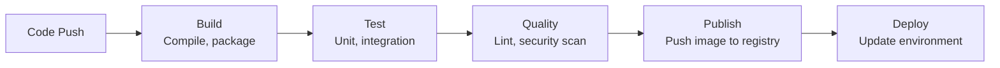

# CI/CD

You change two lines of code. You SSH into the server, pull the latest code, restart the service. It works.

Then someone else changes four lines and SSH's in, but they forget to restart one of the services. Or they do it in the wrong order. Or they're working on staging while you're deploying to production. Now two environments are in different states and nobody knows which is correct.

Manual deployments create variation. Variation creates incidents. CI/CD exists to make every deployment identical.

---

## What CI and CD mean

**Continuous Integration (CI)** is the practice of automatically building and testing code every time it changes. The goal is to catch problems early — before they reach production — and to always keep the main branch in a releasable state.

**Continuous Delivery (CD)** is the practice of automatically deploying every validated change to an environment. The goal is to make deployment a non-event: routine, low-risk, and fast.

Together they form a pipeline. Code is written → committed → automatically built, tested, and deployed.

---

## The pipeline model

A pipeline is a sequence of stages. Each stage must pass before the next begins.



**Build** — compile the application, install dependencies, produce an artifact (binary, container image).

**Test** — run unit tests, integration tests. If tests fail, the pipeline stops here. No deployment happens.

**Quality** — lint for code style, scan for known vulnerabilities, run static analysis. Optional but strongly recommended.

**Publish** — push the artifact to a registry (Docker Hub, ECR, GCR). This is the deployable unit. It has a version. It is immutable.

**Deploy** — update the running environment to use the new artifact. This can be a direct `kubectl set image`, a GitOps sync, or a Helm upgrade.

---

## Environments

Most teams have multiple environments. A change flows through them in order.

| Environment | Purpose | Who deploys |
|-------------|---------|-------------|
| **Development** | Test individual features | Automatically on every push |
| **Staging** | Pre-production integration test | Automatically after dev passes |
| **Production** | Live traffic | Automatically or with manual approval gate |

The pipeline is the same in every environment. The configuration differs. The same container image that passed tests in staging is what gets deployed to production — no rebuilding, no re-testing.

This is a key principle: **build once, deploy everywhere**. The artifact is the unit of trust. If it passed tests in staging, it should behave the same in production.

---

## The artifact

A container image is the ideal CI/CD artifact because it is:
- **Immutable** — a specific tag represents a specific state, forever
- **Self-contained** — runtime, dependencies, and code are bundled together
- **Portable** — runs the same way in development, staging, and production

Tag images with something meaningful: the Git commit SHA, a semantic version, or the pipeline run ID.

```bash
# Tag with commit SHA
docker build -t my-app:$(git rev-parse --short HEAD) .

# The SHA tells you exactly what code is running
docker run my-app:a3f9c1d
```

Never deploy `latest` in production. `latest` is mutable — it points to whatever was most recently pushed. You cannot reliably know what is running or roll back to a specific version.

---

## Fail fast

A good pipeline fails as early as possible. Cheap checks run first, expensive checks run later.

```
Fast (seconds)    → syntax check, compile
Medium (minutes)  → unit tests
Slow (minutes)    → integration tests, security scan
Very slow (10m+)  → end-to-end tests, performance tests
```

If the compile fails, there is no reason to run tests. Run the cheap checks first and let the pipeline tell you quickly what is wrong.

---

## What good looks like

A well-designed CI/CD pipeline gives you:

- **Confidence** — if the pipeline passes, the change is safe to deploy
- **Speed** — changes reach production in minutes, not hours or days
- **Repeatability** — every deployment is identical, regardless of who triggered it
- **Auditability** — every change is tied to a commit, a pipeline run, and a person

When something breaks in production, you know exactly which commit introduced it, because every deployment traces back to a specific commit SHA.
