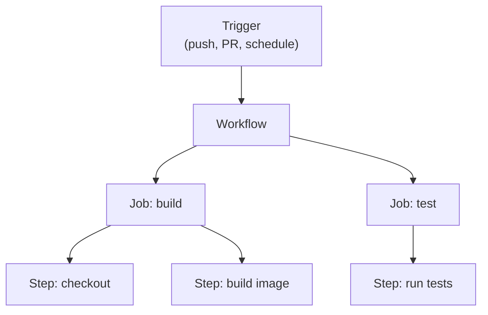

# GitHub Actions

GitHub Actions is CI/CD built into GitHub. You define workflows in YAML files inside `.github/workflows/`. GitHub runs them automatically when code changes.

No external CI server to manage. No webhooks to configure. The pipeline lives in the same repository as the code.

---

## The workflow model



**Workflow** — a YAML file in `.github/workflows/`. Defines when to run and what jobs to execute.

**Job** — a set of steps that run on the same runner (virtual machine). Jobs run in parallel by default. Add `needs:` to make them sequential.

**Step** — a single action or shell command. Steps within a job run sequentially.

**Runner** — the machine that executes the job. GitHub provides hosted runners (ubuntu-latest, windows-latest, macos-latest). You can also run self-hosted runners.

---

## Triggers

```yaml
on:
  push:
    branches: [main]                      # push to main
  pull_request:
    branches: [main]                      # PR targeting main
  schedule:
    - cron: "0 2 * * *"                   # daily at 2am UTC
  workflow_dispatch:                       # manual trigger
```

---

## A complete CI pipeline

```yaml
# .github/workflows/ci.yml
name: CI

on:
  push:
    branches: [main]
  pull_request:
    branches: [main]

jobs:
  test:
    runs-on: ubuntu-latest
    steps:
      - name: Checkout code
        uses: actions/checkout@v4

      - name: Set up Python
        uses: actions/setup-python@v5
        with:
          python-version: "3.11"

      - name: Install dependencies
        run: pip install -r requirements.txt

      - name: Run tests
        run: pytest tests/

  build-and-push:
    runs-on: ubuntu-latest
    needs: test                           # only runs if test passes
    if: github.ref == 'refs/heads/main'   # only on pushes to main (not PRs)

    steps:
      - name: Checkout code
        uses: actions/checkout@v4

      - name: Log in to Docker Hub
        uses: docker/login-action@v3
        with:
          username: ${{ secrets.DOCKERHUB_USERNAME }}
          password: ${{ secrets.DOCKERHUB_TOKEN }}

      - name: Build and push image
        uses: docker/build-push-action@v5
        with:
          push: true
          tags: |
            myorg/myapp:${{ github.sha }}
            myorg/myapp:latest
```

This pipeline:
1. Runs on every PR (test only)
2. Runs on merge to main (test, then build and push image)
3. Only pushes the image if tests pass and we're on main

---

## Secrets and environment variables

Never put credentials in workflow files. Store them in GitHub Secrets.

`Settings → Secrets and variables → Actions → New repository secret`

Reference them in workflows:

```yaml
env:
  API_URL: https://api.example.com         # non-sensitive, inline

steps:
  - name: Deploy
    env:
      API_KEY: ${{ secrets.API_KEY }}      # sensitive, from secrets
    run: ./scripts/deploy.sh
```

Secrets are masked in logs — they appear as `***` if accidentally printed.

---

## Matrix builds

Run the same job across multiple configurations.

```yaml
jobs:
  test:
    strategy:
      matrix:
        python-version: ["3.10", "3.11", "3.12"]
        os: [ubuntu-latest, macos-latest]

    runs-on: ${{ matrix.os }}

    steps:
      - uses: actions/checkout@v4
      - uses: actions/setup-python@v5
        with:
          python-version: ${{ matrix.python-version }}
      - run: pytest tests/
```

This creates 6 parallel jobs (3 Python versions × 2 OS combinations). All must pass.

---

## Caching dependencies

Avoid reinstalling dependencies on every run.

```yaml
- name: Cache pip packages
  uses: actions/cache@v4
  with:
    path: ~/.cache/pip
    key: ${{ runner.os }}-pip-${{ hashFiles('requirements.txt') }}

- name: Install dependencies
  run: pip install -r requirements.txt
```

If `requirements.txt` has not changed, the cache is restored and `pip install` is near-instant.

---

## Hands-on: set up a pipeline

```bash
# 1. Create the workflow directory
mkdir -p .github/workflows

# 2. Create a simple workflow
cat > .github/workflows/ci.yml << 'EOF'
name: CI

on:
  push:
    branches: [main]
  pull_request:

jobs:
  test:
    runs-on: ubuntu-latest
    steps:
      - uses: actions/checkout@v4

      - name: Run a test
        run: echo "All tests passed"

      - name: Check the branch
        run: echo "Running on branch ${{ github.ref_name }}"
EOF

# 3. Commit and push
git add .github/
git commit -m "Add CI workflow"
git push

# 4. Open GitHub → Actions tab
# You will see the workflow run automatically
```

---

## Quick reference

```yaml
# Triggers
on:
  push: { branches: [main] }
  pull_request: { branches: [main] }
  schedule: [{ cron: "0 2 * * *" }]
  workflow_dispatch:

# Jobs
jobs:
  build:
    runs-on: ubuntu-latest
    needs: test              # dependency
    steps:
      - uses: actions/checkout@v4
      - run: echo "hello"

# Contexts
${{ github.sha }}            # commit hash
${{ github.ref_name }}       # branch name
${{ secrets.MY_SECRET }}     # secret value
${{ github.event_name }}     # trigger type
```
