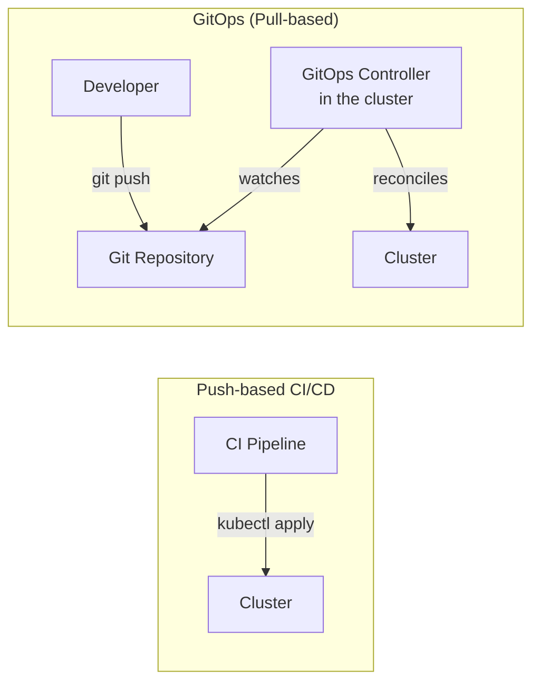
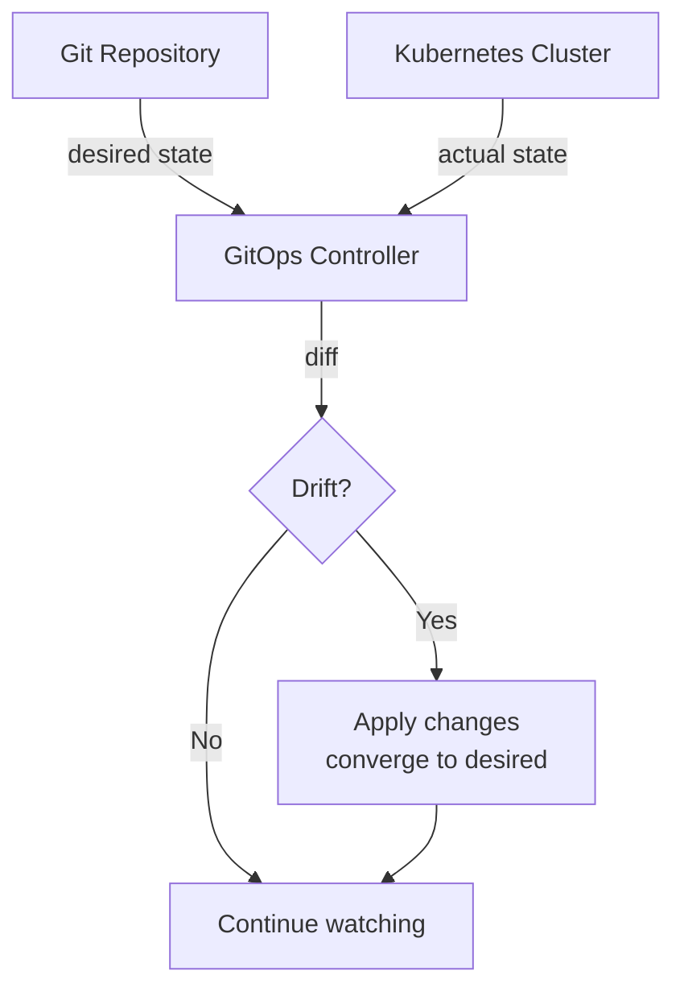

# GitOps

Your CI pipeline builds a container image and pushes it to a registry. Now you need to deploy it.

The push-based approach: the CI pipeline runs `kubectl apply` directly, or calls a deployment script. It works. But now your CI system needs credentials to the production cluster. The deployment is an imperative action — nobody can tell from looking at a file whether the cluster is in the right state. If someone runs `kubectl edit` directly, the cluster drifts from what CI deployed.

The GitOps approach: instead of pushing changes to the cluster, the cluster pulls from Git. Git is the source of truth. A controller running in the cluster watches a Git repository and continuously reconciles the cluster state to match what is in Git.

---

## Push vs pull delivery

In the push model, the pipeline controls the cluster. The pipeline needs cluster credentials. If the pipeline fails midway, the cluster may be in an unknown state.

In the pull model, the cluster controls itself. A controller watches Git and applies what it sees. If someone manually changes something in the cluster, the controller reverts it to match Git. The cluster is always converging toward what Git says it should be.

---

## Core principles

**Git is the single source of truth.** Every desired state — which version is deployed, how many replicas, what config — is expressed in Git as declarative YAML. Not in a CI variable, not in someone's head.

**Declarative, not imperative.** You do not describe what to do. You describe the desired end state. The controller figures out how to get there.

**Reconciliation loop.** The controller continuously compares actual state (what's in the cluster) to desired state (what's in Git) and corrects any differences. This is called drift detection.

**Drift is bad. Convergence is automatic.** If someone runs `kubectl scale deployment app --replicas=5` directly, the controller notices the cluster doesn't match Git (which says 3 replicas) and scales back to 3.

---

## The reconciliation model

The controller runs this loop continuously — typically every few seconds. In practice, the cluster is almost always in the desired state. The loop catches and corrects the occasional manual change or failed update.

---

## What goes in Git

The Git repository that ArgoCD (or Flux) watches should contain:
- Kubernetes YAML manifests (Deployment, Service, ConfigMap, etc.)
- Helm chart values files (per environment)
- Kustomize overlays

It should **not** contain:
- Sensitive secrets (use Sealed Secrets, External Secrets, or Vault integration)
- Application source code (that lives in the app repository)

A common pattern is to have separate repositories:
- **App repo** — source code, Dockerfile, CI pipeline
- **Config repo** — Kubernetes manifests and Helm values

CI writes to the config repo (bumping the image tag). ArgoCD reads from the config repo and deploys.

---

## Rollback

In a GitOps model, rollback is `git revert`. You create a commit that reverts the change. The controller deploys the reverted state.

This is an improvement over imperative rollback because:
- The rollback is tracked in Git history
- The same review and testing process applies
- There is a clear record of what was deployed and when

---

## Hands-on: see ArgoCD apply GitOps

See [ArgoCD](./04-argocd.md) for a complete local setup where you can observe the reconciliation loop in action.

---

## Quick reference

| Concept | What it means |
|---------|--------------|
| Desired state | What Git says should be running |
| Actual state | What is currently running in the cluster |
| Drift | Any difference between desired and actual |
| Reconciliation | The controller correcting drift |
| Source of truth | Git — not the cluster, not a database |
| Rollback | `git revert` — the controller handles the rest |
