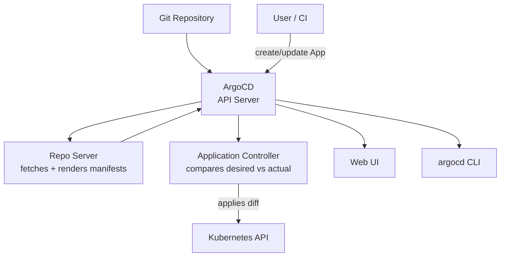

# ArgoCD

ArgoCD is a GitOps controller for Kubernetes. It runs inside your cluster, watches a Git repository, and continuously reconciles the cluster state to match what is in Git.

You define an Application — a pointer to a Git repo, a path inside that repo, and a target cluster and namespace. ArgoCD does the rest.

---

## Architecture



**API Server** — the central component. Handles authentication, RBAC, API calls from the CLI and UI.

**Repo Server** — clones the Git repository, renders Helm templates or Kustomize overlays, returns raw Kubernetes manifests.

**Application Controller** — the reconciliation engine. Compares the manifests from the repo server with what is actually running in the cluster. Applies differences.

---

## Applications

An ArgoCD Application is a CRD (Custom Resource Definition) that maps a Git source to a Kubernetes destination.

```yaml
apiVersion: argoproj.io/v1alpha1
kind: Application
metadata:
  name: my-app
  namespace: argocd
spec:
  project: default
  source:
    repoURL: https://github.com/org/config-repo
    targetRevision: main
    path: apps/my-app
  destination:
    server: https://kubernetes.default.svc
    namespace: production
  syncPolicy:
    automated:
      prune: true        # delete resources removed from Git
      selfHeal: true     # revert manual changes
```

**Sync** — the act of applying what is in Git to the cluster.

**Prune** — if a resource is removed from Git, delete it from the cluster.

**Self-heal** — if someone manually changes something in the cluster, revert it to match Git.

---

## Sync status vs health status

ArgoCD tracks two separate things:

**Sync status** — does the cluster match what is in Git?
- `Synced` — cluster matches Git
- `OutOfSync` — there is a diff (pending changes or manual drift)

**Health status** — are the resources healthy?
- `Healthy` — deployments are available, pods are running
- `Progressing` — rollout in progress
- `Degraded` — something is failing (crashed pods, failed jobs)

You can be `Synced` but `Degraded` — the YAML was applied but the app crashed. You can be `OutOfSync` but `Healthy` — the app is running fine but someone made a manual change.

---

## Hands-on: ArgoCD on Docker Desktop

### Install ArgoCD

```bash
kubectl create namespace argocd
kubectl apply -n argocd -f https://raw.githubusercontent.com/argoproj/argo-cd/stable/manifests/install.yaml

# Wait for pods to start
kubectl wait --for=condition=available deployment/argocd-server -n argocd --timeout=120s

kubectl get pods -n argocd
```

### Access the UI

```bash
# Port-forward the ArgoCD UI
kubectl port-forward svc/argocd-server -n argocd 8080:443

# Get the admin password
kubectl get secret argocd-initial-admin-secret -n argocd \
  -o jsonpath="{.data.password}" | base64 -d
```

Open `https://localhost:8080`. Username: `admin`. Password: from above (accept the certificate warning).

### Create an application

```bash
# Install ArgoCD CLI (macOS)
brew install argocd

# Login
argocd login localhost:8080 --username admin --password <password> --insecure

# Create an app pointing to the ArgoCD example repo
argocd app create guestbook \
  --repo https://github.com/argoproj/argocd-example-apps \
  --path guestbook \
  --dest-server https://kubernetes.default.svc \
  --dest-namespace default

# Check its status
argocd app get guestbook

# Sync it (deploy)
argocd app sync guestbook

# Watch the resources deploy
kubectl get pods -w
```

### Observe self-healing

```bash
# The guestbook deployment has 1 replica
kubectl get deployment guestbook-ui

# Manually scale it to 3
kubectl scale deployment guestbook-ui --replicas=3
kubectl get pods     # 3 pods

# Wait ~30 seconds
kubectl get pods     # back to 1 pod — ArgoCD reverted the manual change
```

This is GitOps in action. Git says 1. You changed it to 3. ArgoCD corrected it back to 1.

### Trigger a rollout via Git change

The GitOps way to deploy a new version:
1. Update the image tag in the Git repo
2. ArgoCD detects the change
3. ArgoCD applies the new manifests
4. Rollout proceeds through the Deployment controller

With automated sync enabled, this happens within seconds of the Git push.

---

## Cleanup

```bash
argocd app delete guestbook
kubectl delete namespace argocd
```

---

## Quick reference

```bash
# Install
kubectl apply -n argocd -f https://raw.githubusercontent.com/argoproj/argo-cd/stable/manifests/install.yaml

# CLI
argocd login <host>                           # authenticate
argocd app create <name> --repo <url> ...     # create app
argocd app get <name>                         # check status
argocd app sync <name>                        # trigger sync
argocd app diff <name>                        # show pending changes
argocd app history <name>                     # deployment history
argocd app rollback <name> <revision>         # rollback to revision

# Kubectl
kubectl get applications -n argocd            # list apps
kubectl get app <name> -n argocd -o yaml      # full app spec
```
