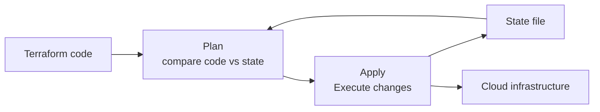

# Terraform

You provision a server by clicking through the AWS console. Your colleague provisions another by running different commands. Two servers, two different configurations. Neither is documented. Neither can be reproduced exactly.

Six months later you need a third server that matches. You cannot. You click through the console again, trying to remember every setting.

So you use Terraform. Infrastructure is defined in code. Every resource is declared in a file. Running `terraform apply` creates exactly what the code describes. Running it again creates nothing new — the infrastructure already matches the code.

---

## The declarative model

Terraform is declarative. You describe the desired end state. Terraform figures out how to get there.

```hcl
# main.tf
resource "aws_instance" "web" {
  ami           = "ami-0c55b159cbfafe1f0"
  instance_type = "t2.micro"
  tags = {
    Name = "web-server"
  }
}
```

You do not say: "launch an instance, wait for it to start, tag it." You say: "I want an instance with these properties." Terraform computes the API calls needed to reach that state.

---

## The state model

Terraform maintains a **state file** that records what it has created. Every resource Terraform manages is tracked in this file.



When you run `terraform plan`, Terraform compares the code (desired state) against the state file (what it last created). It shows you exactly what will be created, modified, or destroyed.

When you run `terraform apply`, Terraform executes those changes and updates the state file to reflect the new reality.

**The state file is critical.** If it's lost, Terraform cannot track what it created. Store it remotely (S3, Terraform Cloud, GCS) in production — never commit it to Git, as it may contain secrets.

---

## Core workflow

```bash
# Initialize — download providers and modules
terraform init

# Preview changes
terraform plan

# Apply changes
terraform apply

# Destroy all resources
terraform destroy
```

---

## Providers

Terraform works with cloud providers through plugins. You declare which providers you need and Terraform downloads them.

```hcl
terraform {
  required_providers {
    aws = {
      source  = "hashicorp/aws"
      version = "~> 5.0"
    }
    docker = {
      source  = "kreuzwerker/docker"
      version = "~> 3.0"
    }
  }
}

provider "aws" {
  region = "us-east-1"
}
```

---

## Hands-on: Terraform with Docker

:::info Lab files
Fork [eigenbytes-devops-labs](https://github.com/anubhab-codes/eigenbytes-devops-labs) — the complete Terraform config is in `05-platform-engineering/terraform/docker-demo/`. Run `terraform init && terraform apply` immediately, no setup needed.
:::

You can run Terraform locally without a cloud account using the Docker provider.

```bash
# Install Terraform
# macOS: brew install terraform
# Linux: see https://developer.hashicorp.com/terraform/install

# Create a working directory
mkdir tf-demo && cd tf-demo

cat > main.tf << 'EOF'
terraform {
  required_providers {
    docker = {
      source  = "kreuzwerker/docker"
      version = "~> 3.0"
    }
  }
}

provider "docker" {}

resource "docker_image" "nginx" {
  name         = "nginx:latest"
  keep_locally = false
}

resource "docker_container" "web" {
  name  = "tf-nginx"
  image = docker_image.nginx.image_id

  ports {
    internal = 80
    external = 8080
  }
}
EOF
```

```bash
# Initialize
terraform init

# Plan
terraform plan

# Apply
terraform apply
# Type 'yes' when prompted

# Verify
docker ps | grep tf-nginx
curl http://localhost:8080

# See state
terraform show
cat terraform.tfstate    # the raw state
```

Now make a change. Update the external port to `8081`:

```hcl
  ports {
    internal = 80
    external = 8081   # changed
  }
```

```bash
terraform plan
# Shows: docker_container.web will be replaced
# Terraform must destroy and recreate the container to change the port mapping

terraform apply
docker ps | grep tf-nginx
# Container now on port 8081
```

### Cleanup

```bash
terraform destroy
cd .. && rm -rf tf-demo
```

---

## Variables and outputs

```hcl
# variables.tf
variable "container_port" {
  description = "External port for the container"
  type        = number
  default     = 8080
}

# main.tf
resource "docker_container" "web" {
  ports {
    internal = 80
    external = var.container_port
  }
}

# outputs.tf
output "container_name" {
  value = docker_container.web.name
}
```

```bash
terraform apply -var="container_port=9090"
terraform output                           # show output values
```

---

## Remote state

In production, state must be stored remotely so the team can collaborate.

```hcl
terraform {
  backend "s3" {
    bucket = "my-terraform-state"
    key    = "prod/terraform.tfstate"
    region = "us-east-1"
  }
}
```

With remote state, multiple engineers can run Terraform against the same infrastructure. State locking prevents two people from applying simultaneously.

---

## Quick reference

```bash
terraform init                    # initialize, download providers
terraform plan                    # preview changes
terraform apply                   # apply changes
terraform apply -auto-approve      # skip confirmation
terraform destroy                  # remove all resources
terraform show                     # current state
terraform output                   # show outputs
terraform state list               # list tracked resources
terraform import <resource> <id>   # import existing resource into state
terraform fmt                      # format code
terraform validate                 # validate configuration
```

---

> Lab files: [eigenbytes-devops-labs/05-platform-engineering/terraform/docker-demo](https://github.com/anubhab-codes/eigenbytes-devops-labs/tree/main/05-platform-engineering/terraform/docker-demo)
