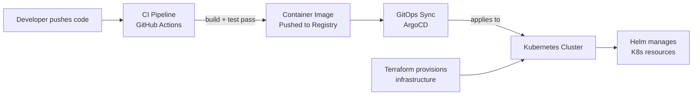

# Platform Engineering

You have a working application running in Kubernetes. Getting it there took manual steps. Every time you change the code, you run those steps again.

That is not how production teams work.

Platform engineering is the discipline of building automated, reliable paths from a code change to a running deployment. It covers the pipelines that build and test your code, the delivery systems that deploy it, the packaging tools that manage configuration, and the infrastructure-as-code that provisions the environment it runs on.

---

## The delivery chain

Each tool in this chain has a specific job:

- **GitHub Actions** — automates the build, test, and publish steps when code changes
- **ArgoCD** — continuously syncs what's in Git to what's running in Kubernetes
- **Helm** — packages Kubernetes resources with configurable values for different environments
- **Terraform** — provisions the infrastructure (clusters, databases, networks) in a repeatable, version-controlled way

---

## What this section covers

| Page | What you learn |
|------|---------------|
| [CI/CD](./01-cicd.md) | Pipeline design, stages, artifacts, environments |
| [GitHub Actions](./02-github-actions.md) | Workflows, triggers, runners, secrets, hands-on pipeline |
| [GitOps](./03-gitops.md) | Pull-based delivery, reconciliation, drift detection |
| [ArgoCD](./04-argocd.md) | Architecture, apps, sync policy, local hands-on |
| [Helm](./05-helm.md) | Charts, templates, values, multi-environment delivery |
| [Terraform](./06-terraform.md) | State model, plan/apply, modules, workspaces |
