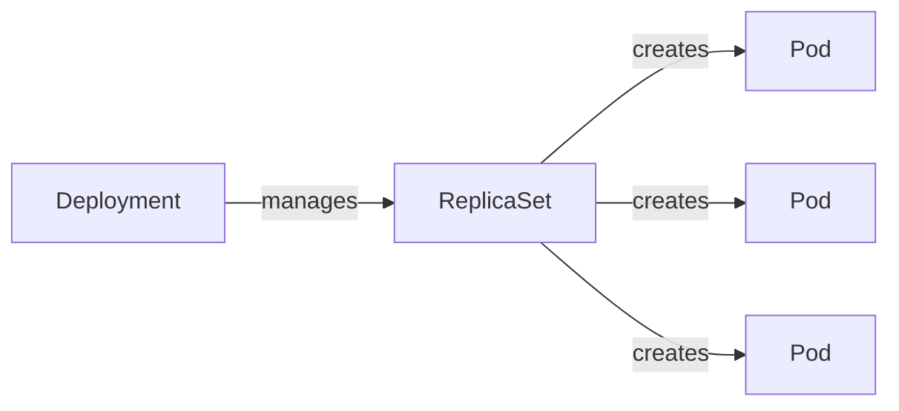

# Deployments

A pod crashes. Kubernetes does nothing.

You need 3 copies of your API running at all times. With raw pods, you create them manually and one dies — it stays dead. You get paged at 2am.

So you use a Deployment.

A Deployment defines the desired state: how many pods, which image, which labels. A controller watches the current state against the desired state and corrects continuously. You want 3 pods. One dies. Kubernetes creates another before you notice.

---

## How it works



A Deployment manages a ReplicaSet. A ReplicaSet manages the pods. You interact with the Deployment and it handles the rest.

You rarely touch the ReplicaSet directly. It exists so rollouts can work: a new rollout creates a new ReplicaSet and gradually shifts pods from the old one to the new one. If the rollout fails, Kubernetes can switch back instantly.

---

## Hands-on

### Create a Deployment

```bash
kubectl create deployment demo --image=nginx
kubectl get deployments
kubectl get pods
```

One deployment. One pod with a generated name.

### Scale it

```bash
kubectl scale deployment demo --replicas=3
kubectl get pods
```

Three pods running. One command.

### Test self-healing

```bash
kubectl delete pod <any-pod-name>
kubectl get pods
```

A new pod appears within seconds. The Deployment noticed the count dropped to 2 and created a replacement automatically.

### Roll out a new image

```bash
kubectl set image deployment/demo nginx=nginx:1.26
kubectl rollout status deployment/demo
```

Kubernetes creates new pods with `nginx:1.26` and removes the old ones gradually. The service never goes down during the rollout.

### Roll back

Something went wrong with the new version. One command to go back:

```bash
kubectl rollout undo deployment/demo
kubectl rollout status deployment/demo
```

The previous version is running again. Kubernetes kept the old ReplicaSet around exactly for this.

Check history:

```bash
kubectl rollout history deployment/demo
```

---

## Labels and selectors

Labels are how Kubernetes connects objects. A Deployment creates pods with labels. A Service routes traffic to pods using those same labels. Nothing is wired by name or IP — only by labels.

View labels on your pods:

```bash
kubectl get pods --show-labels
```

You will see `app=demo`. This is what the Deployment selector watches. This is what a Service selector matches.

Filter by label:

```bash
kubectl get pods -l app=demo
```

Remove a pod from the Deployment's selector (useful for debugging one pod in isolation without traffic hitting it):

```bash
kubectl label pod <pod-name> app-
```

The pod keeps running but traffic stops going to it. The Deployment immediately creates a replacement to restore the desired count.

---

## Cleanup

```bash
kubectl delete deployment demo
kubectl get all   # should show only the kubernetes service
```

---

## Quick reference

```bash
kubectl create deployment <name> --image=<image>
kubectl get deployments
kubectl describe deployment <name>
kubectl scale deployment <name> --replicas=N
kubectl set image deployment/<name> <container>=<image>
kubectl rollout status deployment/<name>
kubectl rollout undo deployment/<name>
kubectl rollout history deployment/<name>
kubectl delete deployment <name>
```
