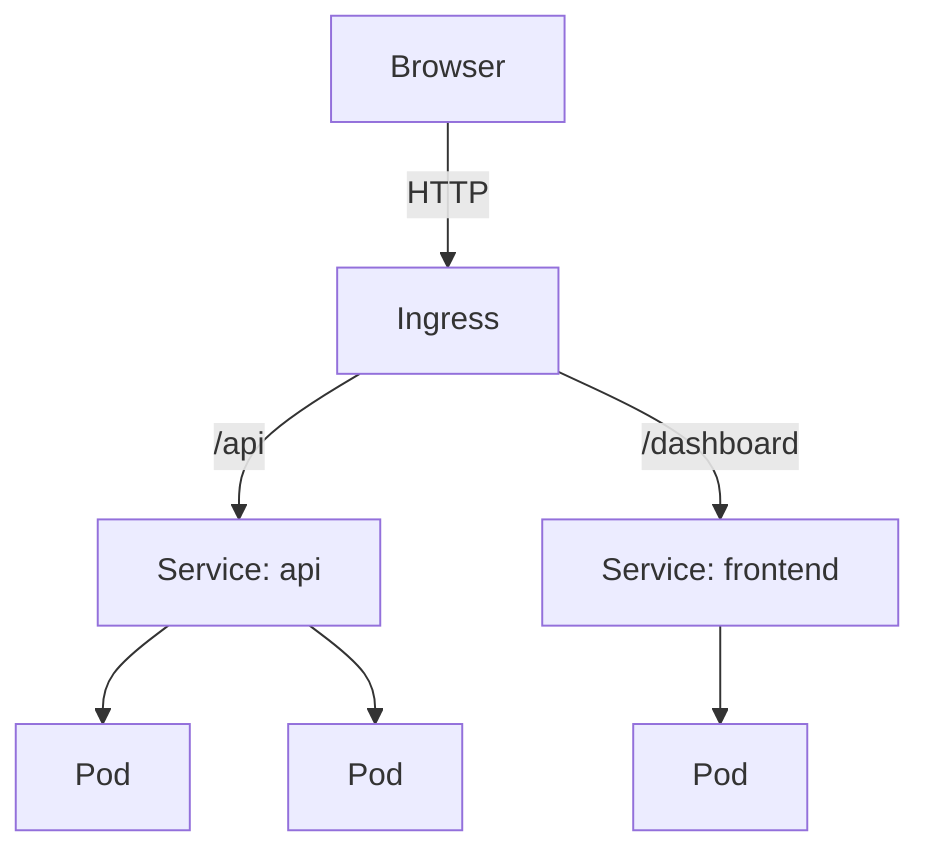

# Services

Every time a pod restarts, it gets a new IP address.

You have 3 pods running your API. Another service needs to talk to them. Which IP do you use? They keep changing. You cannot hardcode them. You cannot track them at scale.

So you use a Service.

A Service gives your application one stable virtual IP. It finds your pods using labels, not IPs. Pods die and come back with new IPs — the Service does not care. It always finds them. It also load-balances traffic across all healthy pods automatically.

---

## Service types

**ClusterIP** — reachable only inside the cluster. Default type. Use for internal service-to-service communication.

**NodePort** — exposes the service on a static port on every node. Accessible from outside the cluster. Fine for local development, not for production at scale.

**LoadBalancer** — provisions a cloud load balancer. One per service. Use for production external access. Gets expensive fast when you have many services.

**Ingress** — HTTP routing layer in front of multiple services. One load balancer routes to many services by host or path. Use this instead of many LoadBalancer services.



---

## Hands-on

### Setup

```bash
kubectl create deployment demo --image=nginx
kubectl scale deployment demo --replicas=3
```

### Expose with ClusterIP

```bash
kubectl expose deployment demo --port=80
kubectl get services
```

```
NAME   TYPE        CLUSTER-IP      PORT(S)   AGE
demo   ClusterIP   10.96.120.45    80/TCP    5s
```

ClusterIP is only reachable from inside the cluster. Test it:

```bash
kubectl run curl --image=curlimages/curl -it --rm --restart=Never -- curl http://demo
```

The service name `demo` resolves automatically via cluster DNS. You get the nginx response.

### Change to NodePort

```bash
kubectl patch svc demo -p '{"spec":{"type":"NodePort"}}'
kubectl get services
```

```
NAME   TYPE       CLUSTER-IP      PORT(S)        AGE
demo   NodePort   10.96.120.45    80:31234/TCP   1m
```

Open `http://localhost:31234` in your browser. Nginx loads.

### Verify what the Service is actually routing to

```bash
kubectl get endpoints demo
```

You will see 3 pod IPs. This is the live list of healthy pods backing the Service. kube-proxy reads this list and programs the routing rules on each node.

Kill one pod and re-check endpoints immediately. The dead pod disappears from the list within seconds. The Service automatically stops sending it traffic.

---

## Cleanup

```bash
kubectl delete service demo
kubectl delete deployment demo
```

---

## Quick reference

```bash
kubectl expose deployment <name> --port=80                     # ClusterIP
kubectl expose deployment <name> --type=NodePort --port=80     # NodePort
kubectl get services
kubectl get endpoints <name>
kubectl describe service <name>
kubectl patch svc <name> -p '{"spec":{"type":"NodePort"}}'
kubectl delete service <name>
```
