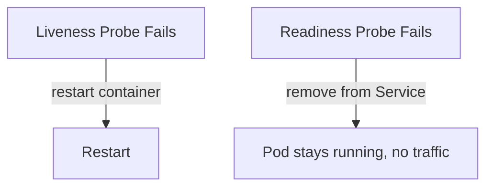

# Resource Management

Your pod starts fine. Then traffic spikes. It starts consuming more and more memory. Eventually it takes down the entire node, killing every other pod running on it.

Or: your pod is running but returning 500s. The process is alive but stuck. Kubernetes keeps sending it traffic because it never knew anything was wrong.

Two problems. Two solutions: resource limits and health probes.

---

## Resource requests and limits

A **request** is what your pod needs to be scheduled. Kubernetes uses it to decide which node has enough capacity.

A **limit** is the maximum your pod is allowed to consume. If it exceeds the CPU limit, it gets throttled. If it exceeds the memory limit, it gets killed and restarted.

```yaml
resources:
  requests:
    memory: "64Mi"
    cpu: "250m"
  limits:
    memory: "128Mi"
    cpu: "500m"
```

CPU is measured in millicores: `250m` = 0.25 of one CPU core. Memory in bytes: `64Mi` = 64 mebibytes.

> Always set both. Without requests, the scheduler packs nodes blindly. Without limits, one bad pod can starve everything else.

---

## Health probes

A **liveness probe** answers: is this container still working? If it fails, Kubernetes restarts the container.

A **readiness probe** answers: is this container ready to receive traffic? If it fails, Kubernetes removes it from the service endpoints. No traffic hits it until it recovers.

Use both:
- Liveness catches stuck processes (deadlock, infinite loop, corrupt state)
- Readiness catches slow starts and temporary unavailability (cache warming, DB reconnect)



---

## Hands-on

### Set resource limits on a pod

```bash
kubectl run resource-demo \
  --image=nginx \
  --requests='cpu=100m,memory=64Mi' \
  --limits='cpu=200m,memory=128Mi'
```

```bash
kubectl describe pod resource-demo
```

Look for the **Requests** and **Limits** section in the output. You will see the values you set.

### Watch what happens when a pod exceeds its memory limit

```bash
kubectl run memory-eater \
  --image=polinux/stress \
  --requests='memory=50Mi' \
  --limits='memory=100Mi' \
  -- stress --vm 1 --vm-bytes 200M
```

```bash
kubectl get pods -w
```

The pod will be OOMKilled (Out of Memory Killed) because it tried to use 200Mi against a 100Mi limit. Kubernetes restarts it and keeps restarting it — which is why this eventually becomes a CrashLoopBackOff.

### Add a liveness probe

Save this as `liveness-demo.yaml`:

```yaml
apiVersion: v1
kind: Pod
metadata:
  name: liveness-demo
spec:
  containers:
  - name: app
    image: busybox
    command: ["sh", "-c", "touch /tmp/healthy; sleep 10; rm /tmp/healthy; sleep 600"]
    livenessProbe:
      exec:
        command: ["cat", "/tmp/healthy"]
      initialDelaySeconds: 3
      periodSeconds: 5
  restartPolicy: Never
```

```bash
kubectl apply -f liveness-demo.yaml
kubectl get pod liveness-demo -w
```

The pod creates `/tmp/healthy`, then deletes it after 10 seconds. The liveness probe checks for that file every 5 seconds. Once the file is gone, the probe fails and Kubernetes restarts the container.

Watch the **RESTARTS** column increment.

### Add a readiness probe to a deployment

```bash
kubectl create deployment readiness-demo --image=nginx
kubectl patch deployment readiness-demo --patch '
{
  "spec": {
    "template": {
      "spec": {
        "containers": [{
          "name": "nginx",
          "readinessProbe": {
            "httpGet": {"path": "/", "port": 80},
            "initialDelaySeconds": 5,
            "periodSeconds": 3
          }
        }]
      }
    }
  }
}'
```

```bash
kubectl rollout status deployment/readiness-demo
kubectl get endpoints readiness-demo
```

The deployment waits until the readiness probe passes before marking pods as ready and adding them to the service endpoints.

---

## Cleanup

```bash
kubectl delete pod resource-demo memory-eater liveness-demo --ignore-not-found
kubectl delete deployment readiness-demo --ignore-not-found
rm liveness-demo.yaml
```

---

## Quick reference

```bash
# View resource usage per pod
kubectl top pods

# View resource usage per node
kubectl top nodes

# Describe pod to see requests/limits and probe config
kubectl describe pod <name>

# Watch pod restarts in real time
kubectl get pods -w

# Check why a pod was killed
kubectl describe pod <name> | grep -A 5 "Last State"
```
