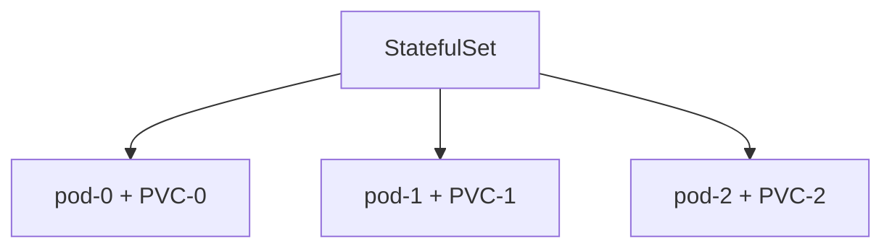

# Workload Types

A Deployment works well for stateless services — web servers, APIs, anything where every pod is identical and interchangeable.

But not everything is stateless.

A database needs stable network identity. Pod 0 is always pod 0. Its DNS name never changes. Its storage stays attached to it specifically, not just any pod in the set.

A batch job needs to run once and finish. A Deployment would keep restarting it.

A scheduled task needs to run at 2am every night. A Deployment doesn't know what time it is.

Three different problems. Three different workload types.

---

## StatefulSet

A **StatefulSet** manages pods that need:
- Stable, predictable names (`pod-0`, `pod-1`, `pod-2` — not random hashes)
- Stable DNS entries that survive pod restarts
- Dedicated persistent storage per pod (each pod gets its own PVC)
- Ordered startup and shutdown (pod-0 starts before pod-1)



Use StatefulSet for: databases (MySQL, PostgreSQL), message brokers (Kafka, RabbitMQ), distributed systems that require peer discovery.

Do not use StatefulSet for stateless APIs. The ordering and stable-name guarantees add complexity you don't need.

---

## Job

A **Job** runs a pod to completion. When the container exits successfully, the Job is done. If it fails, the Job retries according to your policy.

Use Job for: database migrations, batch processing, one-time data transforms, test runners.

---

## CronJob

A **CronJob** creates a Job on a schedule. It uses standard cron syntax.

Use CronJob for: nightly backups, periodic reports, scheduled cleanups, cache invalidation.

---

## Hands-on

### StatefulSet

Save as `statefulset-demo.yaml`:

```yaml
apiVersion: apps/v1
kind: StatefulSet
metadata:
  name: web
spec:
  serviceName: "web"
  replicas: 3
  selector:
    matchLabels:
      app: web
  template:
    metadata:
      labels:
        app: web
    spec:
      containers:
      - name: nginx
        image: nginx
        ports:
        - containerPort: 80
---
apiVersion: v1
kind: Service
metadata:
  name: web
spec:
  clusterIP: None
  selector:
    app: web
  ports:
  - port: 80
```

```bash
kubectl apply -f statefulset-demo.yaml
kubectl get pods -w
```

Watch the pods start one at a time: `web-0` starts first, then `web-1`, then `web-2`. Compare this to a Deployment where all pods start simultaneously.

```bash
kubectl get pods
```

```
NAME    READY   STATUS    RESTARTS   AGE
web-0   1/1     Running   0          30s
web-1   1/1     Running   0          20s
web-2   1/1     Running   0          10s
```

The names are predictable. Delete `web-1`:

```bash
kubectl delete pod web-1
kubectl get pods
```

The replacement is named `web-1` again. Not a random hash. A Deployment would give it a new random suffix.

The headless service (`clusterIP: None`) gives each pod its own DNS entry:
- `web-0.web.default.svc.cluster.local`
- `web-1.web.default.svc.cluster.local`
- `web-2.web.default.svc.cluster.local`

This is how Kafka brokers find each other. How MySQL replicas connect to the primary by name.

### Job

```bash
kubectl create job hello --image=busybox -- echo "job done"
kubectl get jobs
kubectl get pods
kubectl logs job/hello
# job done
```

The pod runs, prints the message, and exits. The Job records it as complete. The pod stays around in `Completed` state so you can read the logs.

Run a Job with retries:

```bash
kubectl create job flaky \
  --image=busybox \
  -- sh -c 'exit $((RANDOM % 2))'
```

```bash
kubectl describe job flaky
```

The job will randomly succeed or fail. When it fails, Kubernetes retries it (default: 6 attempts). Watch the pod count change as retries happen.

### CronJob

```bash
kubectl create cronjob nightly \
  --image=busybox \
  --schedule="*/1 * * * *" \
  -- echo "scheduled task ran"
```

This runs every minute (for testing — in production you'd use a less frequent schedule).

```bash
kubectl get cronjobs
kubectl get jobs -w
```

Every minute, a new Job is created. Watch the Jobs appear.

```bash
kubectl logs -l job-name=<job-name>
# scheduled task ran
```

---

## Cleanup

```bash
kubectl delete statefulset web --ignore-not-found
kubectl delete service web --ignore-not-found
kubectl delete job hello flaky --ignore-not-found
kubectl delete cronjob nightly --ignore-not-found
rm statefulset-demo.yaml
```

---

## Quick reference

```bash
kubectl get statefulsets
kubectl get jobs
kubectl get cronjobs
kubectl describe statefulset <name>
kubectl scale statefulset <name> --replicas=N
kubectl delete job <name>
kubectl delete cronjob <name>
```
