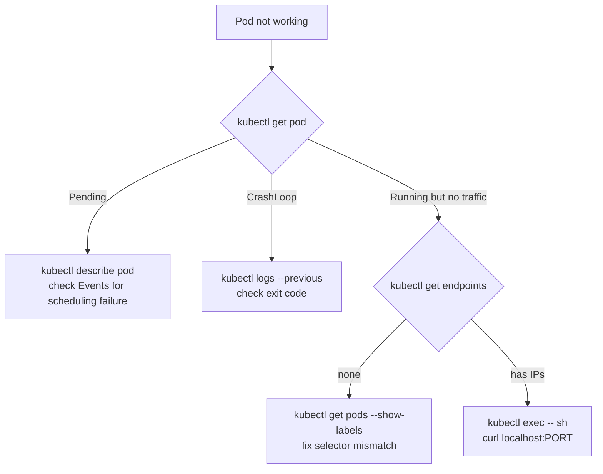

# Troubleshooting

Something is broken. The pod is not running. Traffic is not reaching your service. You don't know where to start.

This page is a diagnostic guide for the most common failures. Every section follows the same pattern: what you see → why it happens → how to find the cause → how to fix it.

---

## CrashLoopBackOff

**What you see:**

```
NAME        READY   STATUS             RESTARTS   AGE
my-app      0/1     CrashLoopBackOff   5          3m
```

**What it means:** The container starts, crashes, Kubernetes restarts it, it crashes again. The `BackOff` part means Kubernetes is increasing the delay between restarts to avoid hammering a broken container.

**How to diagnose:**

```bash
# Check the current logs
kubectl logs my-app

# Check the logs from the previous crash
kubectl logs my-app --previous

# Check the exit code and reason
kubectl describe pod my-app | grep -A 10 "Last State"
```

**Common causes:**

| Exit code | Likely cause |
|-----------|-------------|
| 1 | Application error — check logs for stack trace |
| 137 | OOMKilled — container exceeded memory limit |
| 139 | Segfault |
| 1 with "can't open file" | Wrong image entrypoint or missing file |

**Fixes:**
- Application crash: fix the application bug shown in logs
- OOMKilled: increase memory limit in pod spec
- Missing env var or config: verify ConfigMap/Secret is mounted correctly
- Wrong command: check the `command` and `args` fields in the pod spec

---

## Pod stuck in Pending

**What you see:**

```
NAME        READY   STATUS    RESTARTS   AGE
my-app      0/1     Pending   0          5m
```

**What it means:** The scheduler cannot find a node to place this pod.

**How to diagnose:**

```bash
kubectl describe pod my-app
```

Look at the **Events** section at the bottom. It will tell you exactly why scheduling failed.

**Common causes and fixes:**

| Event message | Cause | Fix |
|--------------|-------|-----|
| `Insufficient cpu` | No node has enough CPU | Reduce cpu request, or add nodes |
| `Insufficient memory` | No node has enough memory | Reduce memory request, or add nodes |
| `0/1 nodes are available: 1 node has taints` | Node taint blocks scheduling | Add toleration or use different node |
| `no PersistentVolumes available` | PVC can't bind | Check `kubectl get pv` and `kubectl get pvc` |

---

## Pod stuck in ImagePullBackOff / ErrImagePull

**What you see:**

```
NAME        READY   STATUS             RESTARTS   AGE
my-app      0/1     ImagePullBackOff   0          2m
```

**What it means:** Kubernetes cannot pull the container image.

**How to diagnose:**

```bash
kubectl describe pod my-app | grep -A 5 Events
```

**Common causes and fixes:**

- **Image does not exist:** Fix the image name and tag in the pod spec
- **Private registry, no credentials:** Create an `imagePullSecret` and reference it in the pod spec
- **Typo in tag:** `nginx:lates` fails; `nginx:latest` works
- **Registry rate limited:** Docker Hub has pull limits; authenticate or use a mirror

---

## Service not routing traffic

**What you see:** The service exists but requests fail or hit wrong pods.

**How to diagnose:**

```bash
# Check that the service exists and has a cluster IP
kubectl get service my-service

# Check that the service has endpoints (if no endpoints, no pods match the selector)
kubectl get endpoints my-service
```

If `ENDPOINTS` shows `<none>`, the service selector does not match any pod labels.

```bash
# Check what labels the service is selecting
kubectl describe service my-service | grep Selector

# Check what labels the pods have
kubectl get pods --show-labels
```

**Fix:** Make the pod labels match the service selector exactly. Labels are case-sensitive.

---

## Container running but app not responding

**What you see:** Pod is `Running`, readiness probe is failing, service has no endpoints.

**How to diagnose:**

```bash
# Shell into the container and test locally
kubectl exec -it my-app -- sh
# Then inside: wget -qO- localhost:8080 or curl localhost:8080
```

If the app responds locally but not via the service, the issue is the service port or selector configuration.

If the app does not respond locally, it has not started yet or is listening on the wrong port.

---

## General diagnostic flow



---

## Quick reference

```bash
# The three commands that solve 80% of problems
kubectl describe pod <name>         # events, config, state
kubectl logs <name> --previous      # last crash logs
kubectl get endpoints <service>     # is traffic routing?

# More specific tools
kubectl get events --sort-by='.lastTimestamp'   # cluster-wide event log
kubectl top pods                                 # CPU/memory usage
kubectl exec -it <name> -- sh                   # shell into container
kubectl port-forward pod/<name> 8080:8080       # test without a service
kubectl get pod <name> -o yaml                  # full spec as applied
```
