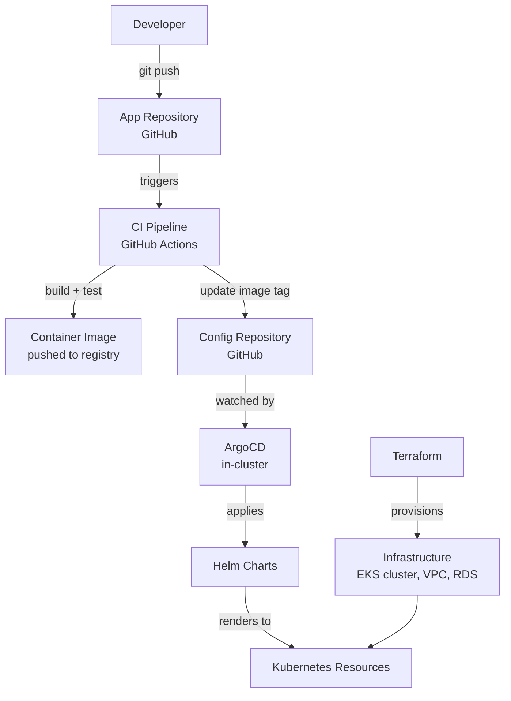
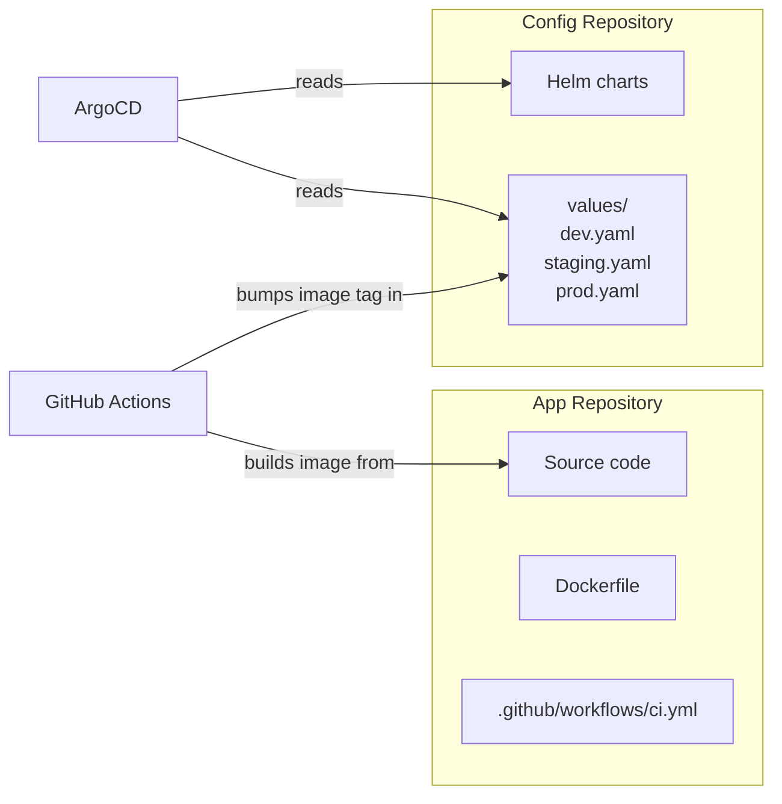
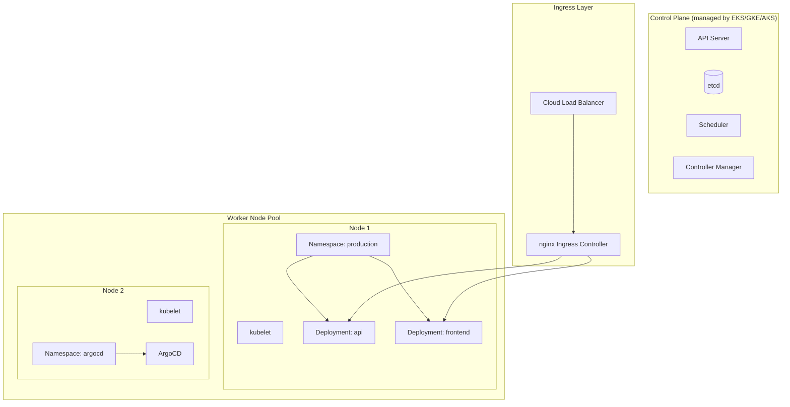
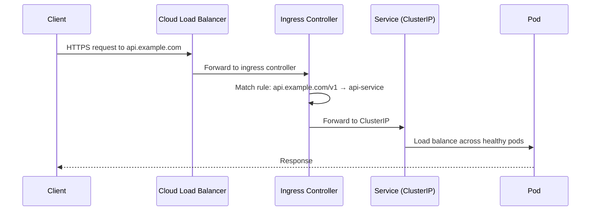

# Production Architecture

This page shows how the tools in this portal connect in a real production environment. Use it as a reference when designing or debugging a system.

---

## The full delivery stack



The flow for a typical code change:

1. Developer pushes to a feature branch
2. CI runs tests and linting automatically
3. PR is merged to main
4. CI builds the container image, tags it with the commit SHA, pushes to registry
5. CI updates the image tag in the config repository
6. ArgoCD detects the change in the config repo
7. ArgoCD renders the Helm chart with the new values
8. ArgoCD applies the rendered manifests to the cluster
9. Kubernetes rolls out the new deployment

---

## Two-repository model



**App repository** contains: source code, Dockerfile, CI workflow.

**Config repository** contains: Helm charts, environment-specific values files.

This separation means:
- The CI pipeline does not need Kubernetes credentials
- The config repository has a clean Git history of every deployment
- Rolling back a deployment is `git revert` in the config repository
- ArgoCD's permissions are limited to the cluster; it does not need repository write access

---

## Kubernetes cluster anatomy



---

## Namespace strategy

Namespaces provide logical isolation within a cluster.

| Namespace | What lives there |
|-----------|-----------------|
| `production` | Production workloads |
| `staging` | Staging workloads |
| `argocd` | ArgoCD controller |
| `ingress-nginx` | Ingress controller |
| `monitoring` | Prometheus, Grafana |
| `cert-manager` | TLS certificate management |

Each namespace has its own RBAC policies, resource quotas, and network policies. Production workloads are isolated from platform tools.

---

## The networking path

A request from the internet to your application:



1. **Cloud Load Balancer** — terminates TLS, forwards HTTP to the ingress controller
2. **Ingress Controller** — matches the Ingress rules, routes to the correct service
3. **Service (ClusterIP)** — provides a stable virtual IP, load balances across pods
4. **Pod** — the application handles the request

---

## Infrastructure provisioning

Terraform manages the infrastructure that Kubernetes runs on.

```hcl
# Simplified EKS cluster
resource "aws_eks_cluster" "prod" {
  name     = "prod"
  role_arn = aws_iam_role.cluster.arn
  version  = "1.30"

  vpc_config {
    subnet_ids = aws_subnet.private[*].id
  }
}

resource "aws_eks_node_group" "workers" {
  cluster_name  = aws_eks_cluster.prod.name
  instance_types = ["t3.medium"]

  scaling_config {
    desired_size = 3
    min_size     = 2
    max_size     = 10
  }
}
```

Key infrastructure components managed by Terraform:
- VPC, subnets, security groups
- EKS cluster and node groups
- IAM roles and policies
- RDS databases
- ECR (Elastic Container Registry)
- S3 buckets for Terraform state and artifacts

The Kubernetes cluster is provisioned by Terraform. Application workloads are managed by ArgoCD and Helm. Each tool has a clear boundary.

---

## Observability

A production system needs three kinds of telemetry:

**Metrics** — numeric measurements over time. Is the CPU high? Are error rates elevated? (Prometheus + Grafana)

**Logs** — structured event records. What happened, when, in what context. (Loki or ELK)

**Traces** — requests as they flow through services. Where is the latency? Which service is failing? (Jaeger or Tempo)

Without observability, debugging a production failure means guessing. With it, you can answer "what is happening?" in seconds, not hours.
