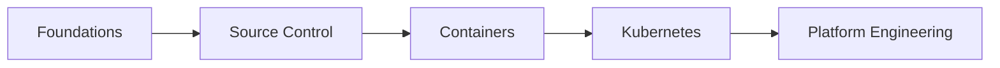

# DevOps Engineering

Most DevOps content teaches tools. Install this, run that command, move on.

This portal teaches engineering thinking. You learn why each tool exists, what problem it solves, and how it connects to everything else. By the end you can look at a production system and understand every layer of it.

---

## How this portal is structured

Five learning phases, each building on the last.

You do not need to follow them in order if you already have foundation knowledge. But every phase assumes the previous one.

---

## Learning path

| Phase | Section | What you learn | Key tools |
|-------|---------|---------------|-----------|
| 1 | **Foundations** | How servers work at the OS and network level | Linux, SSH, TCP/IP, DNS |
| 2 | **Source Control** | How teams manage and deliver code changes | Git, GitHub |
| 3 | **Containers** | How applications are packaged and isolated | Docker |
| 4 | **Kubernetes** | How containers run at scale in production | kubectl, K8s |
| 5 | **Platform Engineering** | How teams ship software continuously and reliably | GitHub Actions, ArgoCD, Helm, Terraform |

The **Reference** section contains production architecture diagrams and a cross-layer troubleshooting playbook. Use it when you're debugging real systems.

---

## The engineering philosophy here

Every concept in this portal is introduced through the problem it solves.

You start with a Pod. It crashes. Nobody restarts it. So you use a Deployment. Now your app is accessible but pod IPs keep changing. So you use a Service. Ten services, ten load balancers, your cloud bill doubles. So you use Ingress. Each concept exists because the previous one was not enough.

That progression — from problem to solution to new problem — is how real systems get built. Understanding it makes you better at operating systems that were built by someone else.

---

## Local setup

Everything in this portal runs locally. You need:

- **Docker Desktop** — for containers and local Kubernetes
- Enable Kubernetes: Docker Desktop → Settings → Kubernetes → Enable Kubernetes → Apply & Restart
- Verify: `kubectl get nodes` — should show one node, `STATUS = Ready`

No cloud accounts required to follow the hands-on sections.
