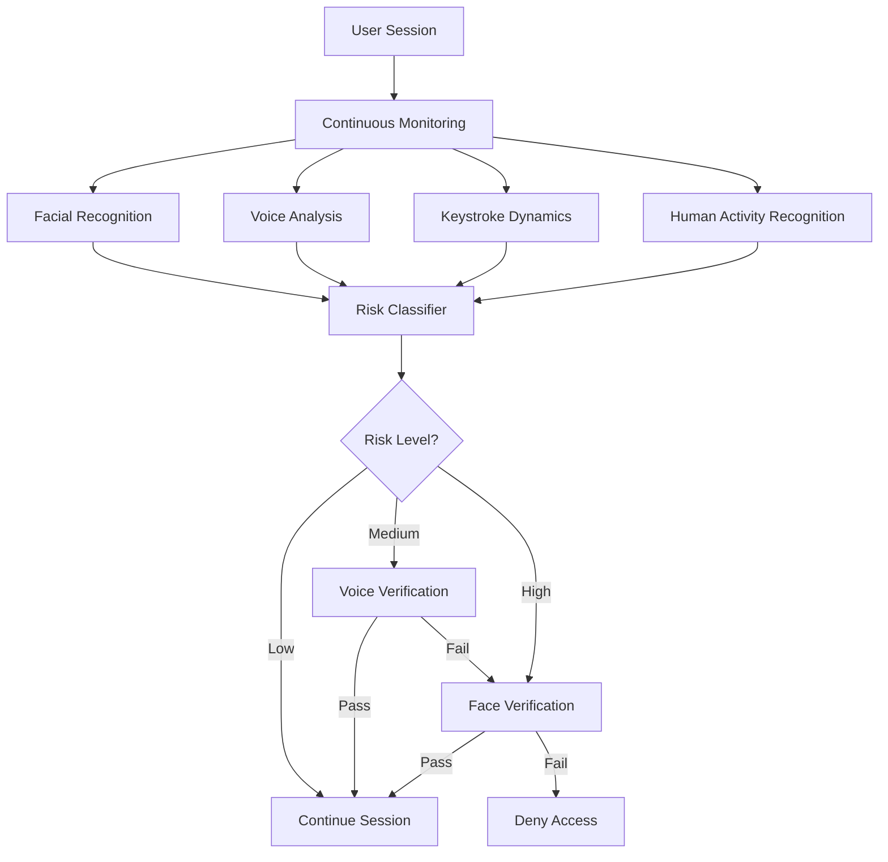
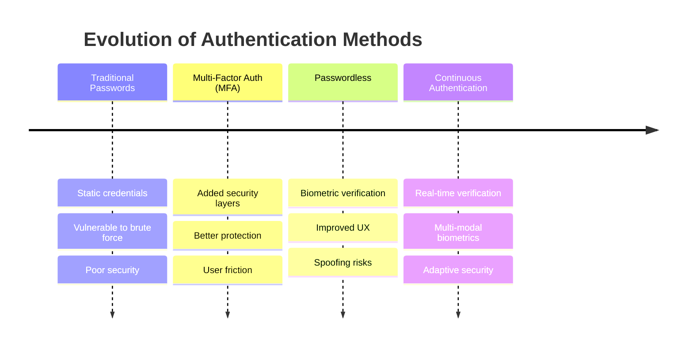

# Abstract

## The Problem Statement

The rapid evolution of technology has exposed the vulnerabilities of traditional authentication mechanisms like passwords, which are prone to security threats such as brute force attacks, phishing, and dictionary attacks.

To mitigate these risks, Multi-Factor Authentication (MFA) was introduced, combining factors like passwords, tokens, and biometrics. While MFA improves security, it often creates friction, leading to poor user experience and, in some cases, causing users to bypass security measures.

Password-less authentication methods, such as facial recognition and fingerprint scanning, were developed to improve convenience but are not without limitations. These methods remain susceptible to spoofing, device theft, and frequent re-authentication, which disrupts workflows. Moreover, they rely on static, one-time validations, making sessions vulnerable to hijacking by unauthorized users.

### The Solution

This project proposes a **continuous, deep learning-based authentication system** that leverages multiple biometric factors for real-time identity verification throughout a user session. Unlike traditional methods, this continuous system ensures the user remains authenticated while active.

## Key Features

### Multi-Modal Biometric Integration

The system combines:
- **Facial Recognition** - Using Convolutional Neural Networks (CNNs)
- **Voice Analysis** - Using Recurrent Neural Networks (RNNs) and Long Short-Term Memory (LSTM) models
- **Behavioral Biometrics** - Including typing rhythms and activity patterns

### Advanced Deep Learning Techniques

The system employs:
- **CNNs** for processing facial images with high accuracy
- **RNNs and LSTMs** for analyzing voice and behavioral patterns
- **Random Forest Classifier** for risk assessment
- **Generative AI** for data augmentation during training

### Continuous Verification

By continuously monitoring biometric data, the system:
- Dynamically adapts to the user's unique traits
- Reduces false positives and negatives
- Minimizes risks such as session hijacking
- Provides seamless authentication without workflow disruption

## Problem Statement

Traditional authentication methods face critical limitations:

| Challenge | Impact |
|-----------|--------|
| **One-time verification** | Vulnerable to session hijacking after initial login |
| **Session-based attacks** | Man-in-the-middle, session fixation, token theft |
| **Static credentials** | Susceptible to credential stuffing and replay attacks |
| **Disruptive re-authentication** | Poor user experience with frequent interruptions |

### Authentication Evolution

## Project Objectives

1. **Design and implement** a continuous authentication system that operates seamlessly throughout the entire user session

2. **Integrate multiple biometric modalities** into a unified framework for enhanced security and user experience

3. **Apply advanced ML and deep learning models** for dynamic, real-time user verification

4. **Address session-based attacks** by leveraging continuous authentication mechanisms with real-time verification

## Key Contributions

### 1. Novel Multi-Modal Architecture
A hybrid system integrating:
- CNNs for visual data processing
- RNNs for behavioral pattern analysis
- LSTMs for keystroke dynamics
- Risk classification for adaptive security

### 2. Continuous Verification Framework
Real-time monitoring that:
- Validates user identity throughout the session
- Adapts to behavioral variations
- Escalates verification based on risk levels

### 3. Practical Implementation
- Prototype using OpenCV and TensorFlow/PyTorch
- Demonstration of real-world applicability
- Performance benchmarking against pre-trained models

### 4. Security Enhancement
- Mitigation of session hijacking
- Protection against spoofing attacks
- Adaptive risk-based authentication

## Use Cases

This solution is particularly relevant for:

- **Remote Work Environments** - Securing distributed workforce access
- **Online Banking** - Protecting financial transactions throughout sessions
- **Healthcare Systems** - Safeguarding sensitive patient data access
- **Enterprise Security** - Preventing unauthorized access in corporate networks
- **IoT Devices** - Continuous verification for smart home and wearable devices

## System Comparison

| Feature | Traditional Auth | MFA | Continuous Auth (This System) |
|---------|-----------------|-----|-------------------------------|
| Frequency | One-time at login | One-time + occasional | Throughout session |
| User Input | High | High | Low (passive) |
| Security Level | Low | Medium | High |
| Adaptability | None | Limited | High |
| Session Protection | No | No | Yes |
| User Disruption | Low initially | Medium | Minimal |

## Technical Stack

- **Deep Learning Frameworks**: TensorFlow, PyTorch
- **Computer Vision**: OpenCV
- **Models**: Custom CNNs, LSTMs, GRUs, Random Forest
- **Datasets**: VoxCeleb, LFW (Labeled Faces in the Wild), UCI HAR
- **Languages**: Python
- **Deployment**: Web-based interface with real-time processing

## Project Timeline

The project was completed over 12 months with the following milestones:

- ✅ Custom Face Model (June 2024)
- ✅ Custom Voice Model (August 2024)
- ✅ Keystroke Dynamics Model (September 2024)
- ✅ Multimodal Integration (October 2024)
- ✅ Random Forest Classifier (January 2025)
- ✅ Human Activity Recognition (January 2025)
- ✅ Data Augmentation & Fine-tuning (February 2025)
- ✅ Application Deployment (April 2025)

---

---

*This project was developed as part of M.Tech research in Artificial Intelligence and Data Science Engineering at IIT Patna, under the supervision of Prof. Rajiv Misra and Prof. Sanjay Kumar Singh.*
