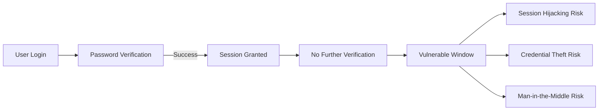
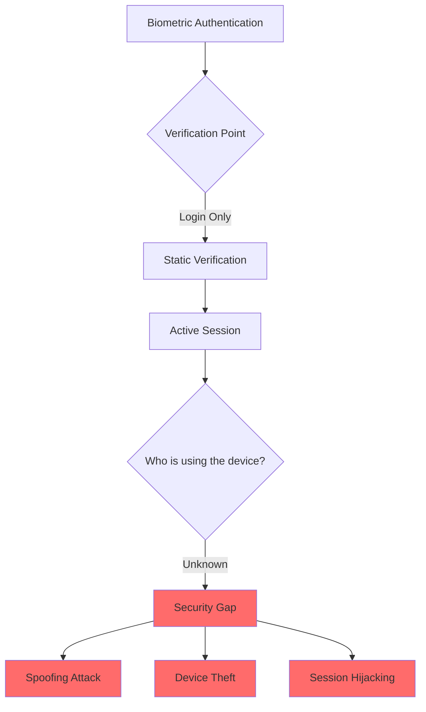
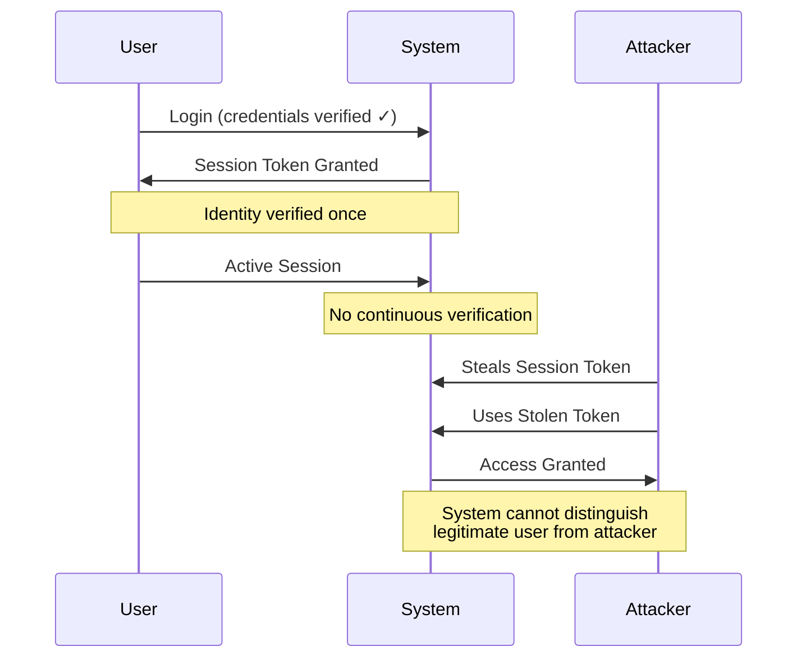
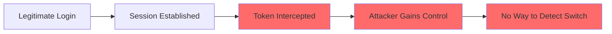
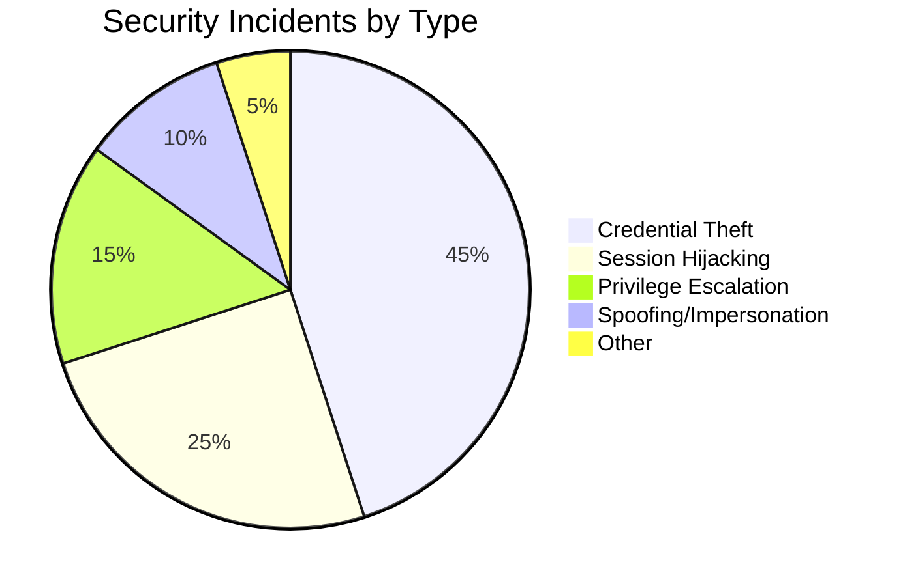
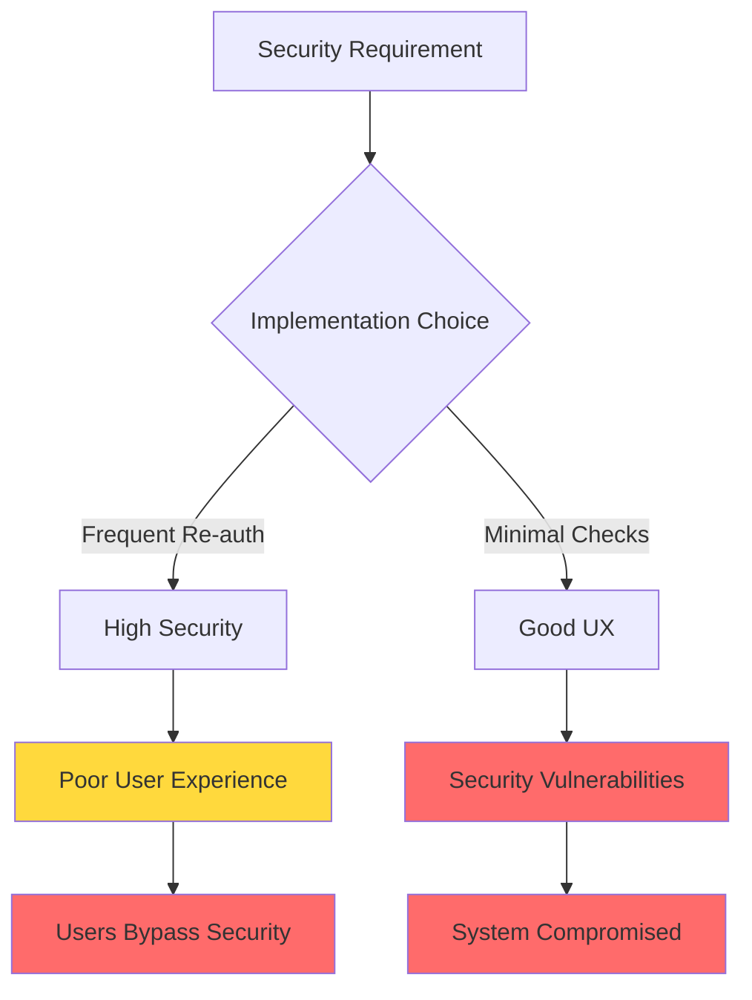
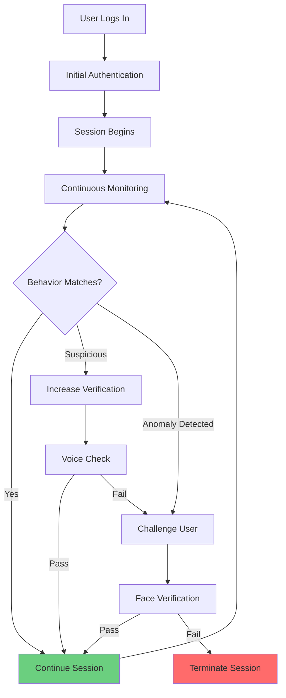

## The Authentication Challenge

In today's digital landscape, securing user sessions has become increasingly complex. While we've made significant progress in authentication technology, fundamental security gaps remain that expose systems to sophisticated attacks.

## Limitations of Current Authentication Methods

### 1. Traditional Password-Based Systems



**Key Vulnerabilities:**
- Brute Force Attacks - Automated attempts to guess passwords
- Phishing - Social engineering to steal credentials
- Dictionary Attacks - Using common password patterns
- Credential Stuffing - Reusing leaked credentials from other breaches
- Point-in-Time Verification - Only validates identity at login

### 2. Multi-Factor Authentication (MFA)

While MFA improves security by requiring multiple verification factors, it introduces significant challenges:

| Authentication Factor | Benefit | Limitation |
|----------------------|---------|------------|
| **Knowledge** (Password/PIN) | Familiar to users | Vulnerable to social engineering |
| **Possession** (Token/Smart Card) | Physical security | User must carry device; can be lost/stolen |
| **Inherence** (Biometric) | Unique to individual | Single point of failure if compromised |

**The MFA Paradox:**
- Enhanced security at login
- User friction and workflow disruption
- No continuous verification after initial authentication
- Users may bypass security measures due to inconvenience

### 3. Password-less Biometric Systems

Modern biometric systems (fingerprint, facial recognition) offer convenience but face critical issues:



**Persistent Vulnerabilities:**
- Spoofing - High-resolution photos can fool facial recognition
- Device Theft - Stolen devices with active sessions remain accessible
- Replay Attacks - Captured biometric data can be reused
- No Session Monitoring - Identity verified only once at login

## The Critical Security Gap

### Session-Based Attack Vectors

Once a user successfully authenticates, traditional systems create a dangerous vulnerability window:



### Common Attack Scenarios

#### 1. Session Hijacking


**Impact:** Attacker takes over authenticated session without needing original credentials

#### 2. Session Fixation
**Scenario:** Attacker injects a valid session ID into victim's session
- User authenticates using the fixed session ID
- Attacker uses the same session ID to gain access
- System cannot distinguish between legitimate and malicious activity

#### 3. Man-in-the-Middle (MitM) Attacks
**Scenario:** Attacker intercepts communication between user and server
- Credentials or session tokens captured in transit
- Attacker impersonates legitimate user
- Single authentication point provides no ongoing verification

## The Problem in Numbers

### Security Statistics

| Security Issue | Impact | Current Solutions |
|---------------|---------|------------------|
| 81% of breaches involve weak/stolen credentials | Critical | MFA, Password Managers |
| Session hijacking accounts for 35% of web attacks | High | Token encryption, HTTPS |
| Average time to detect breach: 207 days | Severe | Log monitoring, SIEM |
| Biometric spoofing success rate: 15-20% | Moderate | Liveness detection |

### The Cost of Static Authentication



## Why Existing Solutions Fall Short

### 1. One-Time Verification Weakness

**Current Approach:**
```
Login → Verify → Grant Access → No Further Checks
```

**The Gap:**
- No validation of who controls the session after login
- Cannot detect if device changes hands
- Unable to identify behavioral anomalies
- No protection against post-authentication attacks

### 2. User Experience vs Security Trade-off



### 3. Inability to Adapt

Traditional systems cannot:
- Adjust security levels based on risk
- Respond to behavioral changes in real-time
- Distinguish between legitimate user variance and malicious activity
- Provide contextual authentication

## The Need for Continuous Authentication

### What's Missing?

| Requirement | Traditional Auth | Continuous Auth |
|-------------|-----------------|-----------------|
| Real-time identity verification | No | Yes |
| Behavioral monitoring | No | Yes |
| Adaptive security levels | No | Yes |
| Session anomaly detection | No | Yes |
| Multi-modal verification | Partial | Yes |
| Minimal user disruption | Yes | Yes |

### The Solution Requirements

A robust continuous authentication system must:

1. **Verify Identity Throughout Session**
   - Not just at login, but continuously during active use
   - Passive monitoring without workflow interruption

2. **Multi-Modal Approach**
   - Combine physiological biometrics (face, voice)
   - Include behavioral biometrics (typing, movement)
   - Integrate contextual factors (location, device, time)

3. **Adaptive Risk Assessment**
   - Dynamically adjust verification requirements
   - Respond to anomalies in real-time
   - Balance security with user experience

4. **Attack Mitigation**
   - Detect and prevent session hijacking
   - Identify spoofing attempts
   - Recognize unauthorized access patterns

## Real-World Impact Scenarios

### Scenario 1: Remote Work Environment
**Problem:** Employee logs in from home, steps away, unauthorized person accesses sensitive data
**Current Systems:** Cannot detect the switch
**Impact:** Data breach, compliance violations

### Scenario 2: Financial Services
**Problem:** User's session token stolen during online banking
**Current Systems:** Attacker completes transactions using valid session
**Impact:** Financial fraud, identity theft

### Scenario 3: Healthcare Systems
**Problem:** Doctor's workstation left unattended with active session
**Current Systems:** Anyone can access patient records
**Impact:** HIPAA violations, privacy breach

## The Vision



This project addresses these critical gaps by implementing a continuous authentication system that:
- Monitors user behavior throughout the session
- Adapts security requirements based on risk levels
- Verifies identity using multiple biometric modalities
- Protects against session-based attacks in real-time
- Maintains user experience with minimal disruption

---

**Next:** [Technical Approach & System Architecture →](#)

**Previous:** [← Project Overview](#)
