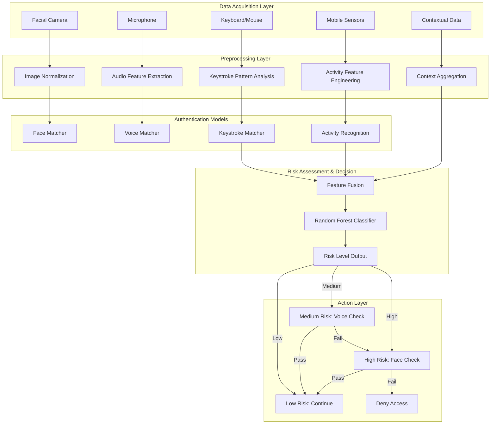
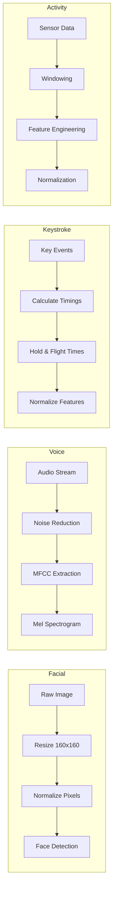
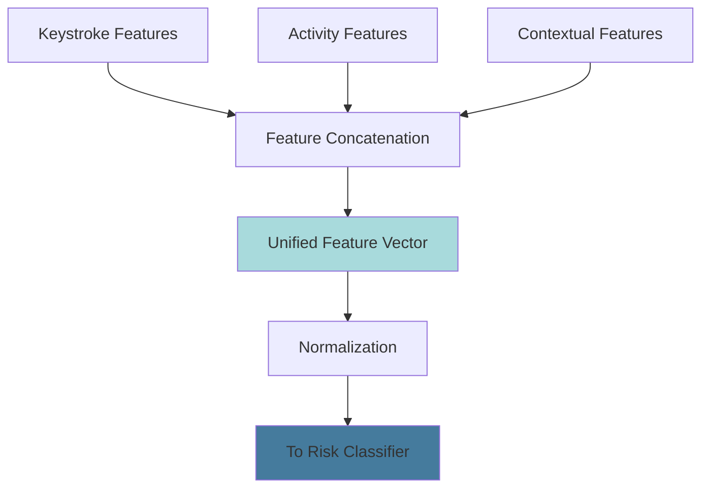
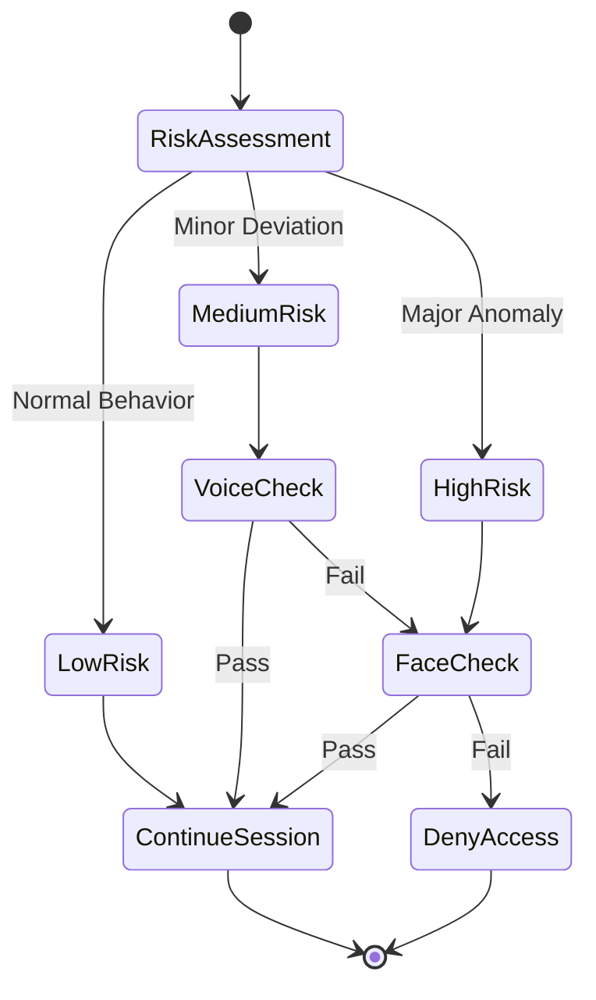
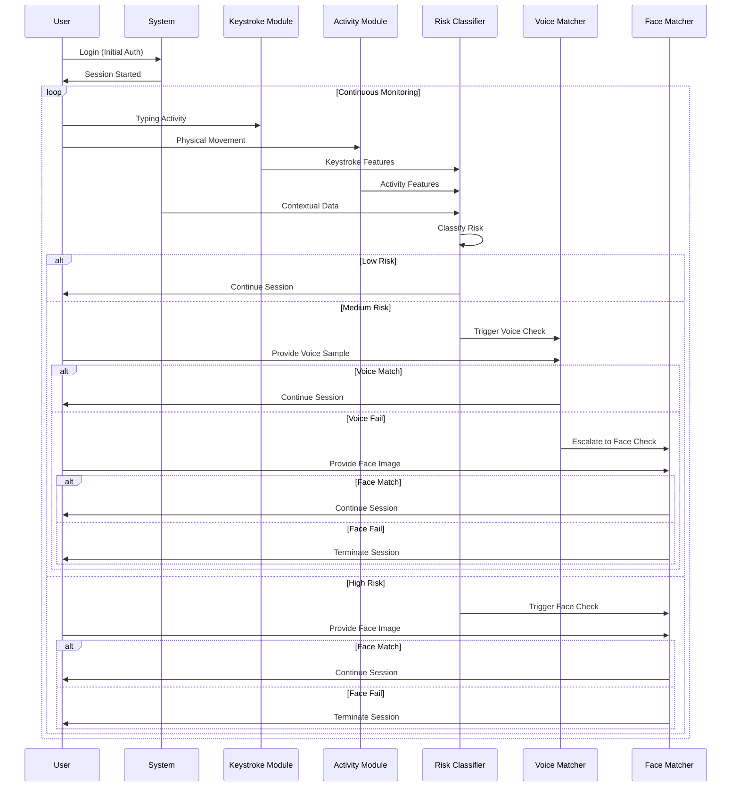
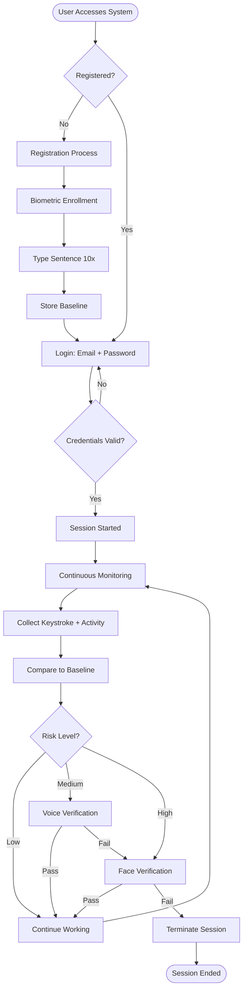
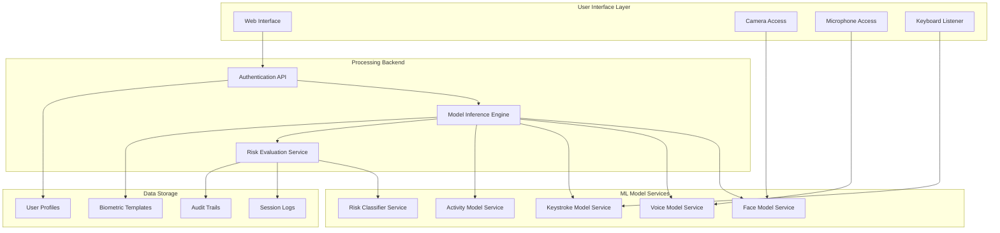

# System Architecture & Overview

## Introduction

The proposed continuous authentication system introduces a novel approach that integrates keystroke dynamics and human activity recognition data from mobile and IoT devices into a unified risk assessment framework. Unlike traditional authentication that verifies identity only at login, this system continuously monitors user behavior throughout the session and dynamically escalates verification requirements based on assessed risk levels.

## High-Level Architecture

## Core System Modules

### 1. Data Acquisition Module

The foundation of the continuous authentication system, responsible for collecting multi-modal biometric and contextual data.

**Biometric Data Sources:**
- **Facial Data**: Captured via webcam/device camera
- **Voice Data**: Recorded through microphone during natural interaction
- **Keystroke Data**: Monitoring typing patterns (hold time, flight time)
- **Activity Data**: Mobile sensors (accelerometer, gyroscope, GPS)

**Contextual Data Sources:**
- Device type and fingerprint
- IP address and geolocation
- Session duration and login time
- Network conditions
- Application usage patterns

### 2. Preprocessing Module

Transforms raw data into standardized formats suitable for machine learning models.

**Processing Steps by Modality:**

| Modality | Input | Processing | Output |
|----------|-------|------------|--------|
| Face | Raw image frames | Resize, normalize, detect faces | 160x160x3 normalized arrays |
| Voice | Audio waveform | Noise reduction, MFCC extraction | Mel spectrograms (128x64) |
| Keystroke | Key press/release events | Timing calculation, normalization | Hold/flight time vectors |
| Activity | Accelerometer/gyroscope | Windowing, feature extraction | 561-dimensional feature vectors |

### 3. Matcher Modules

Specialized deep learning models for each biometric modality.

#### Face Matcher
- **Architecture**: MobileNetV2 with triplet loss
- **Function**: Generates 512-dimensional facial embeddings
- **Comparison**: Euclidean distance between embeddings
- **Threshold**: Optimized at 0.5392

#### Voice Matcher
- **Architecture**: GRU with attention mechanism
- **Function**: Creates speaker-specific voiceprints
- **Input**: Mel spectrograms (128x64)
- **Output**: Speaker classification probabilities

#### Keystroke Dynamics Matcher
- **Architecture**: Bi-directional LSTM
- **Function**: Analyzes typing rhythm and timing patterns
- **Features**: Hold time, flight time, digraph analysis
- **Output**: User-specific typing embeddings

#### Activity Recognition Matcher
- **Architecture**: CNN-GRU hybrid
- **Function**: Classifies human activities from sensor data
- **Activities**: Walking, sitting, standing, running, etc.
- **Dataset**: UCI HAR (Human Activity Recognition)

### 4. Feature Fusion Module

Integrates outputs from keystroke dynamics and activity recognition for comprehensive behavioral analysis.

**Fusion Strategy:**
- **Level**: Feature-level fusion (early fusion)
- **Method**: Concatenation of normalized feature vectors
- **Advantage**: Captures interactions between behavioral modalities
- **Output**: Single unified representation for risk assessment

### 5. Risk Classification Module

A Random Forest classifier that categorizes authentication attempts into three risk levels.

**Input Features:**
- Keystroke dynamics embeddings
- Human activity patterns
- Contextual parameters (IP reputation, geolocation, session data)
- Login anomalies (time, frequency, duration)

**Risk Levels:**

| Risk Level | Criteria | Action Required |
|------------|----------|-----------------|
| Low | Behavior matches historical patterns | Continue session seamlessly |
| Medium | Minor deviations detected | Trigger voice verification |
| High | Significant anomalies or failed voice check | Require face verification |

### 6. Decision & Feedback Module

Manages the adaptive authentication flow based on risk assessment.

## Complete Data Flow

The system operates in a continuous loop throughout the user session:

## User Experience Flow

### Web Application Workflow

## System Integration Points

### Module Interaction Overview

## Unique Aspects of the Solution

### 1. Adaptive Authentication
The system learns and evolves with user behavior over time, reducing false positives and creating a personalized security profile.

### 2. Minimal User Disruption
By using passive behavioral monitoring (keystroke and activity patterns), the system performs continuous checks without requiring active user participation unless risk is detected.

### 3. Escalating Verification
Rather than applying maximum security at all times, the system intelligently escalates authentication requirements based on detected risk, balancing security with usability.

### 4. Application-Agnostic Design
The modular architecture allows the system to be integrated into various platforms (web, mobile, desktop) without modification to core components.

### 5. Multi-Layer Security
Combining behavioral biometrics (passive) with physiological biometrics (active) creates multiple layers of defense against sophisticated attacks.

## System Requirements

### Hardware Requirements
- **Camera**: For facial recognition (minimum 720p)
- **Microphone**: For voice authentication (standard quality)
- **Input Devices**: Keyboard/mouse for keystroke dynamics
- **Mobile Sensors**: Accelerometer, gyroscope (for mobile deployment)

### Software Requirements
- **Deep Learning Frameworks**: TensorFlow 2.x or PyTorch 1.x
- **Computer Vision**: OpenCV 4.x
- **Python**: 3.8 or higher
- **Database**: SQLite (development) / PostgreSQL (production)

### Performance Targets
- **Latency**: Under 200ms for risk assessment
- **Accuracy**: Above 85% for all biometric modalities
- **False Acceptance Rate**: Below 5%
- **False Rejection Rate**: Below 10%

## Security Considerations

### Data Protection
- All biometric data encrypted at rest and in transit
- User embeddings stored instead of raw biometric data
- Compliance with GDPR and relevant privacy regulations

### Attack Resistance
- Protection against replay attacks through liveness detection
- Spoofing resistance via multi-modal verification
- Session hijacking prevention through continuous monitoring

---
