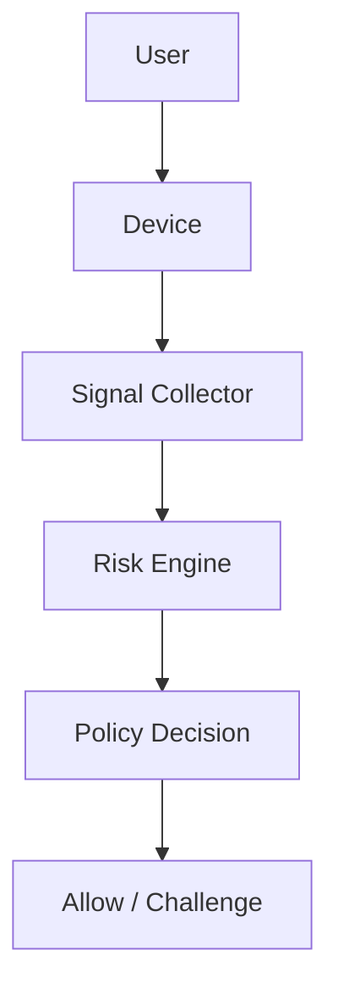

# System Architecture

A continuous authentication system collects signals, scores risk, and applies policy.

## Components

- Signal collectors
- Risk engine
- Policy evaluator
- Adaptive response

## Diagram

```mermaid
flowchart TD
  User --> Device[Device]
  Device --> Signals[Signal Collector]
  Signals --> Risk[Risk Engine]
  Risk --> Policy[Policy Decision]
  Policy --> Action[Allow / Challenge]
```
