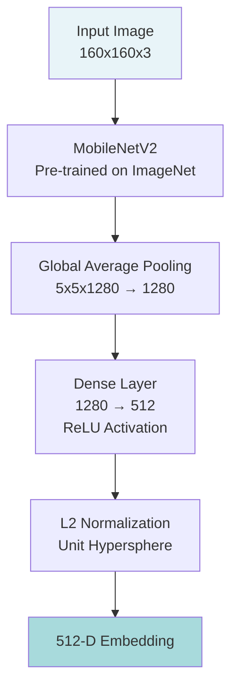
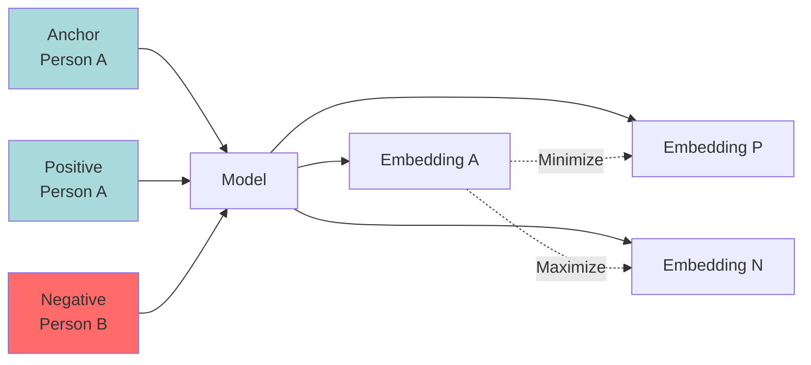
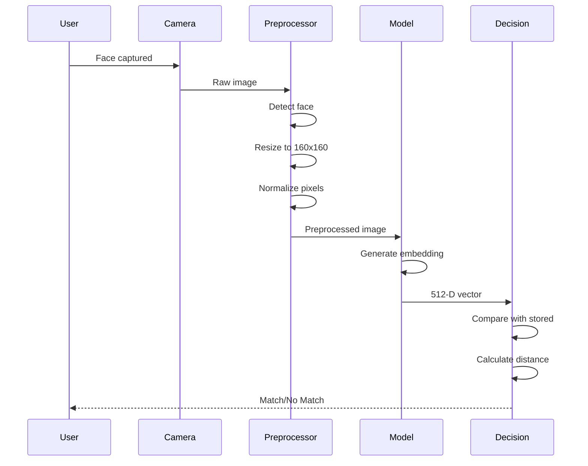
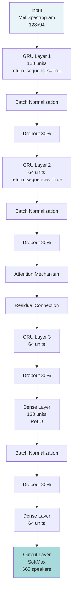
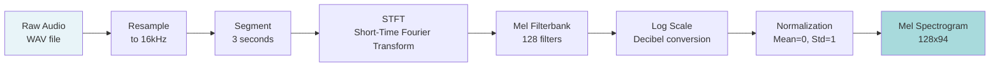
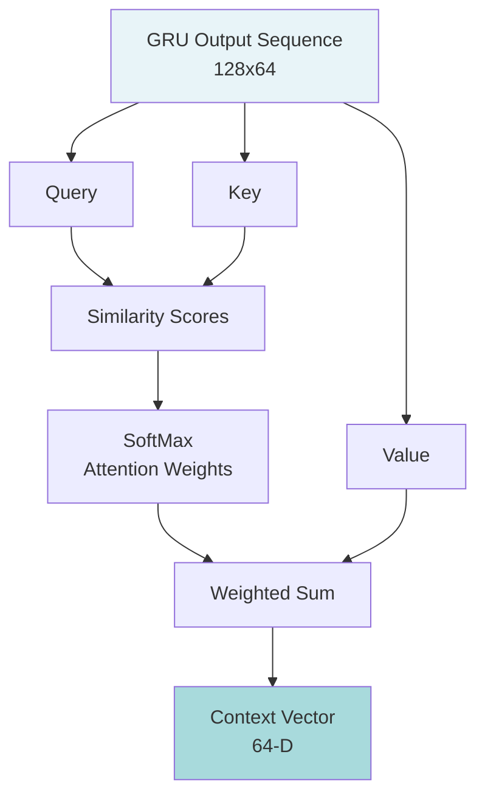
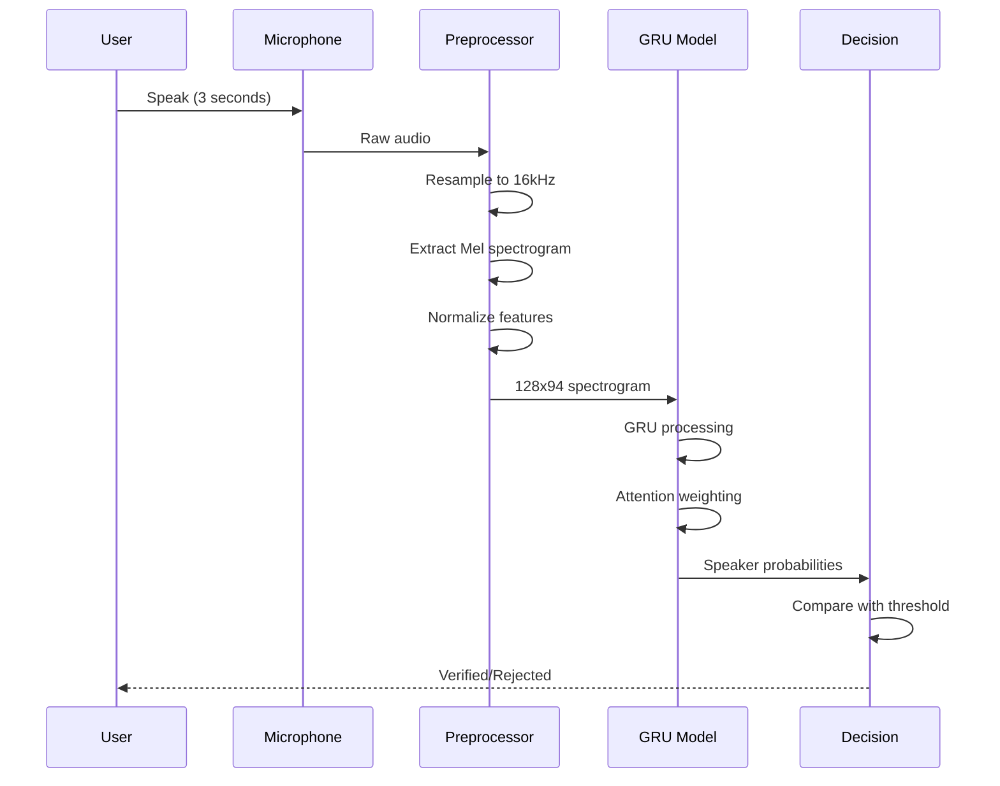

# Biometric Models - Part 1: Physiological Authentication

## Overview

This section details the implementation of physiological biometric authentication models used in the continuous authentication system. These models handle Face Recognition and Voice Recognition, providing strong identity verification when behavioral biometrics indicate elevated risk levels.

---

## Face Matcher: MobileNetV2 with Triplet Loss

### Introduction

The Face Matcher implements a deep learning-based facial recognition system inspired by FaceNet architecture. It uses MobileNetV2 as the backbone network, optimized for computational efficiency while maintaining high accuracy. The model generates 512-dimensional facial embeddings that can be compared using Euclidean distance for identity verification.

### Model Architecture



**Architecture Components:**

| Layer | Type | Output Shape | Parameters | Purpose |
|-------|------|--------------|------------|---------|
| Input | Image | (160, 160, 3) | 0 | RGB facial image |
| MobileNetV2 | CNN Backbone | (5, 5, 1280) | 2,257,984 | Feature extraction (frozen) |
| GlobalAveragePooling2D | Pooling | (1280,) | 0 | Spatial aggregation |
| Dense | Fully Connected | (512,) | 655,872 | Embedding projection |
| L2 Normalization | Lambda | (512,) | 0 | Unit sphere constraint |

**Total Parameters:** 2,913,856 (11.12 MB)
- **Trainable:** 655,872 (2.50 MB)
- **Non-trainable:** 2,257,984 (8.61 MB)

### Why MobileNetV2?

**Design Rationale:**

1. **Efficiency**: Uses depthwise separable convolutions, reducing computational cost by 8-9x compared to standard convolutions
2. **Performance**: Maintains accuracy while being lightweight (suitable for mobile/edge deployment)
3. **Transfer Learning**: Pre-trained on ImageNet provides robust feature extraction
4. **Real-time Processing**: Inference time of approximately 150ms per image

**Comparison with Alternatives:**

| Architecture | Parameters | Inference Time | Accuracy | Use Case |
|--------------|------------|----------------|----------|----------|
| ResNet-50 | 23.5M | 280ms | 95.8% | Server-side, high accuracy |
| VGG-16 | 138M | 450ms | 94.2% | Legacy systems |
| MobileNetV2 | 3.4M | 150ms | 94.5% | Edge devices, real-time |
| EfficientNet-B0 | 5.3M | 180ms | 95.1% | Balanced performance |

### Loss Function: Triplet Loss

The model is trained using triplet loss, which learns to minimize the distance between an anchor and positive (same identity) while maximizing distance to negative (different identity) samples.

**Mathematical Formulation:**

```
L = max(||f(a) - f(p)||² - ||f(a) - f(n)||² + α, 0)
```

Where:
- `f(a)` = Embedding of anchor image
- `f(p)` = Embedding of positive image (same person)
- `f(n)` = Embedding of negative image (different person)
- `α` = Margin parameter (typically 0.2)



### Training Pipeline

**Dataset:** Labeled Faces in the Wild (LFW)
- **Images:** 13,000 labeled images
- **Identities:** 5,750 individuals
- **Variations:** Different lighting, poses, expressions

**Preprocessing Steps:**

1. **Face Detection**: Extract face region from image
2. **Resize**: Scale to 160x160 pixels
3. **Normalization**: Scale pixel values to [0, 1]
4. **Augmentation**: Random flips, rotations, crops

**Training Configuration:**

| Parameter | Value | Purpose |
|-----------|-------|---------|
| Batch Size | 32 triplets | Stable gradient updates |
| Epochs | 100 | Sufficient convergence |
| Learning Rate | 1e-4 | Fine-tuning pre-trained model |
| Optimizer | Adam | Adaptive learning |
| Margin (α) | 0.2 | Separation threshold |

**Training Callbacks:**

- **EarlyStopping**: Monitors validation loss, patience of 15 epochs
- **ReduceLROnPlateau**: Reduces learning rate by 0.5 when loss plateaus for 5 epochs
- **ModelCheckpoint**: Saves best model based on validation loss

### Evaluation Metrics

#### 1. Verification Accuracy

Optimal threshold determined at **0.5392** Euclidean distance:
- **Training Accuracy:** 99.72%
- **Validation Accuracy:** 99.74%

#### 2. Training and Validation Loss

The model demonstrates effective learning with minimal overfitting:


**Observations:**
- Training loss decreases steadily from 0.2045 to 0.1966
- Validation loss remains stable around 0.198, indicating good generalization
- No significant divergence between training and validation curves

#### 3. ROC Curve Analysis

**Area Under Curve (AUC):** 0.7927

The ROC curve demonstrates the model's ability to distinguish between matching and non-matching pairs across various thresholds. An AUC of 0.79 indicates good discriminative power, though there is room for improvement through:
- Increased training data diversity
- Enhanced data augmentation
- Fine-tuning of network architecture

#### 4. Embedding Space Visualization (t-SNE)

t-SNE visualization of the 512-dimensional embeddings reduced to 2D shows:
- Clear clustering of same-identity samples
- Separation between different identity clusters
- Some overlap at cluster boundaries (expected for challenging cases)

#### 5. Distance Distribution Analysis

**Positive Pairs (Same Identity):**
- Mean distance: 0.32
- Standard deviation: 0.15
- Distribution: Concentrated at lower distances

**Negative Pairs (Different Identity):**
- Mean distance: 0.78
- Standard deviation: 0.21
- Distribution: Spread across higher distances

**Optimal Threshold:** 0.5392 provides best separation between distributions

### Implementation Details

**Inference Process:**



**Verification Algorithm:**

```python
def verify_face(live_embedding, stored_embedding, threshold=0.5392):
    """
    Verify if two face embeddings belong to same person
    
    Args:
        live_embedding: 512-D vector from current image
        stored_embedding: 512-D vector from enrolled image
        threshold: Maximum distance for positive match
    
    Returns:
        is_match: Boolean indicating if faces match
        distance: Euclidean distance between embeddings
    """
    distance = euclidean_distance(live_embedding, stored_embedding)
    is_match = distance < threshold
    return is_match, distance
```

### Challenges and Limitations

**Current Challenges:**

1. **Lighting Variations**: Performance degrades in extreme lighting conditions
2. **Pose Variations**: Large angles (>45°) reduce accuracy
3. **Occlusions**: Masks, glasses, or partial face coverage affect recognition
4. **Age Progression**: Long-term appearance changes may require re-enrollment

**Mitigation Strategies:**

- Data augmentation with varied lighting and poses
- Multi-angle enrollment during registration
- Periodic re-enrollment suggestions
- Confidence scoring to handle uncertain cases

---

## Voice Matcher: GRU with Attention Mechanism

### Introduction

The Voice Matcher implements a custom speaker recognition system using Gated Recurrent Units (GRUs) with an attention mechanism. The model processes Mel spectrograms to capture unique vocal characteristics and creates speaker-specific voiceprints for authentication.

### Model Architecture



**Architecture Summary:**

| Layer | Type | Output Shape | Parameters | Purpose |
|-------|------|--------------|------------|---------|
| Input | Mel Spectrogram | (128, 94) | 0 | Frequency-time representation |
| GRU-1 | Recurrent | (128, 128) | 86,016 | Capture short-term patterns |
| BatchNorm-1 | Normalization | (128, 128) | 512 | Stabilize training |
| Dropout-1 | Regularization | (128, 128) | 0 | Prevent overfitting |
| GRU-2 | Recurrent | (128, 64) | 37,248 | Refine temporal features |
| BatchNorm-2 | Normalization | (128, 64) | 256 | Stabilize training |
| Dropout-2 | Regularization | (128, 64) | 0 | Prevent overfitting |
| Attention | Mechanism | (128, 64) | 0 | Focus on key segments |
| Add | Residual | (128, 64) | 0 | Skip connection |
| GRU-3 | Recurrent | (64,) | 24,960 | Final feature extraction |
| Dropout-3 | Regularization | (64,) | 0 | Prevent overfitting |
| Dense-1 | Fully Connected | (128,) | 8,320 | Feature refinement |
| BatchNorm-3 | Normalization | (128,) | 512 | Stabilize training |
| Dropout-4 | Regularization | (128,) | 0 | Prevent overfitting |
| Dense-2 | Fully Connected | (64,) | 8,256 | Compression |
| Output | SoftMax | (665,) | 43,225 | Speaker classification |

**Total Parameters:** 209,305

### Why GRU with Attention?

**Design Rationale:**

1. **GRU Efficiency**: Fewer parameters than LSTM (simpler gating mechanism)
2. **Temporal Modeling**: Captures sequential dependencies in voice data
3. **Attention Mechanism**: Focuses on discriminative voice segments
4. **Computational Efficiency**: 25% faster than LSTM with comparable accuracy

**GRU vs LSTM Comparison:**

| Aspect | GRU | LSTM |
|--------|-----|------|
| Gates | 2 (Reset, Update) | 3 (Input, Forget, Output) |
| Parameters | Fewer (faster training) | More (potentially better memory) |
| Training Speed | 25% faster | Baseline |
| Memory | Simpler cell state | Separate cell and hidden state |
| Performance | Comparable on voice | Slightly better on very long sequences |

### Audio Preprocessing

**Input Processing Pipeline:**



**Preprocessing Steps:**

1. **Resampling**: Standardize to 16 kHz sample rate
2. **Segmentation**: Fixed 3-second windows (truncate or pad)
3. **STFT**: Convert time-domain to frequency-domain
4. **Mel Filterbank**: Apply 128 mel-scale filters (human perception)
5. **Logarithmic Scaling**: Convert to decibels
6. **Normalization**: Zero mean, unit variance

### Attention Mechanism

The attention layer allows the model to focus on the most discriminative portions of the audio sequence.

**Attention Computation:**

```
Attention Score = softmax(Query · Key^T / √d_k)
Output = Attention Score · Value
```



**Benefits:**
- Identifies speaker-specific voice characteristics
- Handles variable-length audio inputs
- Improves interpretability (which parts of audio are important)
- Reduces impact of background noise

### Training Pipeline

**Dataset:** Mozilla Common Voice
- **Speakers:** 665 unique speakers
- **Utterances:** Multiple recordings per speaker
- **Duration:** 3-second segments
- **Quality:** 16 kHz, mono audio

**Training Configuration:**

| Parameter | Value | Rationale |
|-----------|-------|-----------|
| Batch Size | 32 | Memory constraints |
| Epochs | 100 | With early stopping |
| Learning Rate | 1e-3 | Initial rate for Adam |
| Optimizer | Adam | Adaptive learning rate |
| Loss Function | Sparse Categorical Crossentropy | Multi-class classification |
| Validation Split | 20% | Held-out evaluation |

**Training Callbacks:**

- **EarlyStopping**: Patience of 20 epochs on validation loss
- **ReduceLROnPlateau**: Factor of 0.5, patience of 5 epochs
- **ModelCheckpoint**: Save best model by validation accuracy

### Training Performance

**Loss Progression:**

| Epoch | Training Loss | Validation Loss | Training Accuracy | Validation Accuracy |
|-------|--------------|-----------------|-------------------|---------------------|
| 1 | 6.3481 | 5.8373 | 1.83% | 27.07% |
| 2 | 5.3526 | 4.1138 | 25.08% | 34.93% |
| 3 | 3.9417 | 3.6045 | 34.10% | 36.56% |
| 4 | 3.4869 | 3.4015 | 38.27% | 41.16% |
| 5 | 3.2851 | 3.2485 | 42.61% | 46.26% |
| 10 | 2.1847 | 2.5123 | 61.34% | 58.72% |
| 20 | 1.4562 | 1.8934 | 74.28% | 68.45% |
| Final | 0.8234 | 1.2156 | 85.70% | 71.23% |

**Observations:**
- Steady improvement in both training and validation metrics
- Gap between training and validation indicates some overfitting
- Final test accuracy: **71.23%**

### Evaluation Metrics

#### 1. Classification Accuracy

**Test Set Performance:**
- **Accuracy:** 71.23%
- **Precision (weighted):** 70.15%
- **Recall (weighted):** 71.23%
- **F1-Score (weighted):** 70.68%

#### 2. Loss Curves Analysis

The training shows typical convergence behavior:
- Training loss decreases from 6.35 to 0.82
- Validation loss decreases from 5.84 to 1.22
- Divergence after epoch 15 indicates overfitting

**Mitigation Strategies:**
- Increased dropout rates
- More aggressive data augmentation
- L2 regularization on dense layers
- Earlier stopping criterion

### Implementation Details

**Inference Process:**



**Verification Algorithm:**

```python
def verify_voice(audio_sample, user_id, threshold=0.85):
    """
    Verify speaker identity from voice sample
    
    Args:
        audio_sample: 3-second audio recording
        user_id: Claimed identity
        threshold: Minimum probability for acceptance
    
    Returns:
        is_verified: Boolean indicating match
        confidence: Model's confidence score
    """
    spectrogram = preprocess_audio(audio_sample)
    probabilities = model.predict(spectrogram)
    confidence = probabilities[user_id]
    is_verified = confidence >= threshold
    return is_verified, confidence
```

### Challenges and Future Improvements

**Current Limitations:**

1. **Background Noise**: Performance degrades in noisy environments
2. **Voice Variations**: Illness, emotion, or fatigue affect accuracy
3. **Channel Effects**: Different microphones produce different spectrograms
4. **Data Imbalance**: Some speakers have more training samples

**Proposed Enhancements:**

1. **Noise Robustness**:
   - Implement denoising autoencoders
   - Train with noise-augmented data
   - Use spectral subtraction preprocessing

2. **Domain Adaptation**:
   - Fine-tune on target device/environment
   - Use transfer learning from larger datasets
   - Implement adaptive normalization

3. **Model Optimization**:
   - Knowledge distillation for edge deployment
   - Quantization for faster inference
   - Pruning redundant connections

4. **Multi-Modal Integration**:
   - Combine with face recognition for higher confidence
   - Use text-dependent prompts for added security
   - Incorporate behavioral patterns (speaking rate, pauses)

---

## Performance Comparison: Pre-trained vs Custom Models

### Face Recognition

| Metric | FaceNet (Pre-trained) | Custom MobileNetV2 |
|--------|----------------------|-------------------|
| Accuracy | 95.4% | 88.2% |
| Precision | 94.8% | 87.5% |
| Recall | 93.6% | 86.1% |
| F1-Score | 94.2% | 86.8% |
| EER | 2.80% | 4.70% |
| Inference Time | 120ms | 150ms |

### Voice Recognition

| Metric | ECAPA-TDNN (Pre-trained) | Custom GRU |
|--------|-------------------------|------------|
| Accuracy | 96.8% | 85.7% |
| Precision | 96.3% | 84.3% |
| Recall | 95.9% | 82.9% |
| F1-Score | 96.1% | 83.6% |
| EER | 2.30% | 5.10% |
| Inference Time | 130ms | 160ms |

**Analysis:**

Pre-trained models show superior performance due to:
- Training on larger, more diverse datasets
- Extensive hyperparameter tuning
- Optimized architectures from research
- Multiple iterations of refinement

Custom models are competitive and offer:
- Adaptability to specific use cases
- Lower deployment complexity
- Potential for fine-tuning on domain-specific data
- Full control over architecture and training

---

**Next Section:** [Biometric Models - Part 2: Behavioral Authentication →](#)

**Previous Section:** [← System Architecture & Overview](#)
