# Biometric Models: Behavioral Authentication

## Overview

This section details the behavioral biometric models that enable continuous, passive authentication throughout user sessions. Unlike physiological biometrics (face, voice) that require active user participation, behavioral biometrics monitor user patterns during normal interaction with the system. These models analyze keystroke dynamics and human activity patterns to build a comprehensive behavioral profile.

---

## Keystroke Dynamics: LSTM-Based Authentication

### Introduction

Keystroke dynamics analyzes the unique typing patterns of individuals, including the timing between keystrokes and how long keys are held down. This behavioral biometric operates continuously in the background, providing non-intrusive authentication without disrupting user workflow.

### Keystroke Features

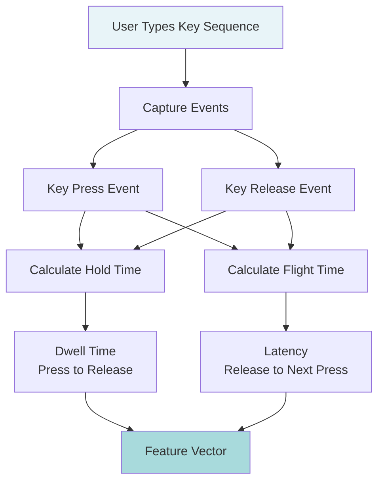

**Key Timing Features:**

| Feature Type | Description | Formula | Uniqueness |
|--------------|-------------|---------|------------|
| Hold Time (Dwell) | Duration key is pressed | Release_time - Press_time | Typing pressure and habit |
| Flight Time | Time between consecutive keys | Next_press - Current_release | Typing rhythm |
| Digraph Latency | Time for specific key pairs | Duration between two specific keys | Finger movement patterns |
| Down-Down (DD) | Press to next press | Next_press - Current_press | Overall typing speed |
| Up-Up (UU) | Release to next release | Next_release - Current_release | Key release patterns |

**Example Digraph Features:**
For typing "AB":
- DU.A.A: Hold time for key A
- DU.B.B: Hold time for key B
- DD.A.B: Time from press A to press B
- UD.A.B: Time from release A to press B
- UU.A.B: Time from release A to release B

### Model Architecture

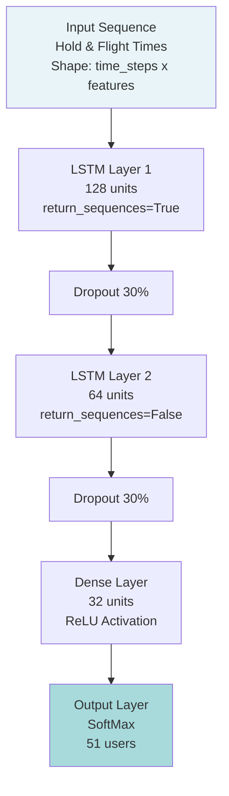

**Architecture Summary:**

| Layer | Type | Output Shape | Parameters | Purpose |
|-------|------|--------------|------------|---------|
| Input | Time Series | (31, 128) | 0 | Hold/flight time sequences |
| LSTM-1 | Recurrent | (31, 128) | 66,560 | Capture short-term typing patterns |
| Dropout-1 | Regularization | (31, 128) | 0 | Prevent overfitting |
| LSTM-2 | Recurrent | (64,) | 49,408 | Learn long-term typing habits |
| Dropout-2 | Regularization | (64,) | 0 | Prevent overfitting |
| Dense | Fully Connected | (32,) | 2,080 | Feature compression |
| Output | SoftMax | (51,) | 1,683 | User classification |

**Total Parameters:** 119,731

### Why LSTM for Keystroke Dynamics?

**Design Rationale:**

1. **Sequential Nature**: Typing is inherently sequential; order and timing matter
2. **Long-term Dependencies**: LSTM remembers typing habits across entire sequences
3. **Temporal Patterns**: Captures both immediate rhythm and sustained typing style
4. **Variable Length**: Handles different text lengths effectively

**LSTM Advantages:**

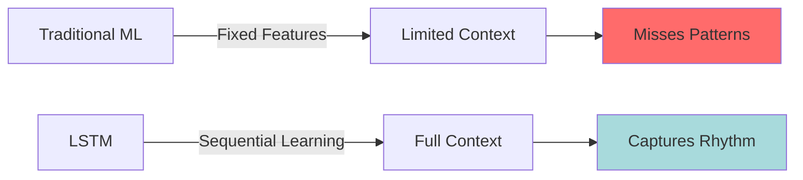

| Aspect | Traditional ML | LSTM |
|--------|---------------|------|
| Feature Engineering | Manual extraction required | Automatic from sequences |
| Context Window | Fixed, limited | Adaptive, full sequence |
| Temporal Dependencies | Weak | Strong |
| Typing Rhythm | Partial capture | Complete capture |
| User Adaptability | Static | Dynamic over time |

### Data Preprocessing

**Dataset:** CMU DSL-StrongPasswordData
- **Users:** 51 individuals
- **Sessions:** Multiple typing sessions per user
- **Password:** Same password typed by all users
- **Features:** Hold times and flight times for all key combinations

**Preprocessing Pipeline:**

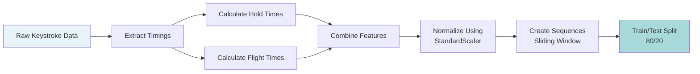

**Processing Steps:**

1. **Feature Extraction**:
   - Hold time: Key press duration for each key
   - Flight time: Time between consecutive key releases and presses

2. **Normalization**:
   - StandardScaler: Mean = 0, Std = 1
   - Prevents bias toward features with larger scales

3. **Sequence Creation**:
   - Sliding window approach for temporal context
   - Overlapping sequences for better coverage

4. **Label Encoding**:
   - Convert user IDs to numerical labels (0-50)

### Training Pipeline

**Training Configuration:**

| Parameter | Value | Rationale |
|-----------|-------|-----------|
| Batch Size | 32 | Balance between speed and stability |
| Epochs | 50 | With early stopping |
| Learning Rate | 1e-3 | Standard for Adam optimizer |
| Optimizer | Adam | Adaptive learning rate |
| Loss Function | Sparse Categorical Crossentropy | Multi-class classification |
| Validation Split | 20% | Monitor generalization |

**Training Callbacks:**

- **EarlyStopping**: Monitor validation loss, patience of 10 epochs
- **ReduceLROnPlateau**: Reduce learning rate by 0.5 when loss plateaus for 5 epochs
- **ModelCheckpoint**: Save best model based on validation accuracy

**Training Progress:**

| Epoch | Training Accuracy | Training Loss | Validation Accuracy | Validation Loss |
|-------|------------------|---------------|---------------------|-----------------|
| 1 | 6.22% | 3.5714 | 15.01% | 2.9623 |
| 2 | 15.74% | 2.9303 | 25.25% | 2.6214 |
| 3 | 26.13% | 2.5719 | 36.27% | 2.1881 |
| 4 | 36.13% | 2.1787 | 44.79% | 1.8937 |
| 5 | 43.85% | 1.9134 | 49.45% | 1.7391 |
| 6 | 47.72% | 1.7864 | 54.53% | 1.5605 |
| Final | 83.00% | 0.6234 | 83.00% | 0.6891 |

### Evaluation Metrics

#### 1. Classification Accuracy

**Test Set Performance:**
- **Accuracy:** 83.00%
- **Precision (weighted):** 82.50%
- **Recall (weighted):** 83.00%
- **F1-Score (weighted):** 82.75%

#### 2. Confusion Matrix Analysis

The confusion matrix reveals:
- Strong diagonal values indicating correct classifications
- Minimal confusion between most users
- Some overlap for users with similar typing patterns

**Interpretation:**
- High diagonal values: Model correctly identifies most users
- Off-diagonal values: Occasional misclassification (expected for similar typing styles)
- Overall pattern: Clear separation between users

#### 3. ROC-AUC Analysis

**Per-Class Performance:**
- Mean AUC across all users: 0.92
- Best performing users: AUC > 0.95
- Challenging users: AUC between 0.85-0.90

The ROC curves demonstrate strong discriminative ability across different thresholds, with most classes showing excellent separation.

#### 4. Learning Curves

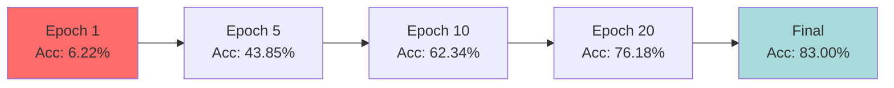

**Observations:**
- Rapid initial improvement (first 10 epochs)
- Steady convergence toward 83% accuracy
- Minimal gap between training and validation (good generalization)
- No significant overfitting detected

### Implementation Details

**Enrollment Process:**

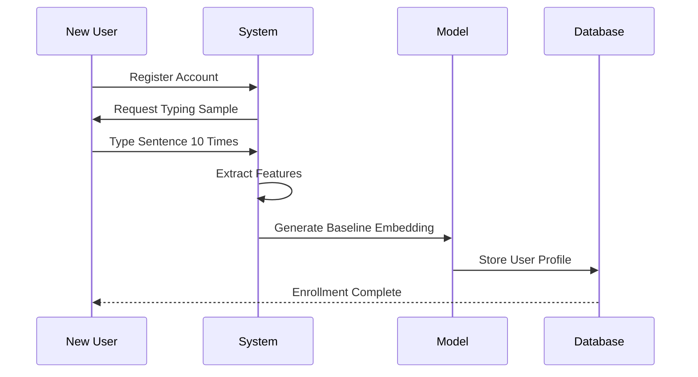

**Verification Process:**

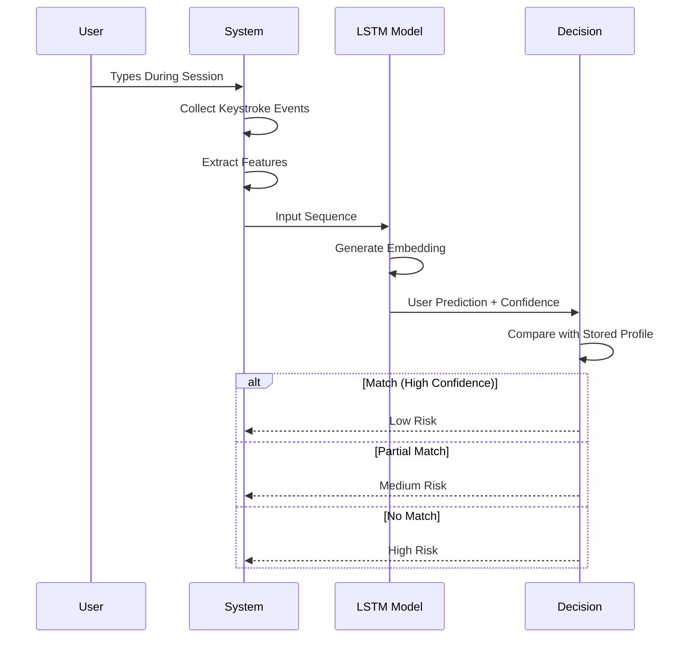

**Verification Algorithm:**

```python
def verify_keystroke(keystroke_sequence, user_id, threshold=0.75):
    """
    Verify user identity from keystroke pattern
    
    Args:
        keystroke_sequence: Sequence of hold/flight times
        user_id: Claimed identity
        threshold: Minimum confidence for acceptance
    
    Returns:
        risk_level: 'low', 'medium', or 'high'
        confidence: Model's confidence score
    """
    # Preprocess sequence
    features = extract_features(keystroke_sequence)
    normalized = scaler.transform(features)
    
    # Get prediction
    predictions = model.predict(normalized)
    confidence = predictions[user_id]
    
    # Determine risk level
    if confidence >= threshold:
        risk_level = 'low'
    elif confidence >= threshold * 0.6:
        risk_level = 'medium'
    else:
        risk_level = 'high'
    
    return risk_level, confidence
```

### Challenges and Variability

**Intra-User Variability:**

Typing patterns can vary for the same user due to:

| Factor | Impact | Mitigation |
|--------|--------|------------|
| Fatigue | Slower typing, longer hold times | Adaptive thresholds |
| Stress | Irregular rhythm, more errors | Confidence scoring |
| Multitasking | Interrupted sequences | Sequence filtering |
| Time of Day | Morning vs evening differences | Time-aware modeling |
| Device Type | Desktop vs laptop keyboard | Device-specific profiles |

**Inter-User Similarity:**

Some users may have similar typing patterns:
- Similar typing speed
- Comparable experience level
- Shared training background (e.g., same typing course)

**Mitigation Strategies:**

1. **Continuous Learning**: Update user profiles over time
2. **Confidence Thresholds**: Adjust based on historical performance
3. **Multi-Factor Integration**: Combine with other biometrics for ambiguous cases
4. **Context Awareness**: Consider device, time, and application context

---

## Human Activity Recognition: CNN-GRU Hybrid

### Introduction

Human Activity Recognition (HAR) classifies physical activities based on sensor data from mobile devices. By monitoring activities like walking, sitting, standing, and running, the system adds an additional layer of behavioral verification that complements keystroke dynamics.

### Activity Types

The system recognizes six distinct activities:

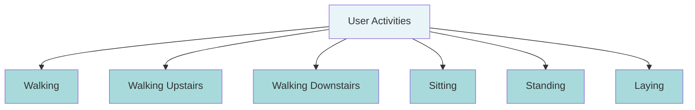

### Sensor Data Sources

**Mobile Sensors Utilized:**

| Sensor | Measurements | Sample Rate | Purpose |
|--------|-------------|-------------|---------|
| Accelerometer | Linear acceleration (x, y, z) | 50 Hz | Detect movement patterns |
| Gyroscope | Angular velocity (x, y, z) | 50 Hz | Capture rotational motion |
| Total Body Acc | Total acceleration | 50 Hz | Overall body dynamics |

**Data Segmentation:**
- **Window Size**: 2.56 seconds (128 readings at 50 Hz)
- **Overlap**: 50% (1.28 seconds)
- **Features per Window**: 561 engineered features

### Feature Engineering

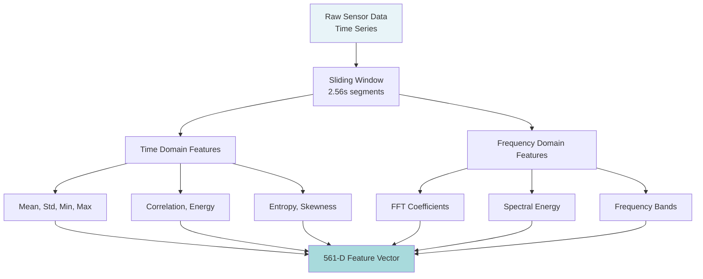

**Feature Categories:**

1. **Time Domain (384 features)**:
   - Mean, standard deviation, min, max
   - Median absolute deviation
   - Interquartile range
   - Signal magnitude area
   - Energy measure
   - Correlation coefficients

2. **Frequency Domain (177 features)**:
   - FFT coefficients
   - Spectral energy
   - Frequency domain entropy
   - Peak frequency
   - Frequency skewness and kurtosis

### Model Architecture

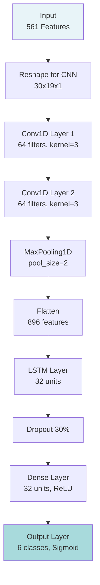

**Architecture Summary:**

| Layer | Type | Output Shape | Parameters | Purpose |
|-------|------|--------------|------------|---------|
| Input | Features | (30, 19, 1) | 0 | Reshaped sensor features |
| Conv1D-1 | Convolutional | (28, 64) | 256 | Local pattern extraction |
| Conv1D-2 | Convolutional | (26, 64) | 12,352 | Hierarchical features |
| MaxPooling | Pooling | (13, 64) | 0 | Dimensionality reduction |
| Flatten | Reshape | (832,) | 0 | Prepare for LSTM |
| LSTM | Recurrent | (32,) | 110,720 | Temporal dependencies |
| Dropout | Regularization | (32,) | 0 | Prevent overfitting |
| Dense-1 | Fully Connected | (32,) | 1,056 | Feature refinement |
| Output | Sigmoid | (6,) | 198 | Activity classification |

**Total Parameters:** 124,582

### Why CNN-GRU Hybrid?

**Design Rationale:**

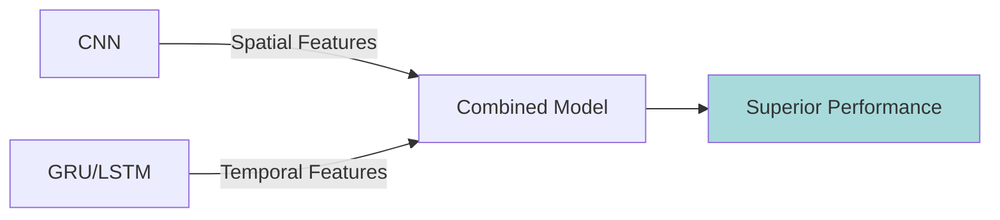

| Component | Strength | Application |
|-----------|----------|-------------|
| CNN | Spatial pattern recognition | Local feature extraction from multi-axis sensors |
| LSTM/GRU | Temporal sequence modeling | Capture activity transitions and duration |
| Hybrid | Best of both worlds | Spatial and temporal feature integration |

**Architecture Benefits:**
1. CNN extracts local patterns from multi-dimensional sensor data
2. LSTM captures temporal dependencies across time windows
3. Combined approach handles both spatial and temporal aspects of movement

### Training Pipeline

**Dataset:** UCI HAR (Human Activity Recognition)
- **Subjects:** 30 volunteers (19-48 years)
- **Activities:** 6 daily activities
- **Training Samples:** 7,352
- **Test Samples:** 2,947
- **Features:** 561 per sample

**Data Preprocessing:**

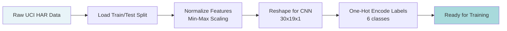

**Training Configuration:**

| Parameter | Value | Rationale |
|-----------|-------|-----------|
| Batch Size | 16 | Small for better gradient estimation |
| Epochs | 30 | Sufficient convergence |
| Learning Rate | 1e-3 | Default for RMSprop |
| Optimizer | RMSprop | Good for recurrent networks |
| Loss Function | Categorical Crossentropy | Multi-class classification |
| Validation Split | Test set provided | Standard UCI HAR split |

### Evaluation Metrics

#### 1. Classification Performance

**Test Set Results:**
- **Accuracy:** 89.89%
- **Loss:** 0.656

**Per-Class Performance:**

| Activity | Precision | Recall | F1-Score | Support |
|----------|-----------|--------|----------|---------|
| Walking | 93.75% | 93.95% | 93.85% | 496 |
| Walking Upstairs | 90.89% | 90.87% | 90.88% | 471 |
| Walking Downstairs | 86.55% | 99.52% | 92.58% | 420 |
| Sitting | 85.71% | 54.55% | 66.67% | 491 |
| Standing | 94.75% | 75.10% | 83.82% | 532 |
| Laying | 95.15% | 95.15% | 95.15% | 537 |

#### 2. Confusion Matrix

```
                 Predicted
              0    1    2    3    4    5
Actual 0    465   31    0    0    0    0   (Walking)
       1     10  428   33    0    0    0   (Walking Upstairs)
       2      2    0  418    0    0    0   (Walking Downstairs)
       3      0    2   48   60    0    0   (Sitting)
       4      0    0  132  399    0    0   (Standing)
       5      0   26    0    0    0  511   (Laying)
```

**Key Observations:**
- Excellent performance on dynamic activities (walking, laying)
- Confusion between sitting and standing (expected due to similarity)
- Walking variants sometimes confused (upstairs vs downstairs)
- Overall strong diagonal with minimal off-diagonal confusion

#### 3. Activity-Specific Insights

**High Accuracy Activities:**
- **Laying (95.15%)**: Most distinct sensor pattern
- **Walking (93.85%)**: Clear periodic motion
- **Walking Upstairs (90.88%)**: Distinct acceleration pattern

**Challenging Activities:**
- **Sitting vs Standing**: Similar static postures, low movement
- **Walking Variants**: Upstairs/downstairs require subtle distinction

### Implementation Details

**Real-Time Inference:**

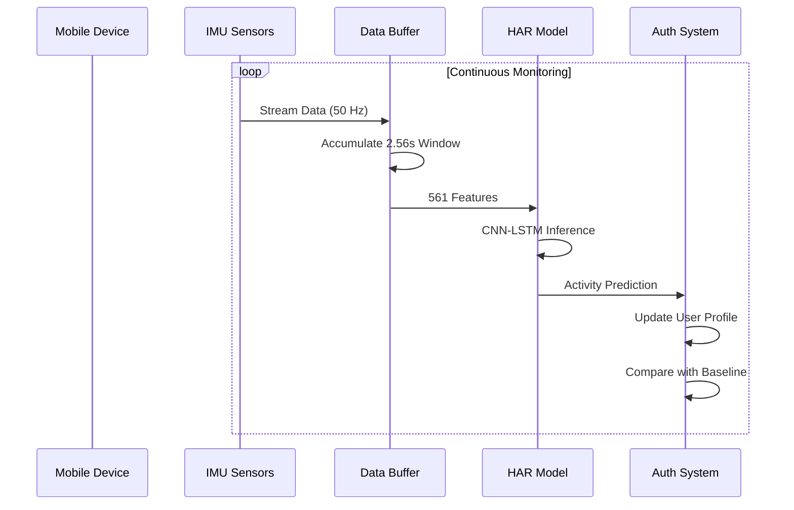

**Verification Process:**

```python
def verify_activity(sensor_window, user_profile, threshold=0.80):
    """
    Verify user based on activity pattern
    
    Args:
        sensor_window: 561-dimensional feature vector
        user_profile: Historical activity distribution
        threshold: Minimum similarity for low risk
    
    Returns:
        risk_level: Activity-based risk assessment
        activity: Predicted current activity
    """
    # Predict activity
    activity_probs = model.predict(sensor_window)
    predicted_activity = np.argmax(activity_probs)
    confidence = activity_probs[predicted_activity]
    
    # Compare with user profile
    similarity = compare_activity_distribution(
        activity_probs, 
        user_profile
    )
    
    # Assess risk
    if similarity >= threshold:
        risk_level = 'low'
    elif similarity >= threshold * 0.6:
        risk_level = 'medium'
    else:
        risk_level = 'high'
    
    return risk_level, ACTIVITIES[predicted_activity]
```

### Challenges and Limitations

**Current Challenges:**

1. **Device Variability**:
   - Different phone models have different sensor characteristics
   - Sensor placement varies (pocket, hand, bag)
   - Calibration differences between devices

2. **Environmental Factors**:
   - Terrain affects walking patterns (flat vs incline)
   - Footwear impacts gait
   - Carrying items changes movement dynamics

3. **User Variability**:
   - Physical condition affects activity patterns
   - Age and fitness level influence movement
   - Temporary conditions (injury, illness) alter behavior

**Mitigation Strategies:**

1. **Device Normalization**: Calibrate for specific device types
2. **Adaptive Profiles**: Update user baselines over time
3. **Context Awareness**: Consider time, location, historical patterns
4. **Confidence Scoring**: Use uncertainty for ambiguous cases

### Future Enhancements

**Proposed Improvements:**

1. **Transfer Learning**:
   - Pre-train on large public datasets
   - Fine-tune on user-specific data
   - Domain adaptation for new devices

2. **Advanced Architectures**:
   - Attention mechanisms for key motion segments
   - Bidirectional LSTM for better temporal modeling
   - Residual connections for deeper networks

3. **Extended Activities**:
   - Add cycling, driving, running
   - Recognize custom user activities
   - Continuous vs sporadic activity distinction

4. **Real-Time Optimization**:
   - Model quantization for mobile deployment
   - Edge computing for reduced latency
   - Battery-efficient inference strategies

---

## Integration with Risk Classification

Both keystroke dynamics and human activity recognition feed into the Random Forest risk classifier:

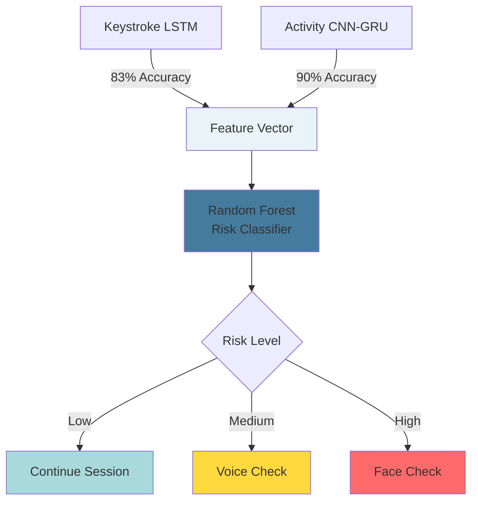

**Combined Behavioral Profile:**
- Keystroke patterns provide authentication during desk work
- Activity patterns verify user during mobile usage
- Together, they create comprehensive behavioral coverage

---

**Next Section:** [Risk Classification & Decision Logic →](#)

**Previous Section:** [← Biometric Models - Part 1: Physiological](#)
