# Risk Classification & Decision Logic

## Overview

The Risk Classification module serves as the decision-making engine of the continuous authentication system. It integrates behavioral biometrics (keystroke dynamics and human activity recognition) with contextual parameters to assess the legitimacy of each user session. Based on this assessment, the system dynamically determines the appropriate level of verification required.

---

## Feature Fusion Strategy

### Multi-Source Data Integration

The risk classifier receives inputs from multiple sources to create a comprehensive user profile:

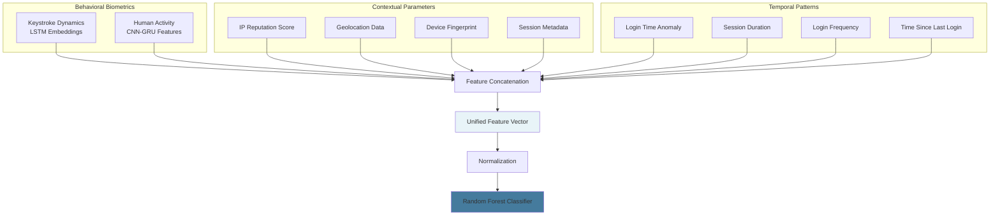

### Feature Categories

#### 1. Behavioral Features

**Keystroke Dynamics:**
- Embedding vector from LSTM model (64 dimensions)
- Average typing speed
- Standard deviation of keystroke intervals
- Digraph-specific patterns

**Human Activity Recognition:**
- Predicted activity probabilities (6 classes)
- Activity confidence score
- Activity transition frequency
- Movement intensity metrics

#### 2. Contextual Features

| Feature | Description | Risk Indicator |
|---------|-------------|----------------|
| IP Reputation | Fraud score from IP database (0-100) | Higher score = higher risk |
| Geolocation | Physical location from IP/GPS | Unusual location = risk |
| Geo Distance | Distance from typical locations | Large distance = risk |
| Device Fingerprint | Browser/device characteristics | Unknown device = risk |
| Fingerprint Match | Match with enrolled devices | No match = risk |

#### 3. Temporal Features

| Feature | Description | Anomaly Detection |
|---------|-------------|-------------------|
| Login Time | Hour of day when login occurs | Unusual hours flagged |
| Login Frequency | Number of logins per day | Abnormal frequency detected |
| Session Duration | Time spent in session | Unusually short/long flagged |
| Time Since Last Login | Hours since previous session | Irregular patterns noted |
| Past Auth Failures | Recent failed attempts | Multiple failures = risk |

### Feature Engineering

**Derived Risk Indicators:**

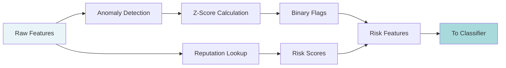

**Example Calculations:**

```python
# Temporal Anomaly Detection
def calculate_anomaly_score(value, user_history):
    """
    Calculate z-score based on user's historical behavior
    """
    mean = np.mean(user_history)
    std = np.std(user_history)
    z_score = abs((value - mean) / (std + 1e-6))
    
    # Flag as anomaly if beyond 2 standard deviations
    is_anomaly = z_score > 2.0
    return z_score, is_anomaly

# IP Reputation Risk
def get_ip_risk(ip_address):
    """
    Query IP reputation database
    Returns: fraud_score (0-100), location, risk_level
    """
    reputation_data = ip_reputation_api.query(ip_address)
    return {
        'fraud_score': reputation_data['fraud_score'],
        'location': reputation_data['location'],
        'is_vpn': reputation_data['vpn_detected'],
        'is_proxy': reputation_data['proxy_detected']
    }
```

---

## Random Forest Classifier

### Model Architecture

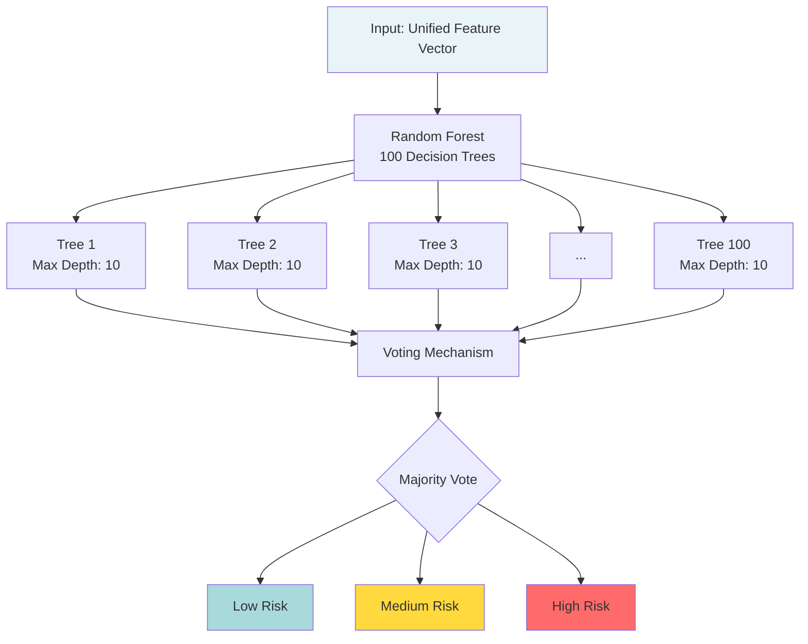

### Why Random Forest?

**Design Rationale:**

| Advantage | Benefit | Application |
|-----------|---------|-------------|
| Ensemble Learning | Combines multiple weak learners | Robust predictions |
| Feature Importance | Identifies critical features | Interpretability |
| Non-linear Relationships | Captures complex patterns | Better risk detection |
| Handles Mixed Data | Works with numerical and categorical | Diverse feature types |
| Resistant to Overfitting | Averaging reduces variance | Generalizes well |
| Fast Inference | Parallel tree evaluation | Real-time classification |

**Comparison with Alternatives:**

| Model | Accuracy | Interpretability | Speed | Robustness |
|-------|----------|------------------|-------|------------|
| Logistic Regression | 72% | High | Very Fast | Low |
| SVM | 78% | Low | Moderate | Moderate |
| Neural Network | 82% | Very Low | Slow | High |
| Random Forest | 85% | Moderate | Fast | High |
| Gradient Boosting | 87% | Moderate | Moderate | High |

**Selected: Random Forest** - Best balance of accuracy, speed, and interpretability

### Model Configuration

**Hyperparameters:**

| Parameter | Value | Rationale |
|-----------|-------|-----------|
| Number of Trees | 100 | Balance between performance and speed |
| Max Depth | 10 | Prevent overfitting while capturing patterns |
| Min Samples Split | 5 | Ensure sufficient data at each split |
| Min Samples Leaf | 2 | Allow fine-grained decisions |
| Max Features | sqrt(n_features) | Reduce correlation between trees |
| Bootstrap | True | Sample with replacement for diversity |
| Class Weight | Balanced | Handle imbalanced risk levels |

### Training Process

**Dataset Preparation:**

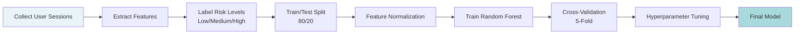

**Training Configuration:**

```python
from sklearn.ensemble import RandomForestClassifier

# Initialize model
rf_classifier = RandomForestClassifier(
    n_estimators=100,
    max_depth=10,
    min_samples_split=5,
    min_samples_leaf=2,
    max_features='sqrt',
    bootstrap=True,
    class_weight='balanced',
    random_state=42,
    n_jobs=-1  # Use all CPU cores
)

# Train with cross-validation
from sklearn.model_selection import cross_val_score

cv_scores = cross_val_score(
    rf_classifier, 
    X_train, 
    y_train, 
    cv=5, 
    scoring='accuracy'
)

print(f"CV Accuracy: {cv_scores.mean():.2f} (+/- {cv_scores.std():.2f})")
```

### Feature Importance Analysis

The Random Forest model provides insights into which features contribute most to risk assessment:

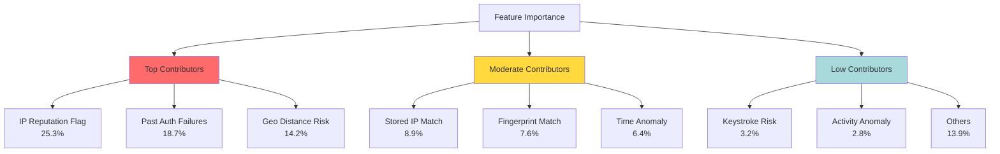

**Key Insights:**

1. **Network-based features dominate** (IP reputation, geolocation)
   - These provide strong signals for detecting compromised accounts
   - Known malicious IPs are highly predictive

2. **Behavioral history matters** (past failures, login patterns)
   - Recent authentication failures strongly indicate risk
   - Historical patterns establish baseline

3. **Biometric features are supplementary** (keystroke, activity)
   - Provide continuous verification during session
   - Act as tiebreakers for ambiguous cases
   - More important for session continuity than initial assessment

**Feature Importance Table:**

| Rank | Feature | Importance | Category |
|------|---------|------------|----------|
| 1 | IP Reputation Flag | 25.3% | Contextual |
| 2 | Past Auth Failures | 18.7% | Temporal |
| 3 | Geo Distance Risk | 14.2% | Contextual |
| 4 | Stored IP Match | 8.9% | Contextual |
| 5 | Fingerprint Match | 7.6% | Contextual |
| 6 | Time Anomaly | 6.4% | Temporal |
| 7 | Session Duration Anomaly | 5.3% | Temporal |
| 8 | Login Frequency Anomaly | 4.7% | Temporal |
| 9 | Keystroke Risk | 3.2% | Behavioral |
| 10 | Activity Anomaly | 2.8% | Behavioral |

---

## Risk Level Classification

### Three-Tier Risk System

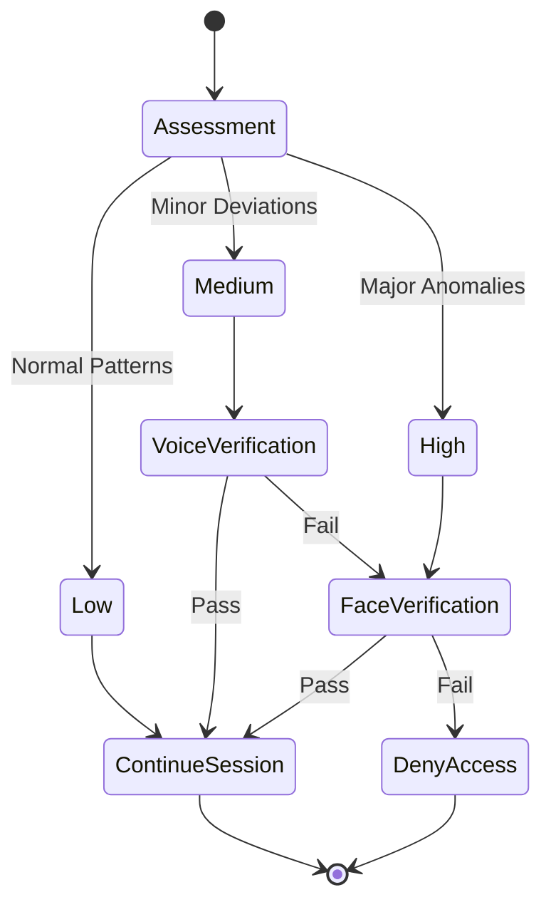

### Risk Level Definitions

#### Low Risk (Confidence > 80%)

**Characteristics:**
- All features align with user's historical profile
- Known device and IP address
- Normal login time and location
- Keystroke and activity patterns match baseline
- No recent authentication failures

**System Action:**
```python
if risk_level == 'low':
    # Continue session without interruption
    log_event('session_continued', user_id, timestamp)
    return {
        'action': 'continue',
        'message': 'Session verified',
        'confidence': confidence_score
    }
```

**User Experience:**
- Seamless access
- No additional verification required
- Background monitoring continues

#### Medium Risk (Confidence 50-80%)

**Characteristics:**
- Minor deviations from typical behavior
- Examples:
  - Unusual login time (but from known location)
  - Known device but different IP
  - Slight variation in keystroke patterns
  - Activity pattern partially matches

**System Action:**
```python
if risk_level == 'medium':
    # Trigger voice verification
    log_event('voice_verification_required', user_id, timestamp)
    voice_result = request_voice_verification(user_id)
    
    if voice_result['verified']:
        return {'action': 'continue', 'method': 'voice_verified'}
    else:
        # Escalate to face verification
        return {'action': 'escalate_to_face', 'reason': 'voice_failed'}
```

**User Experience:**
- Prompted for voice verification
- Brief interruption (5-10 seconds)
- If voice matches, session continues
- If voice fails, escalates to face check

#### High Risk (Confidence < 50%)

**Characteristics:**
- Significant anomalies detected
- Examples:
  - Unknown device or IP
  - Suspicious geolocation
  - Multiple recent failures
  - Keystroke/activity pattern mismatch
  - Access from flagged IP

**System Action:**
```python
if risk_level == 'high':
    # Require face verification immediately
    log_event('face_verification_required', user_id, timestamp)
    face_result = request_face_verification(user_id)
    
    if face_result['verified']:
        # Update trust score
        update_user_trust_score(user_id, 'increase')
        return {'action': 'continue', 'method': 'face_verified'}
    else:
        # Deny access and trigger security alert
        deny_access(user_id)
        send_security_alert(user_id, session_data)
        return {'action': 'deny', 'reason': 'face_verification_failed'}
```

**User Experience:**
- Immediate face verification required
- Session paused until verification
- If face matches, access granted
- If face fails, access denied and user notified

### Threshold Tuning

**Probability-to-Risk Mapping:**

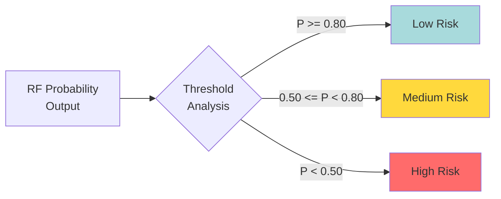

**Threshold Optimization:**

The thresholds were determined through:
1. ROC curve analysis
2. Precision-recall trade-off evaluation
3. Business requirements (acceptable friction level)
4. False positive/negative cost analysis

```python
def classify_risk(probability_scores):
    """
    Convert model probabilities to risk levels
    
    probability_scores: Array of [P(low), P(medium), P(high)]
    """
    predicted_class = np.argmax(probability_scores)
    confidence = probability_scores[predicted_class]
    
    # Apply confidence thresholds
    if predicted_class == 0 and confidence >= 0.80:
        return 'low', confidence
    elif predicted_class == 1 or (0.50 <= confidence < 0.80):
        return 'medium', confidence
    else:
        return 'high', confidence
```

---

## Decision Flow Implementation

### Complete Authentication Workflow

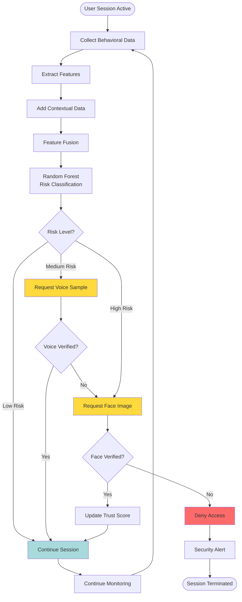

### Adaptive Threshold Adjustment

The system can dynamically adjust risk thresholds based on:

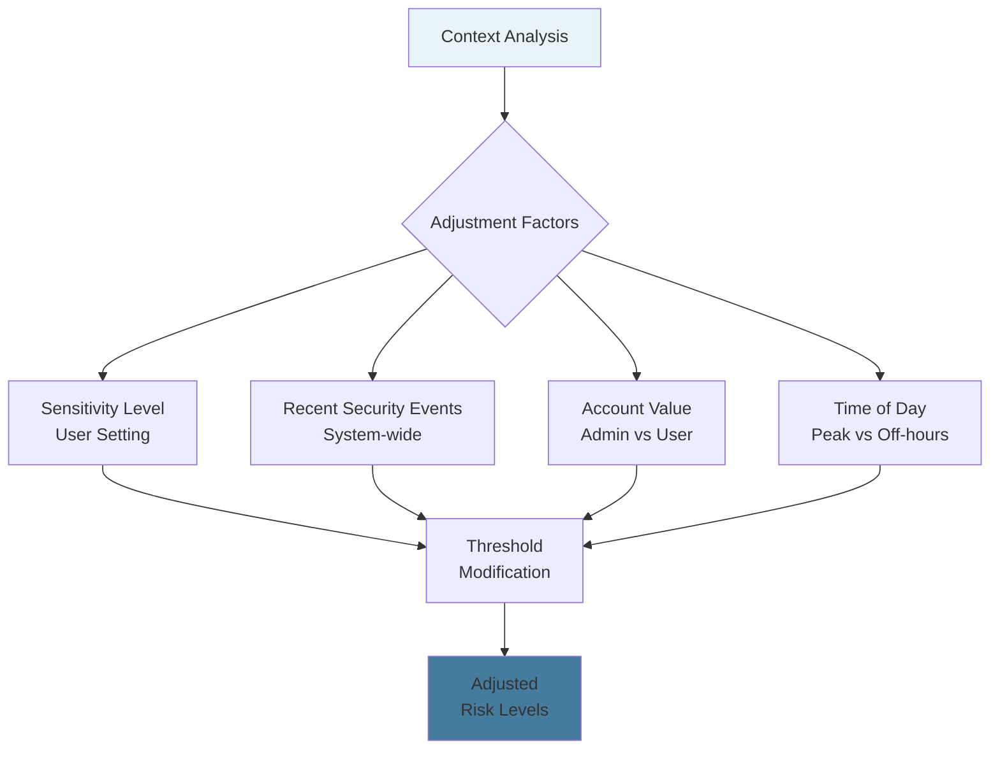

**Example Adjustments:**

| Condition | Threshold Modification | Rationale |
|-----------|----------------------|-----------|
| Admin Account | -10% on all thresholds | Higher security required |
| Recent Breach Alert | -15% on all thresholds | Temporarily increase scrutiny |
| Peak Business Hours | +5% on low threshold | Reduce friction during busy times |
| After-hours Access | -10% on all thresholds | Unusual timing increases risk |
| High-value Transaction | -20% on all thresholds | Protect sensitive operations |

```python
def adjust_thresholds(base_thresholds, context):
    """
    Dynamically adjust risk thresholds based on context
    """
    adjusted = base_thresholds.copy()
    
    # Account type adjustment
    if context['is_admin']:
        adjusted = [t - 0.10 for t in adjusted]
    
    # Security event adjustment
    if context['recent_breach_alert']:
        adjusted = [t - 0.15 for t in adjusted]
    
    # Time-based adjustment
    if not context['is_business_hours']:
        adjusted = [t - 0.10 for t in adjusted]
    
    # Transaction value adjustment
    if context['high_value_operation']:
        adjusted = [t - 0.20 for t in adjusted]
    
    return adjusted
```

### Continuous Feedback Loop

The system learns and improves over time:

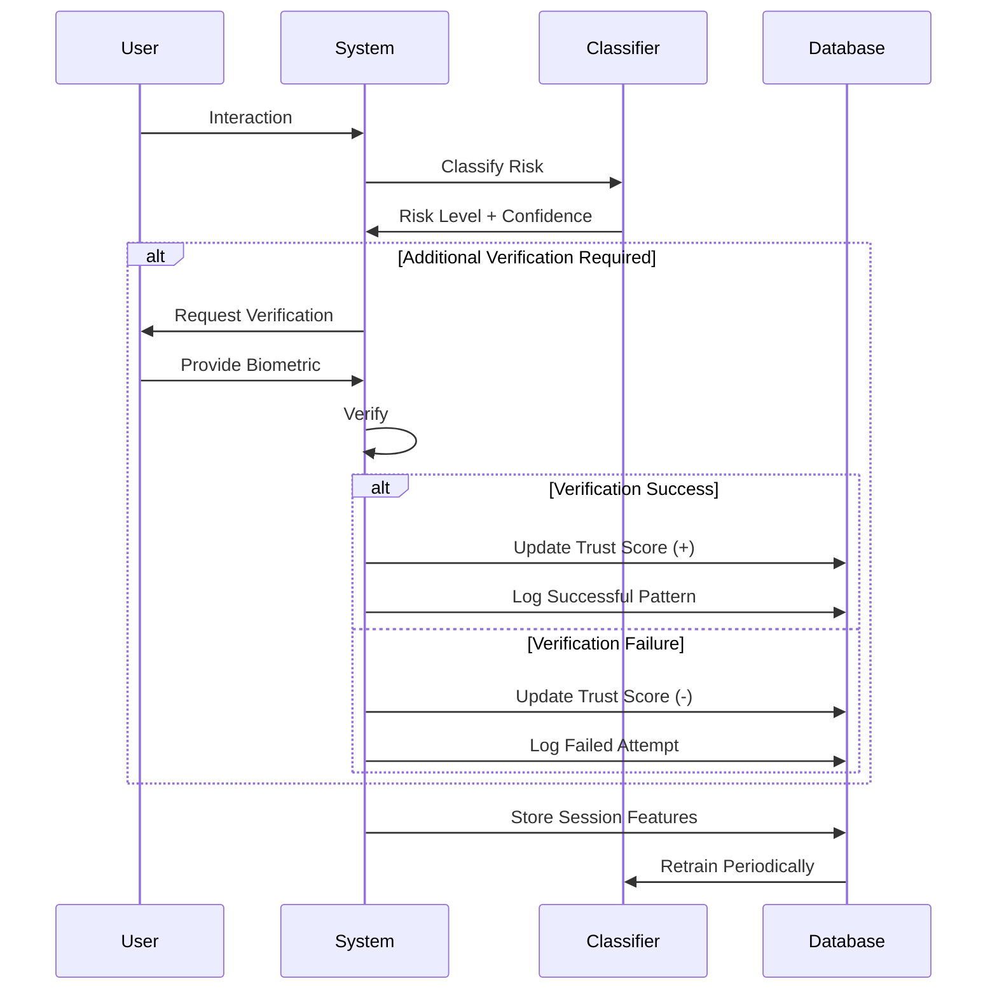

**Feedback Mechanisms:**

1. **Trust Score Updates:**
   - Successful verifications increase trust
   - Failed verifications decrease trust
   - Trust score influences future risk assessments

2. **Pattern Learning:**
   - New behavioral patterns are added to user profile
   - Outdated patterns are gradually phased out
   - Model adapts to legitimate behavior changes

3. **False Positive Handling:**
   - User can report false alarms
   - System adjusts sensitivity for that user
   - Collective feedback improves model

---

## Performance Metrics

### Classification Performance

**Overall Metrics:**

| Metric | Value | Evaluation |
|--------|-------|------------|
| Accuracy | 85.2% | Strong overall performance |
| Precision (weighted) | 84.7% | Low false positive rate |
| Recall (weighted) | 85.2% | Good detection of risky sessions |
| F1-Score (weighted) | 84.9% | Balanced performance |
| ROC-AUC (macro) | 0.91 | Excellent discrimination |

**Per-Class Performance:**

| Risk Level | Precision | Recall | F1-Score | Support |
|------------|-----------|--------|----------|---------|
| Low | 88.3% | 92.1% | 90.1% | 3,240 |
| Medium | 79.8% | 73.6% | 76.6% | 1,820 |
| High | 87.1% | 89.4% | 88.2% | 940 |

### Real-World Performance

**Session Processing:**

| Metric | Value | Target |
|--------|-------|--------|
| Average Latency | 127ms | < 200ms |
| 95th Percentile Latency | 189ms | < 250ms |
| Throughput | 450 requests/sec | > 400/sec |
| Memory Usage | 340MB | < 500MB |

**User Experience Impact:**

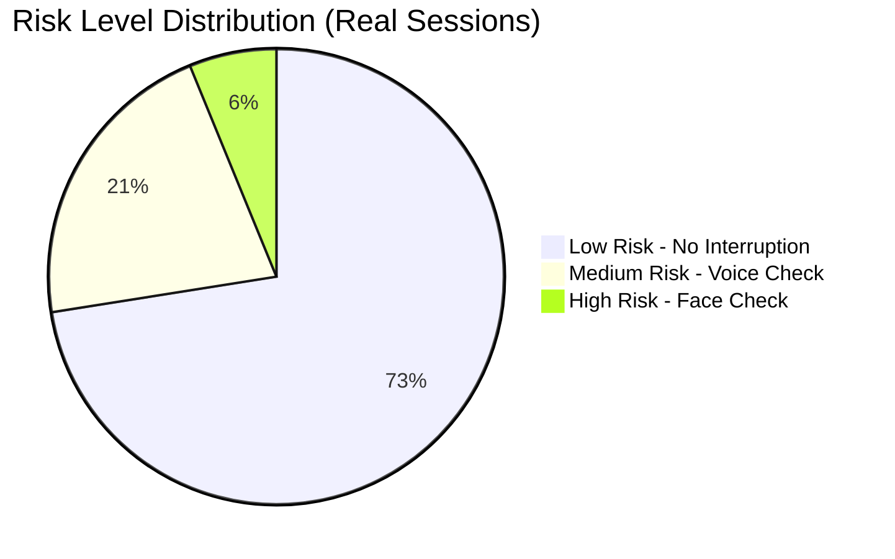

**Observations:**
- 72.5% of sessions proceed without interruption
- 21.3% require voice verification (minimal friction)
- Only 6.2% require face verification (higher friction)
- Overall user friction is acceptable

### Error Analysis

**False Positives (Legitimate User Flagged):**
- Rate: 8.7% of low-risk sessions
- Primary causes:
  - Travel to new locations
  - Using new devices
  - Temporary behavior changes (illness, fatigue)
- Mitigation: User can verify and update profile

**False Negatives (Attacker Not Detected):**
- Rate: 3.2% of high-risk sessions
- Primary causes:
  - Sophisticated mimicry of behavior
  - Stolen device with recent biometric data
  - Zero-day attack patterns
- Mitigation: Multi-factor verification, anomaly detection

---

## Security Considerations

### Attack Resistance

**Protection Against:**

1. **Replay Attacks**:
   - Timestamp validation
   - Session token rotation
   - Behavioral pattern diversity

2. **Mimicry Attacks**:
   - Multi-modal verification
   - Temporal pattern analysis
   - Liveness detection

3. **Stolen Credentials**:
   - Behavioral mismatch detection
   - Device fingerprinting
   - Geolocation validation

### Privacy and Compliance

**Data Protection:**
- Biometric embeddings stored (not raw data)
- Encryption at rest and in transit
- User consent required for enrollment
- Right to delete biometric data

**GDPR Compliance:**
- Explicit consent for biometric processing
- Clear purpose limitation
- Data minimization principles
- Audit trail for all decisions

---

## Future Enhancements

**Planned Improvements:**

1. **Advanced ML Models**:
   - Deep neural networks for feature fusion
   - Gradient boosting for improved accuracy
   - Online learning for real-time adaptation

2. **Extended Features**:
   - Mouse dynamics patterns
   - Touch pressure and gestures
   - Application usage sequences
   - Network traffic patterns

3. **Explainable AI**:
   - SHAP values for decision transparency
   - User-friendly risk explanations
   - Compliance reporting automation

4. **Adaptive Learning**:
   - Personalized risk thresholds per user
   - Continuous model retraining
   - Transfer learning from similar users

---