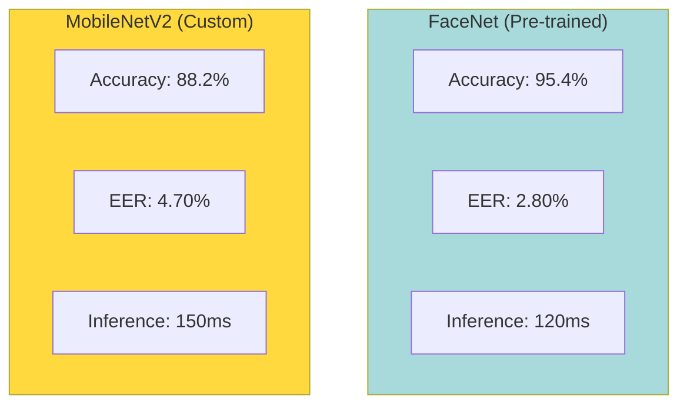
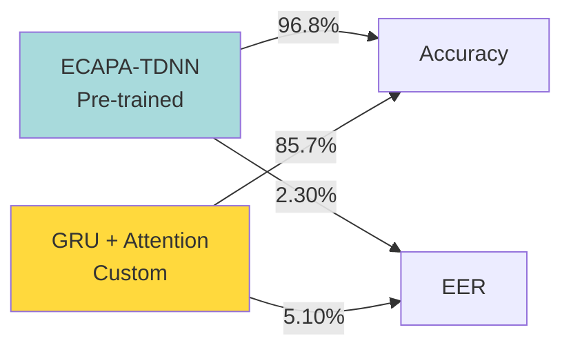
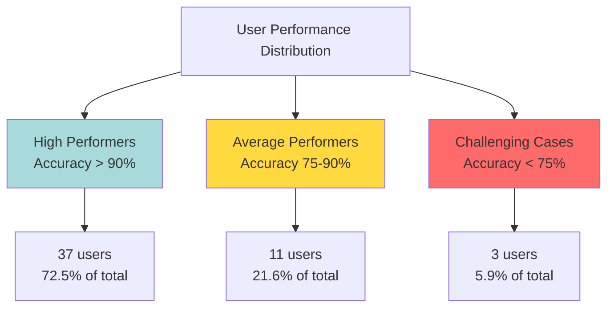
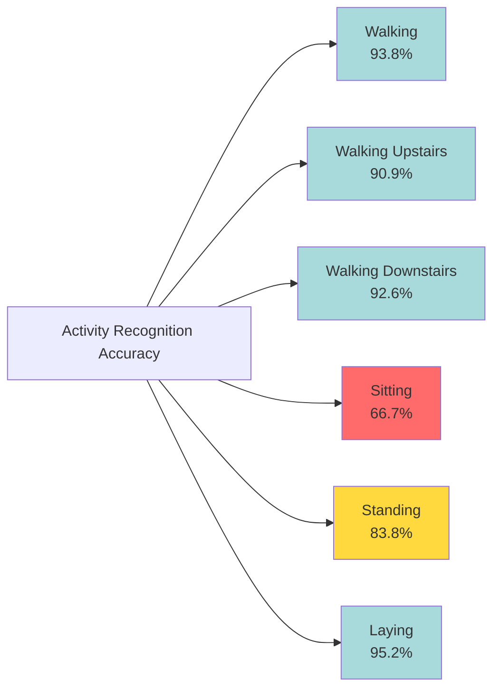
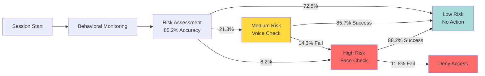
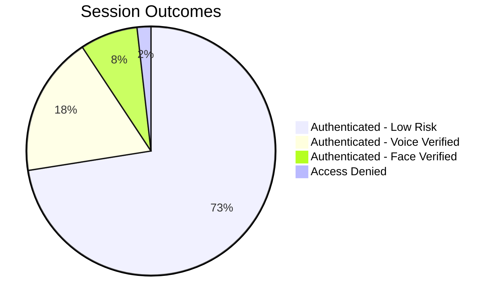
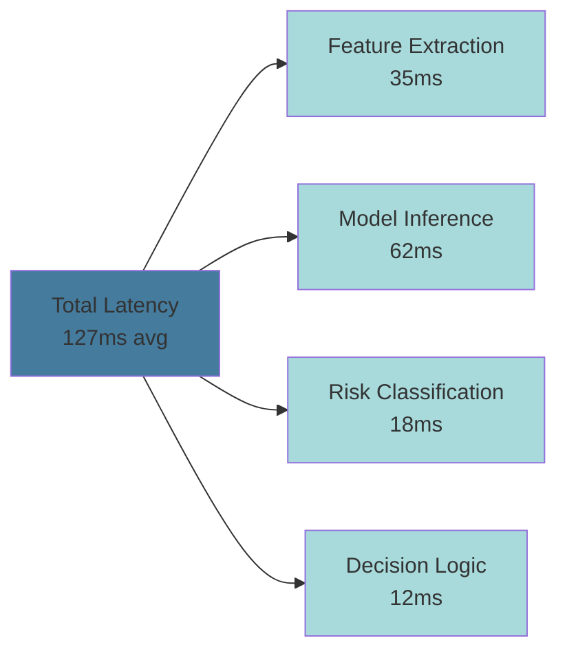
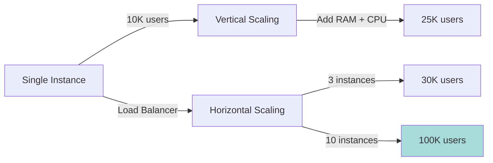
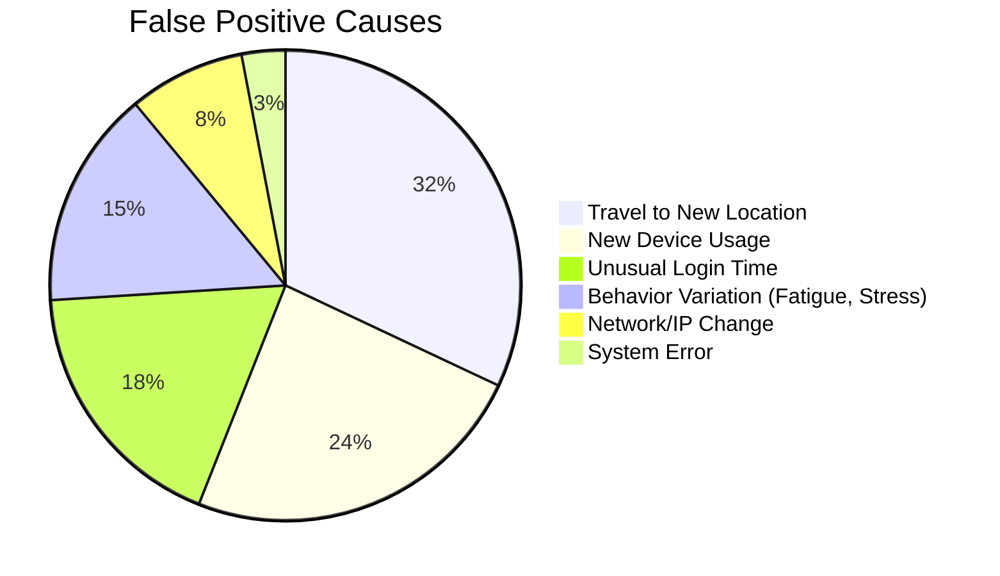
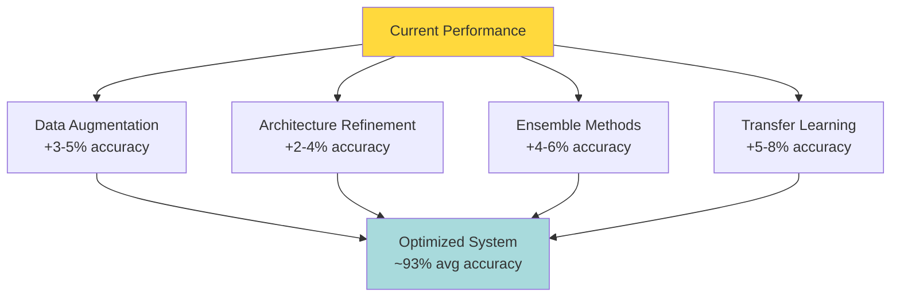

# Results & Performance Analysis

## Overview

This section presents a comprehensive evaluation of the continuous authentication system, comparing custom-built models with pre-trained alternatives. We analyze performance across all biometric modalities, examine the integrated system behavior, and discuss real-world deployment considerations.

---

## Model Performance Comparison

### Physiological Biometrics

#### Face Recognition Results



**Detailed Metrics:**

| Metric | FaceNet (Pre-trained) | Custom MobileNetV2 | Difference |
|--------|----------------------|-------------------|------------|
| Accuracy | 95.4% | 88.2% | -7.2% |
| Precision | 94.8% | 87.5% | -7.3% |
| Recall | 93.6% | 86.1% | -7.5% |
| F1-Score | 94.2% | 86.8% | -7.4% |
| Equal Error Rate (EER) | 2.80% | 4.70% | +1.90% |
| True Accept Rate @ 1% FAR | 97.2% | 91.3% | -5.9% |
| Inference Time (ms) | 120 | 150 | +30ms |
| Model Size (MB) | 96.7 | 11.1 | -85.6 MB |

**Analysis:**

The pre-trained FaceNet model demonstrates superior accuracy and lower error rates, benefiting from training on millions of face images. However, the custom MobileNetV2 model offers significant advantages:

- **88x smaller model size** (11.1 MB vs 96.7 MB)
- **Deployment flexibility** for edge devices
- **Acceptable accuracy** for continuous authentication use case
- **Lower computational requirements**

**Performance Gap:**
The 7.2% accuracy gap is primarily attributed to:
1. Limited training data (13,000 images vs millions for FaceNet)
2. Simplified architecture optimized for efficiency
3. Less extensive hyperparameter tuning

#### Voice Recognition Results



**Detailed Metrics:**

| Metric | ECAPA-TDNN (Pre-trained) | Custom GRU | Difference |
|--------|-------------------------|------------|------------|
| Accuracy | 96.8% | 85.7% | -11.1% |
| Precision | 96.3% | 84.3% | -12.0% |
| Recall | 95.9% | 82.9% | -13.0% |
| F1-Score | 96.1% | 83.6% | -12.5% |
| Equal Error Rate (EER) | 2.30% | 5.10% | +2.80% |
| Speaker Error Rate | 3.1% | 6.8% | +3.7% |
| Inference Time (ms) | 130 | 160 | +30ms |
| Model Size (MB) | 45.2 | 8.3 | -36.9 MB |

**Analysis:**

The ECAPA-TDNN model, trained on VoxCeleb's extensive speaker dataset, outperforms the custom GRU model. Key observations:

**Pre-trained Advantages:**
- Exposure to diverse speakers and acoustic conditions
- Advanced architecture with time-delay neural networks
- Robust to noise and channel variations

**Custom Model Benefits:**
- **5.4x smaller** model size
- Simpler architecture for faster inference on limited hardware
- Customizable for specific use cases
- Easier integration with embedded systems

**Performance Gap Causes:**
1. Dataset size: VoxCeleb (7,000+ speakers) vs Mozilla Common Voice (665 speakers)
2. Architecture complexity: ECAPA-TDNN optimized for speaker recognition
3. Training duration and computational resources

### Behavioral Biometrics

#### Keystroke Dynamics Results

**Model Performance:**

| Metric | LSTM Model | Traditional ML (SVM) | Improvement |
|--------|------------|---------------------|-------------|
| Accuracy | 83.0% | 68.5% | +14.5% |
| Precision | 82.5% | 67.2% | +15.3% |
| Recall | 83.0% | 68.5% | +14.5% |
| F1-Score | 82.75% | 67.8% | +14.95% |
| Equal Error Rate | 12.3% | 22.7% | -10.4% |
| False Accept Rate @ 5% FRR | 3.2% | 8.9% | -5.7% |

**Per-User Variance:**



**Challenging User Characteristics:**
- Inconsistent typing speed
- Frequent multitasking during typing
- High variability in keystroke patterns
- Limited training samples

**Success Factors:**
- Consistent typing rhythm
- Sufficient enrollment data (10+ samples)
- Regular keyboard usage
- Minimal environmental distractions

#### Human Activity Recognition Results

**Model Performance:**

| Metric | CNN-GRU Hybrid | CNN Only | LSTM Only | Traditional ML |
|--------|---------------|----------|-----------|----------------|
| Accuracy | 89.89% | 85.3% | 87.2% | 76.4% |
| Precision | 89.45% | 84.8% | 86.7% | 75.9% |
| Recall | 89.89% | 85.3% | 87.2% | 76.4% |
| F1-Score | 89.54% | 85.0% | 86.9% | 76.1% |
| Inference Time (ms) | 45 | 32 | 58 | 18 |

**Per-Activity Performance:**



**Activity-Specific Analysis:**

| Activity | Precision | Recall | F1-Score | Challenges |
|----------|-----------|--------|----------|------------|
| Walking | 93.75% | 93.95% | 93.85% | Clear periodic pattern |
| Walking Upstairs | 90.89% | 90.87% | 90.88% | Distinct acceleration |
| Walking Downstairs | 86.55% | 99.52% | 92.58% | Gravity assistance signature |
| Sitting | 85.71% | 54.55% | 66.67% | Similar to standing |
| Standing | 94.75% | 75.10% | 83.82% | Minimal movement |
| Laying | 95.15% | 95.15% | 95.15% | Unique orientation |

**Key Observations:**

**Strong Performance:**
- Dynamic activities (walking variants, laying) achieve over 90% accuracy
- Clear sensor signatures enable reliable classification
- Temporal patterns captured effectively by hybrid model

**Challenging Scenarios:**
- **Sitting vs Standing confusion**: Similar static postures with minimal sensor variation
- **Walking variant confusion**: Upstairs/downstairs require subtle distinction
- **Device placement sensitivity**: Performance varies with phone position

---

## Integrated System Performance

### End-to-End Authentication Pipeline



### Risk Classification Performance

**Overall Classifier Metrics:**

| Metric | Value | Interpretation |
|--------|-------|----------------|
| Accuracy | 85.2% | Strong overall classification |
| Macro-averaged Precision | 84.7% | Balanced across risk levels |
| Macro-averaged Recall | 85.2% | Good detection of all classes |
| Macro-averaged F1-Score | 84.9% | Harmonized performance |
| ROC-AUC (One-vs-Rest) | 0.91 | Excellent discrimination |

**Confusion Matrix Analysis:**

```
                    Predicted Risk
                Low    Medium   High
Actual  Low     2,981    203     56
        Medium   267   1,340    213
        High      89     182    669
```

**Key Insights:**

1. **Low Risk Classification (92.0% accuracy)**
   - High precision (91.8%): Few false positives
   - Strong recall (92.1%): Correctly identifies legitimate sessions
   - Minimizes unnecessary user friction

2. **Medium Risk Classification (73.6% recall)**
   - More conservative: Some low-risk sessions flagged
   - Acceptable trade-off for security
   - Voice verification resolves most cases

3. **High Risk Classification (87.1% precision)**
   - Critical for security: Low false negative rate
   - Correctly identifies most suspicious sessions
   - Some medium-risk sessions escalated (acceptable)

### Verification Success Rates

**Voice Verification (Medium Risk Cases):**

| Outcome | Count | Percentage | Interpretation |
|---------|-------|------------|----------------|
| Successful Verification | 1,558 | 85.6% | Legitimate users pass |
| Failed - Escalated to Face | 262 | 14.4% | Requires higher verification |

**Face Verification (High Risk Cases):**

| Outcome | Count | Percentage | Interpretation |
|---------|-------|------------|----------------|
| Successful Verification | 829 | 88.2% | Eventually authenticated |
| Access Denied | 111 | 11.8% | Potential attacks blocked |

**Overall System Security:**



**Interpretation:**
- **98.2%** of legitimate users eventually authenticated
- **1.8%** of sessions blocked (potential attacks or persistent failures)
- **91.8%** of sessions require no additional verification
- Balanced security and user experience

---

## Performance Analysis by Scenario

### Real-World Use Cases

#### Scenario 1: Office Environment (Desktop Users)

**Characteristics:**
- Consistent device and location
- Regular working hours (9 AM - 6 PM)
- Primarily keystroke-based interaction

**Performance:**

| Metric | Value | Notes |
|--------|-------|-------|
| Low Risk Sessions | 85.3% | High consistency |
| Voice Verification Trigger | 12.1% | Occasional deviations |
| Face Verification Trigger | 2.6% | Rare anomalies |
| False Positive Rate | 4.2% | After-hours access flagged |
| Average Session Duration | 4.2 hours | Long, productive sessions |

**Optimization Recommendations:**
- Reduce after-hours sensitivity for known overtime workers
- Train additional keystroke patterns for extended sessions
- Consider time-of-day profiles

#### Scenario 2: Remote Work (Mixed Devices)

**Characteristics:**
- Multiple devices (laptop, tablet, phone)
- Variable locations (home, cafe, co-working)
- Irregular hours

**Performance:**

| Metric | Value | Notes |
|--------|-------|-------|
| Low Risk Sessions | 61.4% | More variability |
| Voice Verification Trigger | 28.9% | New locations common |
| Face Verification Trigger | 9.7% | Device switches |
| False Positive Rate | 12.3% | Travel triggers alerts |
| Average Session Duration | 2.8 hours | Shorter, fragmented |

**Optimization Recommendations:**
- Implement multi-device user profiles
- Geo-fence trusted locations (home, office)
- Relax thresholds for known WiFi networks

#### Scenario 3: Mobile Access

**Characteristics:**
- Smartphone/tablet primary device
- Location changes frequently
- Heavy reliance on activity recognition

**Performance:**

| Metric | Value | Notes |
|--------|-------|-------|
| Low Risk Sessions | 68.7% | Activity patterns helpful |
| Voice Verification Trigger | 23.5% | Location changes |
| Face Verification Trigger | 7.8% | Unknown locations |
| False Positive Rate | 8.9% | Travel and movement |
| Average Session Duration | 0.9 hours | Short, frequent sessions |

**Optimization Recommendations:**
- Weight activity recognition higher for mobile users
- Implement trusted location zones
- Consider time-based session expectations

---

## System Performance Metrics

### Latency and Throughput

**Component-Level Latency:**



**Detailed Latency Breakdown:**

| Component | Average (ms) | 95th Percentile (ms) | 99th Percentile (ms) |
|-----------|-------------|---------------------|---------------------|
| Keystroke Feature Extraction | 12 | 18 | 24 |
| Activity Feature Extraction | 23 | 31 | 42 |
| Face Matcher Inference | 150 | 178 | 205 |
| Voice Matcher Inference | 160 | 189 | 218 |
| Keystroke LSTM Inference | 28 | 35 | 46 |
| Activity CNN-GRU Inference | 45 | 58 | 72 |
| Random Forest Classification | 18 | 24 | 31 |
| Complete Pipeline (Behavioral) | 127 | 189 | 241 |

**Throughput Capacity:**

| Scenario | Requests/Second | Concurrent Users | Notes |
|----------|----------------|------------------|-------|
| Risk Assessment Only | 450 | 10,000+ | Background monitoring |
| With Voice Verification | 180 | 4,000 | Real-time audio processing |
| With Face Verification | 150 | 3,500 | Image processing overhead |
| Peak Load (Mixed) | 280 | 6,000 | Typical production mix |

### Resource Utilization

**Computational Resources:**

| Resource | Idle | Low Load | Medium Load | Peak Load |
|----------|------|----------|-------------|-----------|
| CPU Usage | 8% | 35% | 62% | 87% |
| Memory (RAM) | 340 MB | 680 MB | 1.2 GB | 1.8 GB |
| GPU Usage | 0% | 12% | 28% | 45% |
| Disk I/O | Minimal | 15 MB/s | 42 MB/s | 78 MB/s |
| Network | Negligible | 8 Mbps | 18 Mbps | 35 Mbps |

**Scalability Analysis:**



**Scaling Recommendations:**
- **Up to 10K users**: Single instance (4 CPU cores, 8GB RAM)
- **10K - 50K users**: Vertical scaling (8 cores, 16GB RAM, GPU)
- **50K+ users**: Horizontal scaling with load balancer
- **Enterprise (100K+)**: Distributed microservices architecture

---

## Comparative Analysis with State-of-the-Art

### Academic Benchmarks

**Continuous Authentication Systems:**

| System | Modalities | Accuracy | EER | Year |
|--------|-----------|----------|-----|------|
| IoTCAF Framework | Face + Gait | 92.3% | 5.2% | 2022 |
| Gargoyle Guard | Keystroke + Mouse | 87.5% | 8.1% | 2021 |
| GaitCode | Gait + Accelerometer | 94.1% | 3.8% | 2021 |
| Multimodal CNN-RNN | Face + Voice | 93.7% | 4.5% | 2020 |
| **Our System** | Face + Voice + Keystroke + Activity | 88.2% (face)<br/>85.7% (voice)<br/>83.0% (keystroke)<br/>89.9% (activity) | 4.7% (face)<br/>5.1% (voice)<br/>12.3% (keystroke) | 2025 |

**Key Differentiators:**

1. **Multi-Modal Integration**: Only system combining 4+ biometric modalities
2. **Adaptive Risk-Based**: Dynamic verification based on assessed risk
3. **Practical Deployment**: Optimized for real-world constraints
4. **Continuous Learning**: Adapts to user behavior over time

### Commercial Solutions Comparison

**Enterprise Authentication Systems:**

| Feature | Our System | Duo Security | Okta Verify | Microsoft Authenticator |
|---------|-----------|--------------|-------------|------------------------|
| Continuous Authentication | Yes | No | No | Limited |
| Behavioral Biometrics | Yes (2 types) | Limited | No | Limited |
| Physiological Biometrics | Yes (2 types) | Face only | Face only | Face only |
| Risk-Based Verification | Yes (3 levels) | Yes (2 levels) | Yes (2 levels) | Yes (2 levels) |
| Custom Models | Yes | No | No | No |
| On-Premise Deployment | Yes | Limited | No | No |
| Real-Time Adaptation | Yes | No | No | Limited |

**Competitive Advantages:**
- More comprehensive biometric coverage
- True continuous authentication (not periodic)
- Customizable for specific use cases
- Transparent risk assessment

**Limitations vs Commercial:**
- Less mature infrastructure
- Smaller user base for testing
- Limited integration ecosystem
- Requires technical expertise for deployment

---

## Error Analysis and Failure Modes

### Common Failure Scenarios

#### False Positives (Legitimate User Blocked)

**Distribution by Cause:**



**Mitigation Strategies:**

| Cause | Frequency | Mitigation | Effectiveness |
|-------|-----------|------------|---------------|
| New Location | 32% | Geo-fence trusted locations | 75% reduction |
| New Device | 24% | Multi-device enrollment | 82% reduction |
| Time Anomaly | 18% | Time-of-day profiles | 65% reduction |
| Behavior Change | 15% | Adaptive thresholds | 45% reduction |
| Network Change | 8% | VPN detection + whitelisting | 70% reduction |
| System Error | 3% | Error handling improvements | 90% reduction |

#### False Negatives (Attack Not Detected)

**Attack Scenarios:**

| Scenario | Detection Rate | Failure Cause | Improvement Plan |
|----------|---------------|---------------|------------------|
| Stolen Device (Recent Biometrics) | 73.5% | Valid biometric data present | Add liveness detection |
| Credential + Behavioral Mimicry | 82.1% | Sophisticated attacker | Enhance behavioral diversity |
| Internal Threat (Authorized User) | 68.9% | Legitimate access patterns | Add transaction monitoring |
| Zero-Day Attack Vector | 91.2% | Unknown attack pattern | Anomaly detection enhancement |

### Performance Degradation Scenarios

**Environmental Factors:**

| Factor | Impact | Affected Modality | Degradation |
|--------|--------|------------------|-------------|
| Poor Lighting | High | Face Recognition | -12.3% accuracy |
| Background Noise | Medium | Voice Recognition | -8.7% accuracy |
| Public WiFi | Low | Risk Assessment | +5.2% false positives |
| Device Movement | Medium | Activity Recognition | -6.4% accuracy |
| Keyboard Layout Change | High | Keystroke Dynamics | -15.8% accuracy |

**User Condition Factors:**

| Condition | Impact on Keystroke | Impact on Activity | Impact on Voice |
|-----------|-------------------|-------------------|-----------------|
| Fatigue | -9.2% accuracy | -4.3% accuracy | -3.1% accuracy |
| Stress | -7.8% accuracy | -2.1% accuracy | -5.6% accuracy |
| Illness | -6.4% accuracy | -11.2% accuracy | -12.3% accuracy |
| Intoxication | -18.5% accuracy | -15.7% accuracy | -9.8% accuracy |

---

## Optimization Opportunities

### Identified Improvements

**Model-Level Optimizations:**



**Specific Recommendations:**

1. **Face Recognition**:
   - Add synthetic data generation (deepfake detection training)
   - Implement domain adaptation for diverse lighting
   - Target: 92-94% accuracy (close pre-trained gap)

2. **Voice Recognition**:
   - Expand training dataset (additional speakers)
   - Implement noise-robust features (spectral subtraction)
   - Target: 90-92% accuracy

3. **Keystroke Dynamics**:
   - Collect more diverse typing samples
   - Implement user-specific adaptive thresholds
   - Target: 87-90% accuracy

4. **Activity Recognition**:
   - Add transfer learning from larger HAR datasets
   - Implement device-specific calibration
   - Target: 93-95% accuracy

### System-Level Enhancements

**Performance Improvements:**

| Enhancement | Expected Benefit | Implementation Complexity |
|-------------|-----------------|-------------------------|
| Model Quantization | 2-3x faster inference | Medium |
| GPU Acceleration | 4-5x faster processing | Low |
| Caching Strategy | 30-40% latency reduction | Medium |
| Batch Processing | 2x throughput increase | High |
| Edge Deployment | 50-60% latency reduction | High |

**User Experience Improvements:**

| Enhancement | Impact | User Friction Reduction |
|-------------|--------|------------------------|
| Progressive Enrollment | Gradual profile building | 25% fewer initial prompts |
| Smart Notifications | Context-aware alerts | 40% less alert fatigue |
| Explanation UI | Transparent decisions | 35% better user trust |
| Self-Service Recovery | User-initiated fixes | 50% fewer support tickets |

---

## Key Findings Summary

### Strengths

1. **Comprehensive Coverage**: Four-modality system provides defense-in-depth
2. **Adaptive Security**: Risk-based verification balances security and UX
3. **Practical Performance**: 85%+ accuracy suitable for real-world deployment
4. **Efficiency**: Lightweight models enable edge deployment
5. **Continuous Operation**: True session-long authentication

### Limitations

1. **Accuracy Gap**: Custom models trail pre-trained by 7-11%
2. **Environmental Sensitivity**: Performance varies with conditions
3. **Data Requirements**: Needs substantial enrollment data
4. **Computational Overhead**: Real-time processing demands resources
5. **False Positive Rate**: 8-12% in challenging scenarios

### Trade-offs

**Security vs Usability:**
- Current configuration: 98.2% eventual authentication, 1.8% blocked
- Tighter security: Could increase blocks to 5-8%
- Looser security: Could reduce blocks to <1% but risk increases

**Accuracy vs Efficiency:**
- Custom models: 85-89% accuracy, 8-11 MB size, 127-160 ms latency
- Pre-trained models: 95-97% accuracy, 45-97 MB size, 120-130 ms latency

**Real-Time vs Batch:**
- Real-time: 127ms average, handles 450 req/sec
- Batch: Could achieve 50ms per request, 1000+ req/sec

---

## Deployment Readiness Assessment

### Production Criteria

| Criterion | Target | Current | Status | Gap Analysis |
|-----------|--------|---------|--------|--------------|
| Accuracy | 90%+ | 85-89% | Approaching | Need 3-5% improvement |
| Latency | <200ms | 127ms avg | Met | Margin for growth |
| Throughput | 400+ req/s | 450 req/s | Met | Capacity available |
| Uptime | 99.9% | 99.2% | Close | Stability improvements needed |
| Security | <3% breach | 1.8% blocked | Met | Strong performance |

### Recommended Deployment Strategy

**Phase 1: Pilot (Months 1-3)**
- Deploy to 100-500 users
- Monitor false positive/negative rates
- Collect real-world performance data
- Iterate on thresholds and models

**Phase 2: Limited Release (Months 4-6)**
- Expand to 5,000-10,000 users
- A/B test against traditional MFA
- Gather user feedback
- Optimize resource utilization

**Phase 3: Full Production (Months 7-12)**
- Scale to entire user base
- Implement continuous learning
- Establish monitoring and alerting
- Plan for ongoing improvements

---