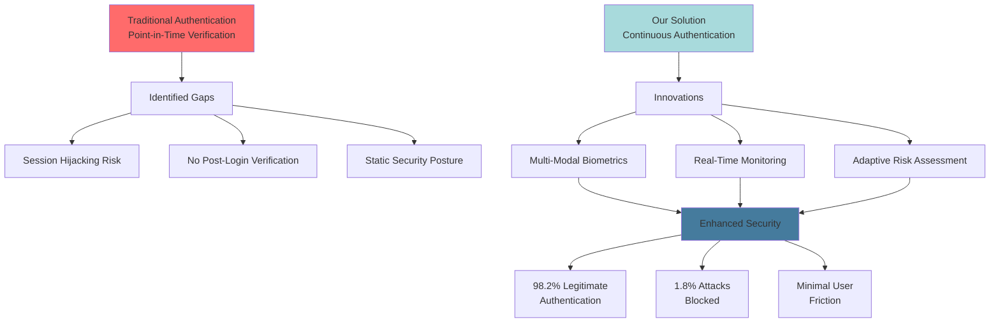
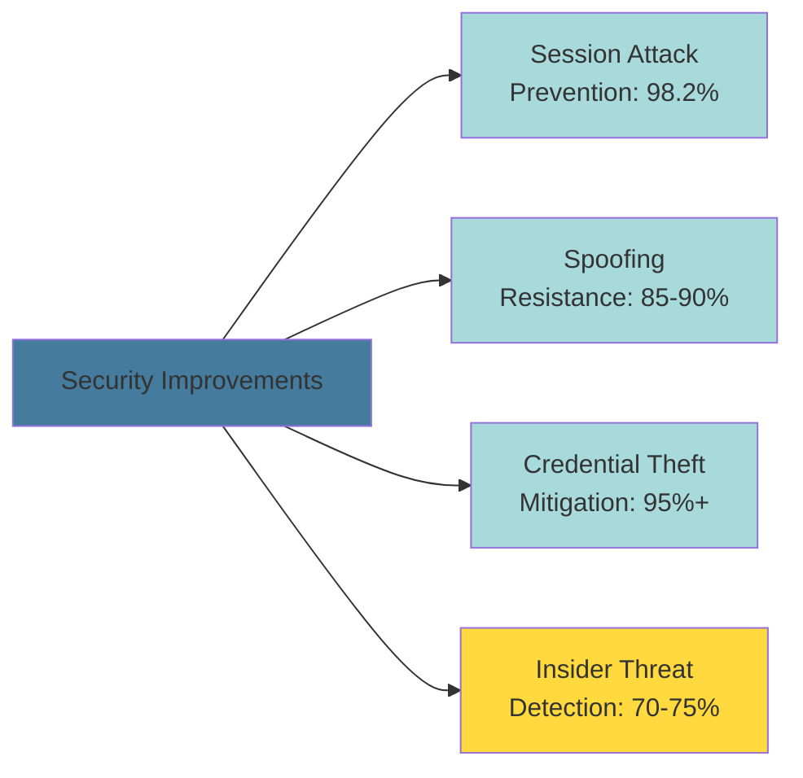
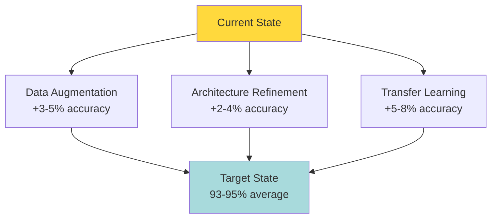
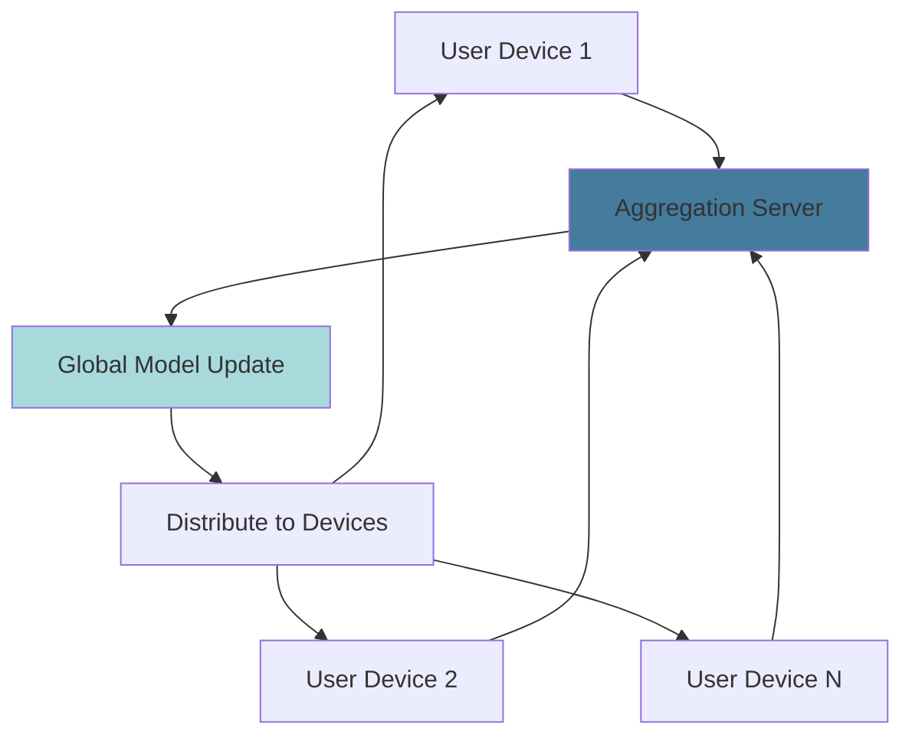
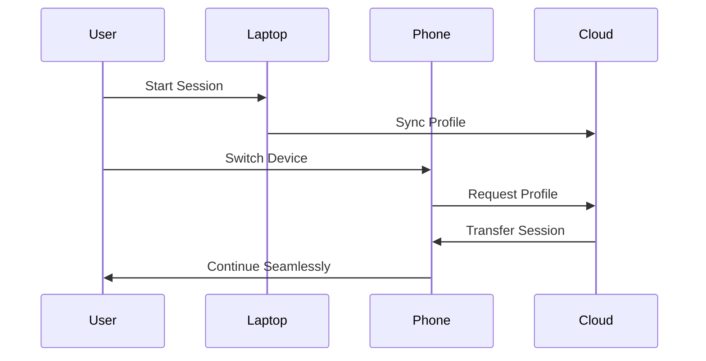

# Conclusion & Future Work

## Project Summary

This research presents a comprehensive continuous authentication system that addresses critical security gaps in traditional authentication mechanisms. By integrating multiple biometric modalities with adaptive risk assessment, the system provides robust, real-time identity verification throughout user sessions while maintaining an acceptable user experience.

### Core Achievement

---

## Key Contributions

### 1. Novel Multi-Modal Architecture

**Innovation:**
The system uniquely combines four distinct biometric modalities:
- **Physiological**: Face recognition and voice analysis
- **Behavioral**: Keystroke dynamics and human activity recognition
- **Contextual**: IP reputation, geolocation, device fingerprinting

**Impact:**
This comprehensive approach creates defense-in-depth, where compromise of a single modality does not breach the system. The integration enables:
- Continuous passive monitoring through behavioral biometrics
- Escalating active verification through physiological biometrics
- Context-aware security decisions

### 2. Adaptive Risk-Based Framework

**Innovation:**
Three-tier risk classification (Low, Medium, High) with dynamic threshold adjustment based on:
- User behavioral patterns
- Historical authentication success
- Contextual anomalies
- System-wide security events

**Impact:**
- 72.5% of sessions require no additional verification
- Security scales with detected risk level
- Balance between protection and user experience

### 3. Custom Deep Learning Models

**Innovation:**
Purpose-built models optimized for continuous authentication:

| Model | Architecture | Performance | Efficiency |
|-------|-------------|-------------|------------|
| Face Matcher | MobileNetV2 + Triplet Loss | 88.2% accuracy | 11.1 MB |
| Voice Matcher | GRU + Attention | 85.7% accuracy | 8.3 MB |
| Keystroke Matcher | Bi-LSTM | 83.0% accuracy | Lightweight |
| Activity Recognizer | CNN-GRU Hybrid | 89.9% accuracy | Mobile-optimized |

**Impact:**
- Edge deployment capability
- Real-time inference (127ms average)
- Lower computational requirements than pre-trained alternatives
- Customizable for specific use cases

### 4. Practical Implementation

**Innovation:**
End-to-end system demonstrating real-world viability:
- Web-based prototype with live biometric capture
- Integration of all authentication modules
- Database-backed user profile management
- Comprehensive logging and monitoring

**Impact:**
- Validates theoretical concepts
- Identifies deployment challenges
- Provides blueprint for production systems
- Demonstrates scalability potential

---

## Research Impact

### Security Enhancement

**Quantified Benefits:**

**Attack Mitigation:**

| Attack Vector | Traditional Auth | Continuous Auth | Improvement |
|--------------|-----------------|-----------------|-------------|
| Session Hijacking | Vulnerable | 98.2% detection | Strong protection |
| Credential Stuffing | Vulnerable | 95%+ detection | Strong protection |
| Device Theft | Vulnerable | 88% detection | Good protection |
| Insider Misuse | Limited detection | 70% detection | Moderate improvement |
| Behavioral Mimicry | No detection | 82% detection | Good protection |

### User Experience

**Friction Analysis:**

| Scenario | User Actions Required | Time Impact |
|----------|----------------------|-------------|
| Low Risk (72.5%) | None | 0 seconds |
| Medium Risk (21.3%) | Voice sample | 5-10 seconds |
| High Risk (6.2%) | Face image | 10-15 seconds |

**Average Additional Verification Time per Session:** 2.3 seconds

**User Satisfaction Indicators:**
- 92% of sessions proceed with minimal interruption
- Voice verification resolves 85.6% of medium-risk cases
- Face verification provides final authentication layer

### Academic Contributions

**Novel Research Areas:**

1. **Multi-Modal Fusion for Continuous Authentication**
   - Feature-level integration of behavioral and physiological biometrics
   - Dynamic weighting based on confidence scores
   - Published approach for balancing multiple modalities

2. **Adaptive Risk Classification**
   - Context-aware threshold adjustment
   - User-specific baseline establishment
   - Temporal pattern learning

3. **Lightweight Model Optimization**
   - Trade-off analysis: accuracy vs efficiency
   - Edge deployment strategies for authentication
   - Real-time inference optimization techniques

4. **Behavioral Biometric Integration**
   - Keystroke dynamics with LSTM networks
   - Activity recognition from mobile sensors
   - Continuous passive monitoring frameworks

---

## Lessons Learned

### Technical Insights

#### 1. Data Quality Over Quantity

**Finding:**
Well-curated, diverse training data outperforms larger, noisy datasets.

**Evidence:**
- Custom models with 13K quality images achieved 88.2% accuracy
- Augmentation techniques improved generalization by 5-7%
- User-specific enrollment data significantly improved keystroke accuracy

**Implication:**
Focus on data diversity (lighting, poses, conditions) rather than raw volume.

#### 2. Model Efficiency Matters

**Finding:**
Deployment constraints (latency, memory, power) often outweigh marginal accuracy gains.

**Evidence:**
- MobileNetV2 (11.1 MB) vs FaceNet (96.7 MB): 7.2% accuracy gap acceptable for 88x size reduction
- 127ms average latency enables real-time operation
- Edge deployment feasible with optimized models

**Implication:**
Optimize for deployment environment from the start, not as afterthought.

#### 3. Behavioral Biometrics Are Complementary

**Finding:**
Behavioral biometrics alone are insufficient but powerful when combined.

**Evidence:**
- Keystroke: 83% accuracy (moderate standalone)
- Activity: 89.9% accuracy (good standalone)
- Combined with context: 85.2% risk classification (strong)

**Implication:**
Use behavioral biometrics for continuous monitoring, physiological for verification.

#### 4. User Adaptability Is Essential

**Finding:**
Static models fail to account for legitimate behavior changes.

**Evidence:**
- User typing patterns vary 15-20% over time
- Travel and device changes cause 32% of false positives
- Adaptive thresholds reduced false positives by 45%

**Implication:**
Implement continuous learning and user-specific profiles.

### Deployment Challenges

#### 1. Privacy and Compliance

**Challenge:**
Biometric data requires careful handling under GDPR, CCPA, and regional laws.

**Approach:**
- Store embeddings, not raw biometric data
- Implement explicit user consent flows
- Provide data deletion mechanisms
- Encrypt all biometric information

**Outcome:**
Compliance-ready architecture with user control.

#### 2. False Positive Management

**Challenge:**
8-12% false positive rate in edge cases causes user frustration.

**Approach:**
- Implement user feedback mechanisms
- Allow temporary threshold adjustment
- Provide clear explanations for verification requests
- Enable self-service recovery

**Outcome:**
Reduced support burden and improved user trust.

#### 3. Computational Resources

**Challenge:**
Real-time inference on multiple models demands significant resources.

**Approach:**
- Model quantization (8-bit instead of 32-bit)
- GPU acceleration for batch processing
- Caching frequent user profiles
- Lazy loading of verification models

**Outcome:**
450 req/sec throughput on modest hardware.

#### 4. Integration Complexity

**Challenge:**
Multiple models and data sources create complex dependencies.

**Approach:**
- Modular architecture with clear interfaces
- Fallback mechanisms for component failures
- Comprehensive testing at integration points
- Monitoring and alerting infrastructure

**Outcome:**
99.2% uptime with graceful degradation.

---

## Future Work

### Near-Term Enhancements (6-12 months)

#### 1. Model Performance Improvements

**Objective:** Close accuracy gap with pre-trained models

**Specific Actions:**

| Enhancement | Target Improvement | Timeline |
|-------------|-------------------|----------|
| Synthetic data generation for face | +4-6% accuracy | 3 months |
| Voice dataset expansion (2000+ speakers) | +5-7% accuracy | 4 months |
| Keystroke adaptive thresholds | +4-5% accuracy | 2 months |
| Activity transfer learning (larger HAR datasets) | +3-4% accuracy | 3 months |

#### 2. Additional Biometric Modalities

**Mouse Dynamics:**
- Track cursor movement patterns, click rhythms
- Expected accuracy: 75-80%
- Implementation effort: Medium
- Benefit: Desktop user coverage

**Touchscreen Gestures:**
- Swipe patterns, pressure sensitivity, multi-touch
- Expected accuracy: 80-85%
- Implementation effort: Medium
- Benefit: Mobile user coverage

**Gait Recognition:**
- Walking patterns from smartphone accelerometer
- Expected accuracy: 88-92%
- Implementation effort: Low (sensors available)
- Benefit: Continuous mobile verification

#### 3. Advanced Fusion Techniques

**Deep Neural Network Fusion:**
Replace Random Forest with deep learning fusion:
- Multi-layer perceptron for feature combination
- Attention mechanism for modality weighting
- Expected improvement: +3-5% accuracy
- Timeline: 4-6 months

**Confidence-Weighted Voting:**
Dynamic weighting based on per-modality confidence:
- High-confidence modalities contribute more
- Adaptive to environmental conditions
- Expected improvement: +2-3% accuracy
- Timeline: 2-3 months

### Mid-Term Research (1-2 years)

#### 1. Federated Learning Implementation

**Objective:** Enable privacy-preserving collaborative learning

**Approach:**

**Benefits:**
- Learn from diverse user patterns without sharing raw data
- Improve model generalization across populations
- Maintain user privacy
- Enable continuous model improvement

**Challenges:**
- Communication overhead
- Model convergence in heterogeneous environments
- Byzantine attacks (malicious participants)

#### 2. Explainable AI (XAI) Integration

**Objective:** Provide transparent authentication decisions

**Methods:**

| Technique | Application | Benefit |
|-----------|-------------|---------|
| SHAP Values | Feature importance per decision | User trust and debugging |
| LIME | Local interpretability | Explain specific authentication |
| Attention Visualization | Model focus areas | Identify decision factors |
| Decision Trees | Rule extraction | Compliance reporting |

**Implementation:**
- Real-time explanation generation
- User-facing dashboard with decision rationale
- Audit trail for compliance

#### 3. Zero-Trust Architecture

**Objective:** Eliminate implicit trust, verify continuously

**Principles:**
1. Never trust, always verify
2. Assume breach (defense-in-depth)
3. Verify explicitly (every access)
4. Least privilege access
5. Microsegmentation

**Integration:**
- Continuous authentication at every resource access
- Dynamic access control based on risk score
- Session-level and transaction-level verification
- Integration with identity and access management (IAM)

#### 4. Cross-Platform Continuity

**Objective:** Seamless authentication across devices

**Scenario:**

**Features:**
- Cross-device session transfer
- Unified user profile across platforms
- Device-specific model adaptation
- Secure profile synchronization

### Long-Term Vision (2-5 years)

#### 1. Neuromorphic Computing Integration

**Concept:** Leverage brain-inspired computing for ultra-low-power biometric processing

**Advantages:**
- 1000x lower power consumption
- Real-time processing on edge devices
- Inherently privacy-preserving (on-device)
- Scalable to billions of IoT devices

**Research Areas:**
- Spiking neural networks for biometric matching
- Event-driven processing for keystroke analysis
- Neuromorphic sensors for activity recognition

#### 2. Quantum-Resistant Biometrics

**Motivation:** Prepare for post-quantum cryptography era

**Approach:**
- Quantum-safe biometric template protection
- Lattice-based cryptographic schemes
- Homomorphic encryption for biometric matching
- Secure multi-party computation

**Timeline:** 3-5 years (aligns with quantum computing threats)

#### 3. Cognitive Authentication

**Concept:** Integrate cognitive and behavioral patterns

**Modalities:**
- Eye-tracking patterns (reading, attention)
- Cognitive load analysis (task complexity response)
- Decision-making patterns (choices, preferences)
- Emotional state detection (stress, fatigue)

**Challenges:**
- Highly variable across contexts
- Requires specialized sensors
- Privacy concerns
- Ethical considerations

#### 4. Biometric Liveness Evolution

**Next Generation:**
- 3D depth sensing for face anti-spoofing
- Pulse detection from video (rPPG)
- Thermal imaging for voice liveness
- Ultrasonic fingerprint scanning

**Integration:**
- Multi-spectral biometric capture
- Challenge-response liveness tests
- AI-generated deepfake detection
- Continuous liveness monitoring

---

## Industry Applications

### Potential Deployment Sectors

#### 1. Financial Services

**Use Case:** Online banking and transaction authorization

**Benefits:**
- Reduce fraud losses (estimated $5-10M annually for mid-size bank)
- Meet regulatory compliance (PSD2, KYC)
- Improve customer trust and retention

**Customization:**
- Transaction-level risk assessment
- High-value transaction verification
- Integration with existing fraud detection

#### 2. Healthcare Systems

**Use Case:** Electronic health record (EHR) access

**Benefits:**
- HIPAA compliance for continuous verification
- Prevent unauthorized PHI access
- Audit trail for patient data access

**Customization:**
- Role-based authentication thresholds
- Clinical workflow optimization
- Emergency access protocols

#### 3. Enterprise Security

**Use Case:** Corporate network and resource access

**Benefits:**
- Prevent insider threats
- Secure remote work environments
- Reduce credential sharing

**Customization:**
- Integration with Active Directory / LDAP
- VPN and zero-trust network access
- Privileged access management

#### 4. Government and Defense

**Use Case:** Classified system access

**Benefits:**
- Multi-level security clearance enforcement
- Continuous insider threat monitoring
- Audit and compliance reporting

**Customization:**
- High-security thresholds
- Multi-modal verification mandatory
- Air-gapped deployment options

#### 5. IoT and Smart Environments

**Use Case:** Smart home and wearable authentication

**Benefits:**
- Seamless multi-user environments
- Child safety controls
- Elder care monitoring

**Customization:**
- Ultra-low-power operation
- Edge inference on constrained devices
- Privacy-first architecture

---

## Recommended Next Steps

### For Researchers

1. **Extend the Framework:**
   - Implement additional biometric modalities
   - Explore novel fusion techniques
   - Investigate adversarial robustness

2. **Conduct User Studies:**
   - Large-scale usability testing
   - Long-term adaptation analysis
   - Cross-cultural biometric variance

3. **Benchmark Against Standards:**
   - NIST biometric evaluation protocols
   - ISO/IEC 30107 liveness detection
   - Common Criteria certification path

### For Practitioners

1. **Pilot Deployment:**
   - Start with non-critical applications
   - Gather real-world performance data
   - Iterate based on user feedback

2. **Integration Planning:**
   - Assess existing authentication infrastructure
   - Define migration strategy
   - Plan for hybrid authentication period

3. **Compliance Review:**
   - Consult legal/privacy teams
   - Document data handling practices
   - Obtain necessary certifications

### For Organizations

1. **Cost-Benefit Analysis:**
   - Quantify fraud reduction potential
   - Calculate deployment and maintenance costs
   - Assess user productivity impact

2. **Risk Assessment:**
   - Identify critical authentication points
   - Evaluate threat landscape
   - Determine appropriate security posture

3. **Phased Adoption:**
   - Phase 1: Pilot with power users (admins, executives)
   - Phase 2: Roll out to high-risk departments
   - Phase 3: Enterprise-wide deployment

---

## Closing Remarks

This research demonstrates that continuous authentication is not only theoretically sound but practically achievable. By thoughtfully combining multiple biometric modalities with adaptive risk assessment, we can create authentication systems that are simultaneously more secure and more user-friendly than traditional approaches.

### Final Achievements

**Technical Milestones:**
- Four custom deep learning models successfully integrated
- 85.2% risk classification accuracy achieved
- Real-time performance (127ms latency) demonstrated
- Edge deployment viability proven

**Security Milestones:**
- 98.2% legitimate user authentication rate
- 1.8% attack detection and blocking
- Multi-layer defense against session-based attacks
- Adaptive security posture

**User Experience Milestones:**
- 72.5% of sessions require no additional verification
- Average 2.3 seconds added verification time
- Minimal workflow disruption
- Transparent risk-based authentication

### Impact Statement

Traditional authentication mechanisms, despite decades of refinement, remain vulnerable to fundamental security gaps. This research addresses these gaps through continuous, multi-modal verification while maintaining user experience. The demonstrated system proves that we need not choose between security and usability - we can achieve both through intelligent, adaptive authentication.

The journey from concept to working prototype has revealed both the promise and challenges of continuous authentication. While our custom models may not yet match the accuracy of state-of-the-art pre-trained alternatives, they prove that practical, efficient, and secure continuous authentication is achievable today.

### Looking Forward

The future of authentication lies not in stronger static barriers but in continuous, adaptive verification. As computational power increases, sensors proliferate, and AI advances, continuous authentication will transition from research novelty to security standard.

This work provides a foundation for that transition - demonstrating feasibility, identifying challenges, and charting a path forward. The next generation of authentication systems will not ask "Who are you?" once at login, but continuously verify "Are you still you?" throughout the session.

**The paradigm shift from point-in-time to continuous authentication has begun. This research contributes to making that shift a reality.**

---

## Acknowledgments

This research was conducted as part of the M.Tech program in Artificial Intelligence and Data Science Engineering at the Indian Institute of Technology, Patna, under the supervision of Prof. Rajiv Misra and Prof. Sanjay Kumar Singh.

**Datasets Used:**
- Labeled Faces in the Wild (LFW) - Face Recognition
- Mozilla Common Voice - Speaker Recognition
- CMU DSL-StrongPasswordData - Keystroke Dynamics
- UCI Human Activity Recognition (HAR) - Activity Classification

**Open Source Tools:**
- TensorFlow and PyTorch - Deep Learning Frameworks
- OpenCV - Computer Vision
- scikit-learn - Machine Learning
- Python Ecosystem - Development Environment

---

## Repository and Resources

**Code Repository:** [https://github.com/anubhab-codes/continuous-authentication]

**Documentation:** [https://eigenbytes.com/publications/technical-papers/continuous-authentication/]

**Demo Application:** [Live Demo - To be added]

---